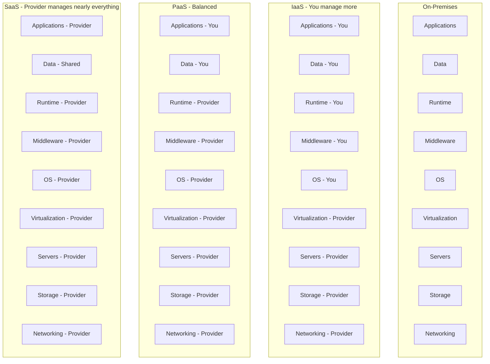
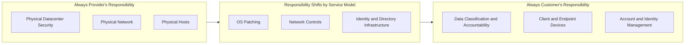
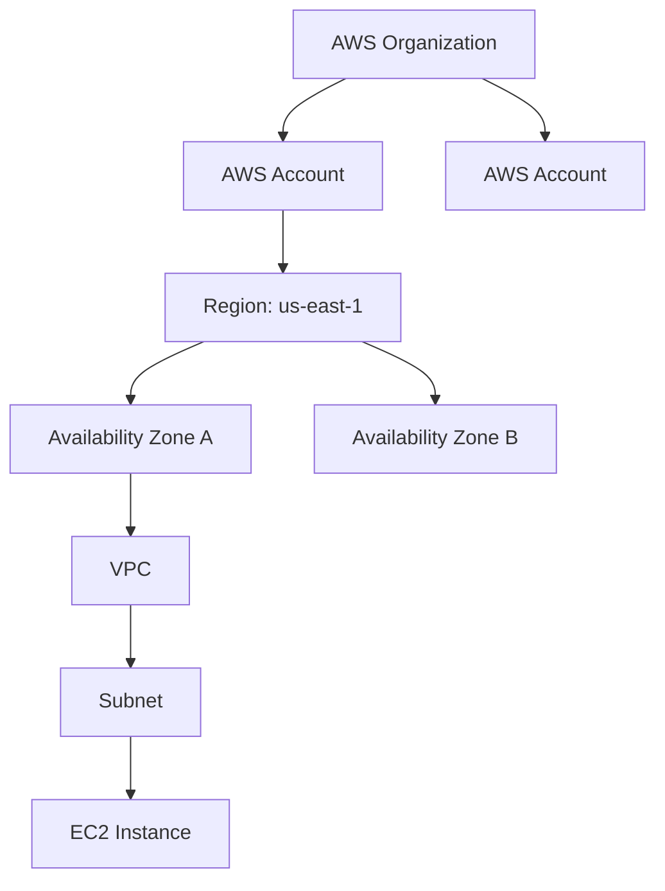
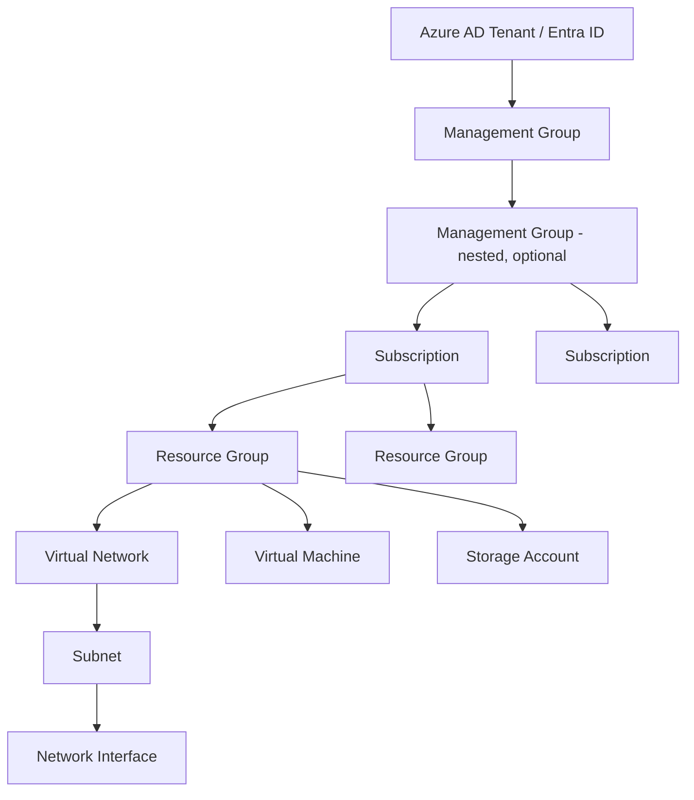
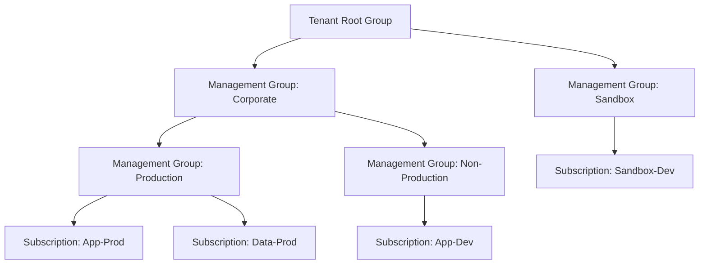
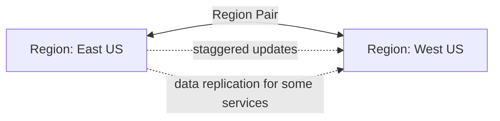
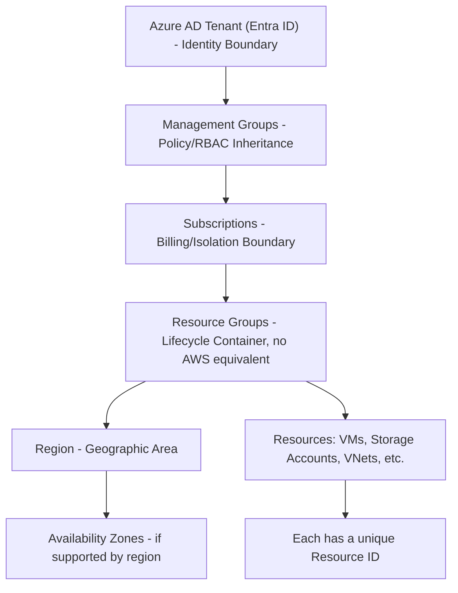

# Created and maintained by Vilas Varghese

# Cloud Concepts Recap and the Azure Mental Model

## How to Use This Note

This is the foundation note for the entire Azure track. Everything downstream (compute, storage, networking, identity) builds on the mental model established here. Since you already know AWS, every concept below is introduced through its AWS equivalent first, then mapped precisely to its Azure counterpart. Pay close attention to the places where the mapping is **not** one-to-one, those gaps are the most common source of mistakes in interviews and exam questions, because they're where people assume Azure works exactly like AWS and get caught out.

This note covers AZ-900 exam objectives: **Describe cloud concepts** and part of **Describe Azure architecture and services**.

---

## 1. Cloud Computing Concepts Recap

You already know these from AWS. This section is a fast recap, not a re-teach, framed so the terminology transfers cleanly to Azure.

### 1.1 The Core Value Propositions of Cloud

| Concept | What it means | AWS example you know | Azure equivalent |
|---|---|---|---|
| **High availability** | System stays up despite component failure | Multi-AZ RDS, ALB across AZs | Availability Zones, Availability Sets |
| **Scalability** | Handle more load by adding capacity | Auto Scaling Groups, HPA | VM Scale Sets, App Service autoscale |
| **Elasticity** | Scale up *and* down automatically based on demand | ASG scale-in/scale-out policies | VM Scale Sets autoscale rules |
| **Agility** | Provision resources in minutes, not weeks | Launching an EC2 instance | Deploying a VM via Azure Portal/CLI |
| **Fault tolerance** | System continues operating even if a part fails | Multi-AZ deployment | Availability Zone-redundant services |
| **Disaster recovery** | Recover from a large-scale failure (region loss) | Cross-region replication, backups | Azure Site Recovery, paired regions |

### 1.2 CapEx vs OpEx

This is a guaranteed AZ-900 exam topic, know it cold:

- **CapEx (Capital Expenditure)**: large upfront investment (buying physical servers, building a data center). You own the asset, it depreciates over time.
- **OpEx (Operational Expenditure)**: pay-as-you-go spending, no upfront investment, cost scales with usage.

Cloud computing shifts organizations from CapEx to OpEx. This is true of AWS and Azure identically, no difference in the underlying economic argument, only the tool used to realize it changes.

### 1.3 Consumption-Based Pricing Model

Same principle as AWS: you pay for what you use, not for fixed provisioned capacity you might not need. Azure's specific pricing tools are covered in a later note; for now, understand the model conceptually since AZ-900 tests the *concept*, not tool usage.

---

## 2. Service Models: IaaS, PaaS, SaaS

You know this from AWS. The exam tests whether you can correctly classify a *specific Azure service* into the right category, so the classification skill matters more than the definitions themselves.



| Model | You manage | Provider manages | AWS example | Azure example |
|---|---|---|---|---|
| **IaaS** | OS, runtime, middleware, app, data | Physical hardware, virtualization, networking | EC2, EBS, VPC | Azure VMs, Azure Disks, VNet |
| **PaaS** | App, data | OS, runtime, middleware, scaling infrastructure | Elastic Beanstalk, RDS | Azure App Service, Azure SQL Database |
| **SaaS** | Just your data/config | Everything else, including the application itself | (Not really an AWS-native concept, third-party SaaS runs *on* AWS) | Microsoft 365, Dynamics 365 |

**Exam trap:** Azure Functions and AWS Lambda are frequently miscategorized. They are **serverless**, a deployment model, not strictly a separate service model, but for exam purposes they're typically treated as an extension of PaaS (you manage only code, provider manages everything else, including scaling to zero). If asked to classify Azure Functions on AZ-900, answer PaaS/serverless.

**Interview-ready one-liner:** "IaaS gives you the building blocks and you assemble them, like renting an empty apartment. PaaS gives you a furnished apartment; you just move your things in. SaaS is a hotel room, everything is done for you, you just use the service."

---

## 3. Shared Responsibility Model

Identical underlying concept to AWS, same exam relevance, same interview relevance.



| Responsibility | On-Prem | IaaS | PaaS | SaaS |
|---|---|---|---|---|
| Data governance and rights management | Customer | Customer | Customer | Customer |
| Client/endpoint protection | Customer | Customer | Customer | Customer |
| Identity and access management | Customer | Customer | Shared | Shared |
| Application-level controls | Customer | Customer | Shared | Provider |
| Network controls | Customer | Shared | Shared | Provider |
| Operating system | Customer | Customer | Provider | Provider |
| Physical hosts/network/datacenter | Provider | Provider | Provider | Provider |

**The one line examiners and interviewers want to hear:** "No matter which service model you use, the customer is always responsible for their data and for identity and access management. That never shifts to the provider."

---

## 4. The Azure Mental Model: Terminology Map

This is the core of this note. Your students already have a working mental model of AWS's hierarchy (Account, Region, AZ, VPC). Azure's hierarchy has more layers and does not map one-to-one, so build this carefully.

### 4.1 AWS Hierarchy (What They Already Know)



### 4.2 Azure Hierarchy (New Model to Learn)



**Critical structural difference to call out explicitly:** AWS has no direct equivalent of a **Resource Group**. In AWS, resources exist within a Region/VPC and are organized loosely via tags. In Azure, the **Resource Group is a mandatory, first-class container**, every single resource must belong to exactly one resource group, and resource groups are the primary unit of lifecycle management (delete a resource group, everything inside it is deleted). This is one of the most important mental model shifts for an AWS engineer moving to Azure.

### 4.3 Full Terminology Mapping Table

| AWS Concept | Azure Concept | Notes on the Mapping |
|---|---|---|
| AWS Organization | Management Group (+ Tenant) | Azure's tenant (Azure AD/Entra ID) is a layer above anything AWS has; think of it as the identity boundary for an entire company |
| AWS Account | Subscription | Closest equivalent; billing and access boundary |
| (No direct equivalent, tags used instead) | **Resource Group** | Mandatory logical container for resources; no AWS equivalent, this is new |
| Region | Region | Conceptually identical: a geographic area with multiple datacenters |
| Availability Zone | Availability Zone | Conceptually identical, but **not all Azure regions have Availability Zones** (unlike AWS where nearly all regions have multiple AZs), check region capability before assuming |
| VPC | Virtual Network (VNet) | Conceptually identical: an isolated network space you control |
| Subnet | Subnet | Identical concept |
| IAM (Users, Groups, Roles, Policies) | Azure AD (Entra ID) + Azure RBAC | Azure splits this into two systems: Entra ID (identity) and RBAC (authorization), covered in depth in a dedicated note |
| Security Group | Network Security Group (NSG) | Conceptually identical, applied at subnet or NIC level |
| S3 | Blob Storage | Object storage equivalent |
| EC2 | Virtual Machines | Compute equivalent |
| EBS | Managed Disks | Block storage equivalent |
| Route 53 | Azure DNS / Traffic Manager | Split across two services in Azure |
| CloudWatch | Azure Monitor | Metrics, logs, and alerting equivalent |
| CloudFormation | ARM Templates / Bicep | IaC equivalent, covered in the AZ-400 track |
| ARN (Amazon Resource Name) | Resource ID | Every Azure resource has a unique Resource ID string, conceptually the same purpose as an ARN |

### 4.4 Resource ID Format (Azure's Equivalent of ARN)

Just as every AWS resource has an ARN, every Azure resource has a fully qualified Resource ID. Recognizing this format is useful for both the exam and real troubleshooting:

```
/subscriptions/{subscription-id}/resourceGroups/{resource-group-name}/providers/{resource-provider}/{resource-type}/{resource-name}
```

Example:
```
/subscriptions/2f4a1b3c-.../resourceGroups/rg-prod-app/providers/Microsoft.Compute/virtualMachines/vm-web-01
```

Notice the hierarchy is baked directly into the ID string: subscription, then resource group, then provider/type, then name, reinforcing that resource group membership is not optional metadata, it's structural.

---

## 5. Subscriptions and Management Groups in Depth

### 5.1 Why Azure Has an Extra Layer (Management Groups)

AWS Organizations lets you group accounts and apply Service Control Policies (SCPs) across them. Azure's equivalent, **Management Groups**, does the same job but sits explicitly above Subscriptions in a visible hierarchy that can be nested multiple levels deep (up to six levels), which is deeper than most AWS OU structures typically go in practice.



**Policy and RBAC inheritance flows downward**: a policy applied at the "Corporate" management group automatically applies to every subscription and resource group beneath it, exactly like SCPs cascading down an AWS Organization's OU tree.

### 5.2 Why Multiple Subscriptions Are Common in Azure

Just as companies use multiple AWS accounts for billing isolation, blast-radius containment, and environment separation, Azure subscriptions serve the same purposes:
- Billing boundary (each subscription gets its own invoice)
- Isolation boundary (a quota limit or an outage in one subscription doesn't affect another)
- Access control boundary (RBAC can be scoped per subscription)

**Interview-ready comparison:** "An AWS Account and an Azure Subscription serve the same organizational purpose, billing and isolation, but Azure adds Management Groups as a native, deeply-nestable layer above subscriptions for policy inheritance, where in AWS you'd rely on Organizational Units within AWS Organizations to get similar behavior."

---

## 6. Resource Groups Deep Dive

Since this has no AWS equivalent, spend real time here, it's the single biggest new concept in this note.

### 6.1 Key Rules

- Every resource must belong to **exactly one** resource group.
- A resource group has a **Region** associated with it (the region where its metadata is stored), but resources inside it can be deployed to *different* regions than the resource group's own region.
- Resource groups are the default scope for **RBAC assignments** and **Azure Policy**.
- Deleting a resource group **deletes every resource inside it**. This is both a powerful cleanup tool and a serious operational hazard, a common cause of production incidents is an engineer deleting a resource group thinking it only contained test resources.

### 6.2 Good Resource Group Design Patterns

| Pattern | When to use it |
|---|---|
| Group by application lifecycle | All resources for one app (VM, database, storage) in one resource group, so decommissioning the app is a single delete operation |
| Group by environment | Separate resource groups per dev/staging/prod, even within the same subscription |
| Group by team/department | Useful for cost allocation and RBAC scoping when multiple teams share a subscription |

**Exam trap:** a resource group's location (region) is just where its deployment metadata lives, it does **not** restrict which region the resources inside it can be deployed to. Students often assume a "West Europe" resource group forces all resources into West Europe, this is false.

---

## 7. Regions, Availability Zones, and Region Pairs

### 7.1 Regions and Availability Zones

Conceptually identical to AWS: a **Region** is a geographic area containing one or more datacenters; an **Availability Zone** is a physically separate datacenter (or set of datacenters) within a region with independent power, cooling, and networking.

**Key difference from AWS:** not every Azure region supports Availability Zones. Always verify zone support for a specific region before designing a high-availability architecture around it, this is a real exam question pattern and a real production consideration.

### 7.2 Region Pairs (Azure-Specific Concept, No Direct AWS Equivalent)

Azure pairs most regions with another region in the same geography for disaster recovery purposes (e.g., East US is paired with West US). This pairing has specific guarantees:

- Planned Azure updates are rolled out to paired regions **at different times**, never simultaneously, reducing the risk of a platform-level update causing an outage in both regions at once.
- In the rare event of a broad regional outage, Azure prioritizes recovery of one region in each pair.
- Data residency: some services replicate data only within the region pair, which matters for compliance/data-sovereignty questions.

**This is a guaranteed AZ-900 topic and has no AWS equivalent to anchor to**, treat it as genuinely new material and make sure students can name the concept even if they can't name specific pairs.



---

## 8. Putting the Full Model Together



**Narrate this diagram top to bottom in class as the session's closing summary:** identity sits at the very top (Tenant), policy and governance cascade down through Management Groups, billing and isolation are scoped at the Subscription level, and the Resource Group is the everyday working unit where engineers actually operate day to day, distinct from anything in the AWS model.

---

## 9. Side-by-Side Summary Table (Quick Revision)

| Layer | AWS | Azure | New Concept for AWS Engineers? |
|---|---|---|---|
| Company-wide identity boundary | (Implicit via AWS Organizations root) | Azure AD Tenant (Entra ID) | Yes, more explicit in Azure |
| Multi-account/subscription governance | AWS Organizations + OUs + SCPs | Management Groups + Azure Policy | Similar concept, different tooling |
| Billing/isolation unit | AWS Account | Subscription | Direct equivalent |
| Resource lifecycle container | Tags (informal) | Resource Group (mandatory, formal) | **Yes, genuinely new** |
| Geographic area | Region | Region | Direct equivalent |
| Isolated datacenter within a region | Availability Zone | Availability Zone (not in every region) | Mostly equivalent, verify support |
| DR pairing between regions | Manual design choice | Region Pairs (built-in Azure concept) | **Yes, genuinely new** |
| Network isolation boundary | VPC | Virtual Network (VNet) | Direct equivalent |
| Unique resource identifier | ARN | Resource ID | Direct equivalent, different string format |

---

## 10. Common Interview and Exam Questions

**Conceptual (AZ-900 style):**
1. What is the difference between CapEx and OpEx, and how does cloud computing shift an organization from one to the other?
2. Classify Azure SQL Database, Azure VMs, and Microsoft 365 into IaaS, PaaS, or SaaS.
3. In the shared responsibility model, which two responsibilities never shift to the cloud provider regardless of service model?
4. What is a Region Pair, and why does Azure stagger platform updates across paired regions?
5. Does every Azure region support Availability Zones? What must you verify before designing for high availability?

**Mental-model / mapping (interview style, AWS-to-Azure):**
6. An AWS engineer asks: "What's the Azure equivalent of an AWS Account?" What's your answer, and what's the one thing they need to understand about Management Groups that AWS Organizations doesn't force as explicitly?
7. Why does Azure have Resource Groups when AWS has no equivalent construct? What real operational risk does this introduce that doesn't exist in AWS?
8. If someone deletes a Resource Group by mistake, what happens? How would you prevent this in a production subscription?
9. Does a Resource Group's region restrict where resources inside it can be deployed? Explain your answer.
10. Walk through the full Azure hierarchy from Tenant down to an individual VM, and name the AWS equivalent (or "no equivalent") at each layer.

---

## 11. Key Takeaways to Memorize Before Moving to the Next Note

- **IaaS/PaaS/SaaS and the shared responsibility model work identically in concept to AWS**, only the specific service names change.
- **Resource Groups are the single biggest new structural concept** in Azure with no AWS equivalent, mandatory, lifecycle-defining, and a real operational hazard if misunderstood.
- **Management Groups sit above Subscriptions** and behave like a more explicit, deeply-nestable version of AWS Organizations' OU structure.
- **Region Pairs are an Azure-native disaster recovery concept** with no direct AWS equivalent, know what they guarantee (staggered updates, prioritized recovery).
- **Not every Azure region has Availability Zones**, always verify before assuming AWS-style multi-AZ availability is possible.

Next note in this track: **Azure Global Infrastructure and Resource Organization**, which goes deeper into Regions, Availability Zones, and how to architect for availability using these building blocks.