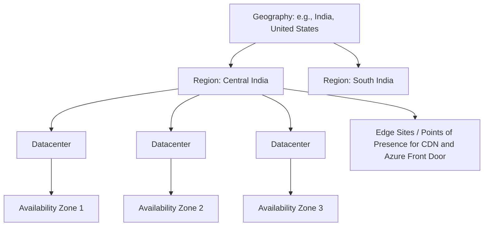
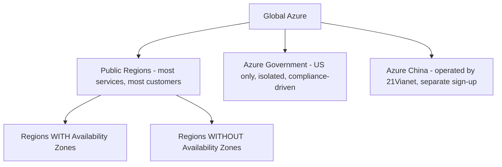
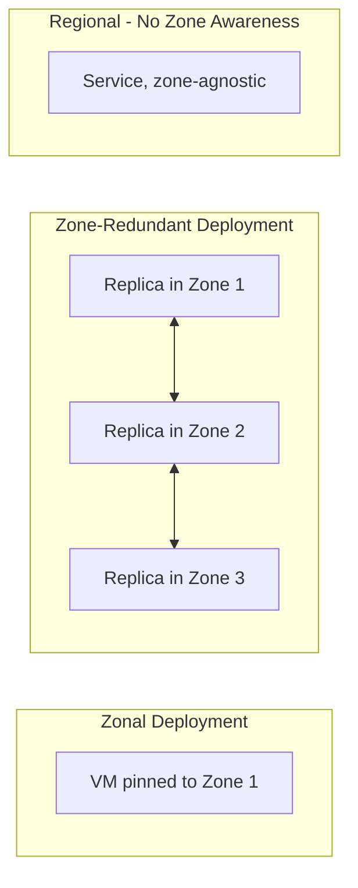
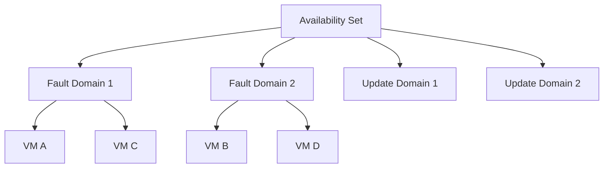
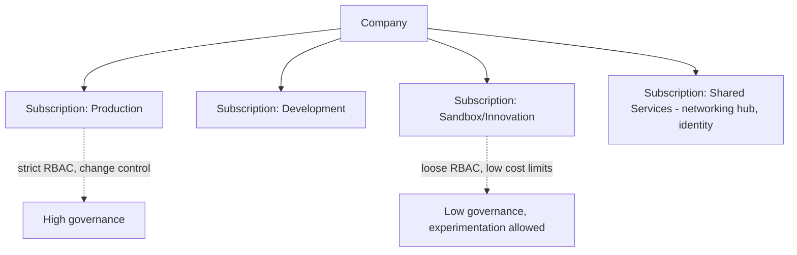
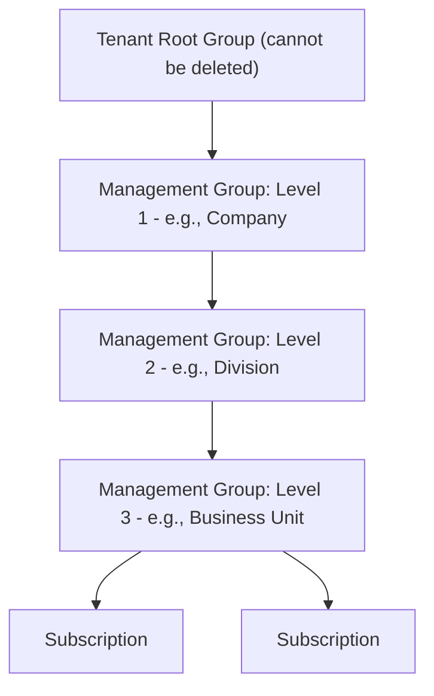
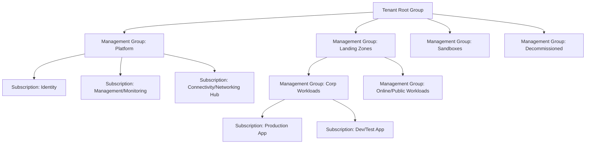
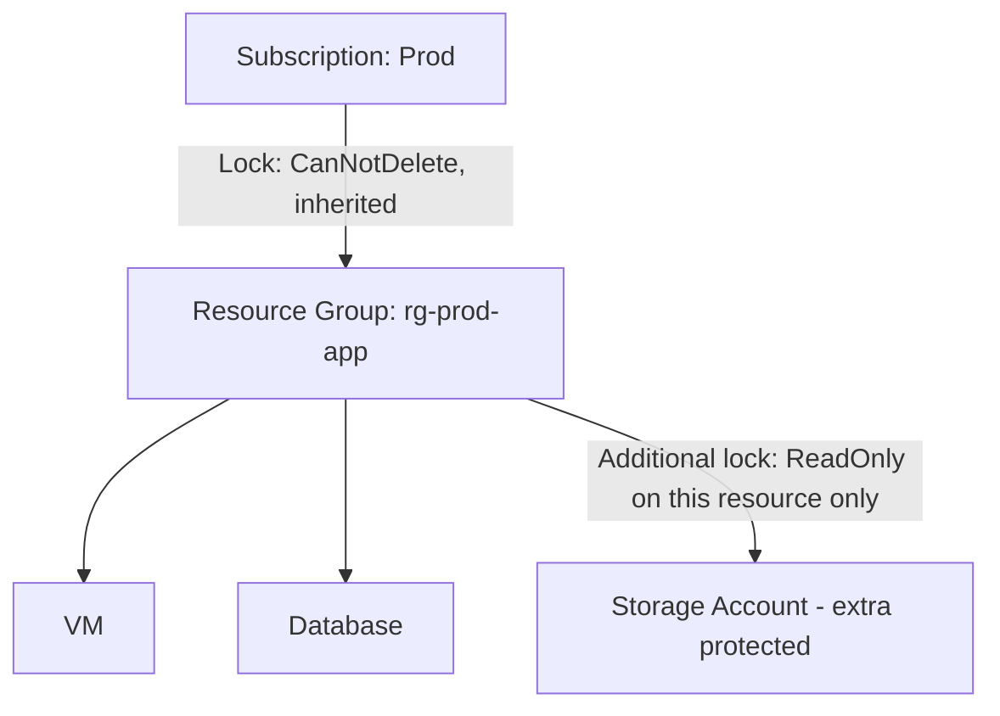
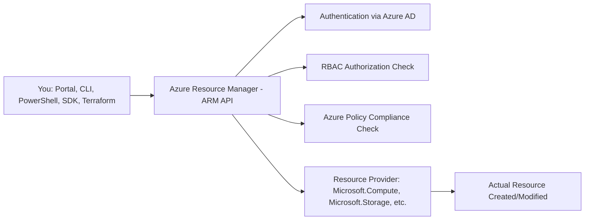

# Written and maintained by Vilas Varghese

# Azure Global Infrastructure and Resource Organization

## How to Use This Note

Note 1 introduced the Azure mental model at a conceptual level. This note goes deep into the four structural pillars you'll be tested on directly, in both AZ-900 and AZ-400, and asked about in nearly every Azure interview: **Regions, Availability Zones, Resource Groups, and Management Groups/Subscriptions**. Where Note 1 gave you the map, this note gives you the operational detail: limits, quotas, exam traps, and the physical infrastructure reasoning behind each construct.

Every section starts from what you already know in AWS, then goes one level deeper into Azure-specific behavior that AWS engineers commonly get wrong on first exposure.

---

## 1. The Physical Layer: How Azure's Infrastructure Is Actually Built

Before the logical constructs (Region, Subscription, Resource Group), understand the physical hierarchy underneath them. This shows up in AZ-900 exam questions phrased as "which of the following best describes a Region/Availability Zone/Datacenter."

| Term | Definition | AWS Equivalent |
|---|---|---|
| **Geography** | A defined area of the world containing one or more regions, respects data residency and compliance boundaries (e.g., "India," "United States," "European Union") | No direct single-word equivalent; closest is how AWS groups regions informally by continent for compliance discussions |
| **Region** | A set of datacenters deployed within a latency-defined perimeter, connected by a dedicated regional low-latency network | Region |
| **Availability Zone** | One or more physically separate datacenters within a region, each with independent power, cooling, and networking | Availability Zone |
| **Datacenter** | The physical building; not directly exposed as a concept you choose in the portal, it's abstracted behind Region/AZ | Not directly exposed either |
| **Edge Site / Point of Presence** | Smaller facilities used for content delivery (Azure CDN, Azure Front Door) and low-latency ingress, not for compute/storage deployment | CloudFront edge locations |

**Exam-relevant fact:** Microsoft states that Azure has more global regions than any other cloud provider. You don't need the exact number memorized (it changes), but know that region count and geographic reach is a commonly cited Azure differentiator in both marketing material and exam framing.

---

## 2. Regions in Depth

### 2.1 What Determines Which Region You Pick

Same four decision factors as AWS, but worth restating in Azure-specific terms since AZ-900 tests this directly:

| Factor | Explanation |
|---|---|
| **Compliance and data residency** | Some data must legally remain within a country/geography (e.g., Indian financial data often must stay within India, served by Central India / South India regions) |
| **Latency to users** | Pick the region physically closest to your primary user base |
| **Service availability** | Not every Azure service is available in every region, newer services often launch in a limited set of regions first |
| **Pricing** | Prices vary by region for the same service, sometimes significantly |

### 2.2 Special Region Categories (Azure-Specific, No Direct AWS Parallel in Naming)

- **Recommended Regions**: Microsoft's suggested default regions when you don't have a specific constraint, chosen for broad service availability and Availability Zone support.
- **Sovereign/National Cloud Regions**: **Azure Government** (US) and **Azure China** (operated by 21Vianet, a separate entity due to Chinese regulations) are physically and logistically isolated from global Azure, with separate sign-up, separate portal URLs, and a subset of services. This has no clean AWS equivalent (AWS GovCloud is the closest analog, but Azure China's operation-by-a-separate-company model is genuinely distinct).
- **Region with no Availability Zones**: some Azure regions are single-datacenter-equivalent or don't yet offer zone redundancy. **Always verify AZ support per region before designing a highly available architecture**, this is a repeated exam trap.

### 2.3 Checking Region/Service/Zone Availability (Practical Skill, Interview-Relevant)

In real work (and worth mentioning in an interview to show hands-on fluency), you check:
- **Products available by region** page, to confirm a service is offered where you need it.
- The **Azure CLI** command `az vm list-skus --location <region> --zone` to programmatically verify zone support for a specific VM SKU in a specific region, not all VM sizes support zones even in a zone-enabled region.

---

## 3. Availability Zones in Depth

### 3.1 Structural Guarantee

An Availability Zone in Azure is guaranteed to have:
- At least **one discrete datacenter** (often more).
- **Independent power, cooling, and networking** from other zones in the same region.
- A round-trip latency low enough between zones in the same region to support **synchronous replication** (this is what makes zone-redundant storage and zone-redundant databases possible without giving up strong consistency).

**Minimum guarantee to memorize for the exam:** a region with Availability Zone support has a **minimum of three separate zones**. This mirrors AWS's typical minimum of three AZs per enabled region.

### 3.2 Zonal vs Zone-Redundant Services

This distinction is a very common point of confusion and a real exam topic:

| Deployment Type | What it means | Example |
|---|---|---|
| **Zonal** | You explicitly pin a resource to a specific zone (e.g., "Zone 1"); if that zone fails, the resource is unavailable until you fail over yourself | A VM pinned to Zone 1 |
| **Zone-redundant** | The service automatically replicates/distributes across all zones in the region without you managing zone placement | Zone-redundant storage (ZRS), zone-redundant Azure SQL Database |
| **Regional** | The service has no zone awareness at all, it's simply "in the region," Azure manages placement internally | Some PaaS services abstract this away entirely |

**Interview-ready distinction:** "Zonal means I choose the zone and I own the failover. Zone-redundant means the platform spreads my data or compute across zones automatically, so a single zone failure doesn't take me down without any action on my part. This is a more automatic version of what you'd manually build in AWS with an ALB spanning multiple AZs and an Auto Scaling Group configured to launch across all of them."

### 3.3 Availability Sets (Pre-Availability-Zone, Same-Datacenter HA)

Azure has a legacy/complementary concept AWS doesn't have a named equivalent for: **Availability Sets**. This groups VMs within a **single datacenter** (not across zones) into:
- **Fault Domains**: groups of VMs sharing a common power source and network switch, spreading VMs across fault domains protects against rack-level hardware failure.
- **Update Domains**: groups of VMs that Azure will patch/reboot together during planned maintenance, spreading VMs across update domains ensures not all your VMs reboot simultaneously during a host OS patch cycle.

**Key exam distinction:** Availability Sets protect against failures **within a single datacenter** (rack/host-level). Availability Zones protect against failure of an **entire datacenter**. They solve different failure scopes, and you cannot combine a single VM into both an Availability Set and span multiple Availability Zones simultaneously, choose one HA strategy per workload tier.

### 3.4 Availability Zone Comparison Summary

| Dimension | Availability Set | Availability Zone |
|---|---|---|
| Failure scope protected against | Rack/host failure within one datacenter | Entire datacenter failure |
| Latency between members | Very low (same datacenter) | Low but higher than same-datacenter (still supports sync replication) |
| AWS equivalent | No direct named equivalent (closest informal parallel: spreading instances across racks, which AWS abstracts away entirely) | Availability Zone |

---

## 4. Subscriptions in Depth

### 4.1 What a Subscription Actually Controls

A Subscription is simultaneously:
- A **billing boundary** (one invoice, one payment method).
- An **access control boundary** (RBAC and Azure Policy can be scoped at the subscription level).
- A **quota/limit boundary** (resource limits like "maximum number of VMs" are often set per subscription, not per account globally).

### 4.2 Subscription Types (Exam-Relevant)

| Type | Description |
|---|---|
| **Free** | Time-limited credit for new users to explore Azure, plus a set of always-free service tiers |
| **Pay-As-You-Go** | Standard consumption-based billing tied to a credit card, no upfront commitment |
| **Enterprise Agreement (EA)** | For large organizations with a committed annual spend, negotiated directly with Microsoft |
| **Cloud Solution Provider (CSP)** | Purchased through a Microsoft partner who manages billing and support on the customer's behalf |
| **Student** | Free credit for verified students, no credit card required |
| **Microsoft Developer/Visual Studio subscriptions** | Discounted rates for individual developers with an active MSDN/Visual Studio subscription |

**AWS comparison:** AWS doesn't have quite this many named subscription "types" as a first-class concept, the closest AWS parallel is the distinction between a standalone AWS account (self-service, credit card billing) and an Enterprise Discount Program (EDP) agreement for large committed spend, which maps loosely to Azure's EA.

### 4.3 Why Organizations Use Multiple Subscriptions

Identical reasoning to why organizations use multiple AWS accounts:

- **Isolate billing** per department, environment, or project.
- **Contain the blast radius** of a quota limit or a misconfiguration to one subscription.
- **Apply different governance levels**: production subscriptions get strict Azure Policy and RBAC, sandbox subscriptions get looser controls for experimentation.

---

## 5. Management Groups in Depth

### 5.1 Structural Limits (Exam-Relevant Numbers)

- A management group hierarchy can be **up to six levels deep**, not counting the root level and the subscription level (so eight levels total including root and subscriptions).
- Every subscription and management group has exactly **one parent** at any given time (a strict tree, not a graph).
- All management groups and subscriptions ultimately roll up to a single **Tenant Root Group**, which cannot be deleted or moved.

### 5.2 What Flows Down the Hierarchy

| Mechanism | Behavior |
|---|---|
| **Azure Policy assignments** | Applied at a management group, inherited by every subscription/resource group/resource beneath it |
| **RBAC role assignments** | A role granted at a management group applies to all subscriptions beneath it |
| **Cost views** | Cost Management can aggregate spend across all subscriptions under a management group |

**AWS comparison:** this directly mirrors how Service Control Policies (SCPs) and RBAC-equivalent permission boundaries cascade down an AWS Organizations OU tree. The core difference: Azure explicitly names and exposes the "Management Group" construct as something you interact with regularly in the portal and CLI, where AWS's OU structure is more commonly managed exclusively through AWS Organizations tooling and is less visually present day-to-day.

### 5.3 Common Real-World Management Group Design (Landing Zone Pattern)

This is a very common interview question: "How would you structure management groups for a new enterprise Azure environment?" The standard answer references the **Azure Landing Zone** reference architecture:

**Interview-ready summary:** "I'd separate platform concerns (identity, connectivity, central monitoring) from workload concerns (landing zones for actual applications), and further split landing zones by network exposure (corp/internal vs online/public-facing), applying stricter Azure Policy at the platform and online management groups than at sandbox."

---

## 6. Resource Groups: Operational Depth

Note 1 introduced Resource Groups conceptually. This section covers the operational detail needed for exam questions and hands-on interview scenarios.

### 6.1 Resource Group Rules, Precisely

- A resource can only belong to **one** resource group at a time, but it **can be moved** between resource groups (and even between subscriptions) without being deleted and recreated, using the "Move" operation.
- Not all resource types support being moved; always verify before planning a migration.
- A resource group itself **can be moved between subscriptions**, but not between tenants directly without additional steps.
- Resources within a single resource group **can span multiple regions**. The resource group's own "location" is purely metadata storage location.

### 6.2 Resource Locks

A concept with a rough AWS parallel (IAM deny policies or S3 bucket policies preventing deletion) but implemented as a distinct first-class feature in Azure:

| Lock Type | Effect |
|---|---|
| **CanNotDelete** | Authorized users can still read and modify the resource, but cannot delete it |
| **ReadOnly** | Authorized users can read the resource but cannot modify or delete it |

Locks can be applied at the subscription, resource group, or individual resource level, and are **inherited downward**. This is a direct, practical answer to "how do you prevent someone from accidentally deleting a production resource group," a question that connects directly back to the operational hazard flagged in Note 1.

### 6.3 Tags

Tags in Azure serve the same purpose as AWS tags (cost allocation, automation targeting, ownership tracking), applied as key-value pairs on resources, resource groups, or subscriptions. **Exam nuance:** not all resource types support tags, and tags do not automatically flow down from a resource group to the resources inside it (unlike locks and policies, which do inherit). If you want consistent tagging, you must apply an **Azure Policy** to enforce or auto-append tags, tagging itself is not inherited by default.

### 6.4 Naming Conventions (Practical/Interview Topic)

Microsoft publishes recommended naming conventions using resource-type prefixes, commonly tested informally in interviews as a sign of real-world experience:

| Resource Type | Recommended Prefix | Example |
|---|---|---|
| Resource Group | `rg-` | `rg-prod-webapp` |
| Virtual Machine | `vm-` | `vm-web-01` |
| Virtual Network | `vnet-` | `vnet-hub-prod` |
| Storage Account | `st` (no hyphens allowed, must be globally unique, lowercase alphanumeric only) | `stprodappdata001` |
| Network Security Group | `nsg-` | `nsg-web-subnet` |

**Exam trap:** Storage Account names have unusually strict constraints, lowercase letters and numbers only, no hyphens, 3-24 characters, and **globally unique across all of Azure**, not just your subscription. This trips up students coming from S3, where bucket names are also globally unique, but AWS naming rules are less restrictive than Azure's storage account naming rules.

---

## 7. Azure Resource Manager (ARM): The Deployment Layer Underneath Everything

This ties the whole hierarchy together and is worth introducing here even though it's covered in depth in the AZ-400 track.

Every single interaction with Azure, whether through the Portal, CLI, PowerShell, an SDK, or Terraform, goes through **Azure Resource Manager (ARM)**, which is the consistent management layer that enforces RBAC and Policy before any resource provider acts. This is the direct conceptual equivalent of how every AWS API call goes through IAM authentication/authorization before reaching the target service.

**Resource Providers** (e.g., `Microsoft.Compute`, `Microsoft.Storage`, `Microsoft.Network`) must be **registered on a subscription** before you can create resources of that type, a one-time setup step per subscription that has no direct AWS equivalent (AWS services are simply available once your account exists, no separate "registration" step).

---

## 8. Full Side-by-Side Comparison: AWS Organizational Model vs Azure

| Concept | AWS | Azure | Exam/Interview Note |
|---|---|---|---|
| Identity boundary for the whole company | Implicit, tied to root AWS Organizations account | Explicit: Azure AD (Entra ID) Tenant | Azure makes this an explicit, separately-named layer |
| Multi-account/subscription grouping and policy | AWS Organizations + Organizational Units + SCPs | Management Groups + Azure Policy | Both cascade downward; Azure allows up to 6 nested levels |
| Billing/isolation unit | AWS Account | Subscription | Direct equivalent; Azure has more named subscription "types" |
| Mandatory resource lifecycle container | None (tags used informally) | **Resource Group (mandatory)** | Biggest structural difference; genuinely new for AWS engineers |
| Prevent accidental deletion | IAM deny policies, S3 bucket policies, sometimes deletion protection flags per-service | **Resource Locks** (CanNotDelete, ReadOnly), first-class, inheritable | Azure's approach is more centralized and consistent across resource types |
| Geographic area | Region | Region | Direct equivalent |
| Isolated datacenter(s) within a region | Availability Zone | Availability Zone (not all regions support it) | Verify support before designing HA |
| Rack/host-level HA within one datacenter | Not directly exposed as a customer concept | **Availability Set** (Fault Domains + Update Domains) | Genuinely new concept for AWS engineers |
| DR pairing between regions | Manual design choice | **Region Pairs** (built-in guarantee) | Genuinely new concept, covered in Note 1 |
| API/control-plane enforcement layer | IAM (implicit, not a separately named "layer") | **Azure Resource Manager (ARM)**, explicitly named | Azure names and exposes this layer explicitly |
| Per-service enablement step | Not required, services available by default | **Resource Provider registration** required per subscription | Genuinely new, one-time setup step |

---

## 9. Common Interview and Exam Questions

**Regions and Availability Zones:**
1. What is the minimum number of Availability Zones in a zone-enabled Azure region?
2. What's the difference between a zonal deployment and a zone-redundant deployment? Give an example of each.
3. What's the difference between an Availability Set and an Availability Zone, in terms of the failure scope each protects against?
4. What are Fault Domains and Update Domains, and why does an Availability Set need both?
5. Why might Azure Government and Azure China not be directly comparable to AWS GovCloud in terms of operational structure?

**Subscriptions and Management Groups:**
6. How many levels deep can an Azure Management Group hierarchy go?
7. Why would a company use multiple Azure subscriptions instead of one large subscription with many resource groups?
8. Describe the Azure Landing Zone pattern for structuring management groups in an enterprise environment.
9. What's the AWS equivalent of an Azure Management Group, and what's one meaningful difference in how it's used day to day?

**Resource Groups and ARM:**
10. Can a single resource belong to two resource groups at once? Can a resource be moved between resource groups?
11. Does a resource group's assigned region limit where resources inside it can be deployed?
12. What's the difference between a CanNotDelete lock and a ReadOnly lock?
13. Do tags applied to a resource group automatically apply to resources created inside it? Why or why not?
14. What is a Resource Provider, and what one-time step is required before deploying a new resource type to a subscription?
15. Trace what happens, layer by layer, when you run `az vm create`, starting from your CLI command through to the VM being provisioned.

---

## 10. Key Takeaways to Memorize Before the Exam

- **Region → Availability Zone → Datacenter** is the physical hierarchy; not every region has zones, always verify.
- **Zonal vs zone-redundant** is a distinct, testable concept: pinned-to-one-zone vs automatically-spread-across-zones.
- **Availability Sets** (Fault Domains + Update Domains) protect against failure **within** one datacenter; **Availability Zones** protect against failure of an **entire** datacenter. Different failure scopes, don't conflate them.
- **Region Pairs** guarantee staggered platform updates and prioritized recovery, an Azure-native DR concept with no direct AWS parallel.
- **Resource Groups are mandatory and lifecycle-defining**: one resource group per resource, deleting a resource group deletes everything inside it, use **Resource Locks** to prevent accidental deletion.
- **Management Groups** nest up to six levels above Subscriptions, cascading Azure Policy and RBAC downward, directly analogous to AWS Organizations' OU tree but more explicitly surfaced.
- **Azure Resource Manager (ARM)** is the universal control-plane layer every tool goes through, and **Resource Providers must be registered per subscription** before use, a one-time step with no AWS equivalent.

Next note in this track: **Azure Core Compute Services**, covering Virtual Machines, VM Scale Sets, App Service, and Azure Functions, mapped against EC2, Auto Scaling Groups, Elastic Beanstalk, and Lambda.
