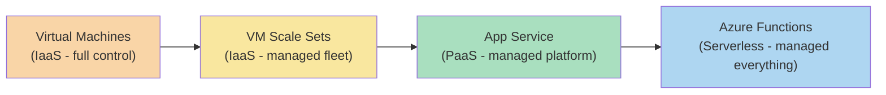
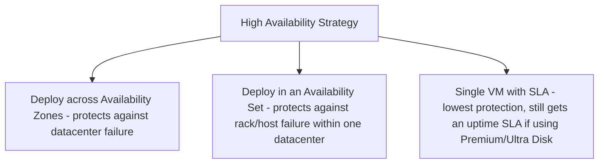
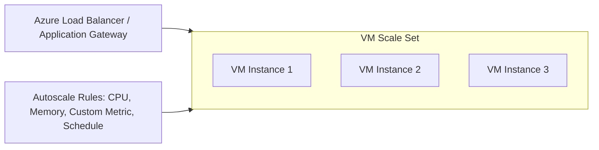
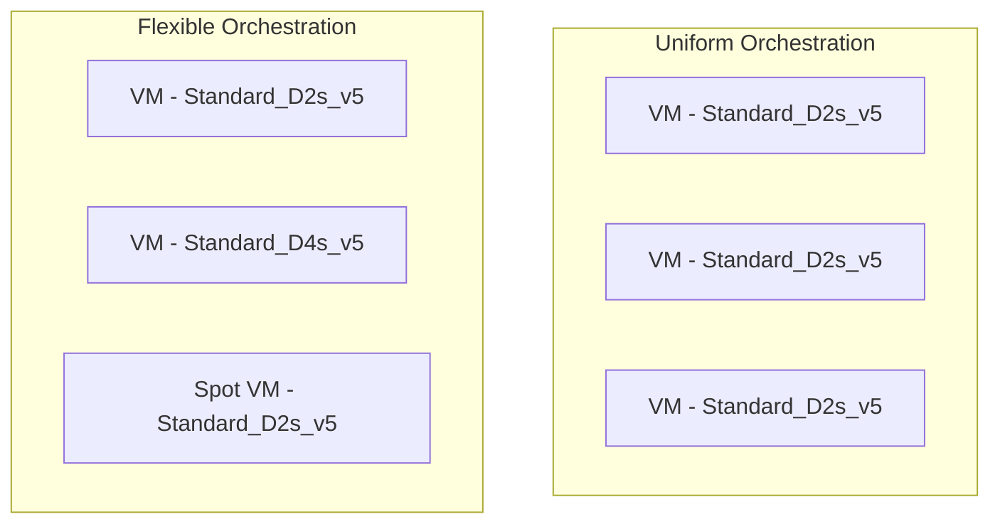
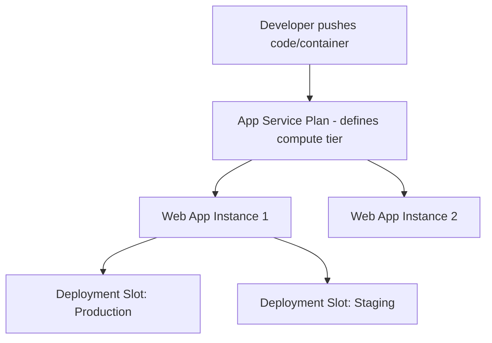
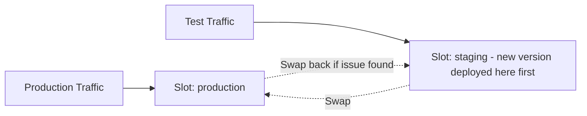
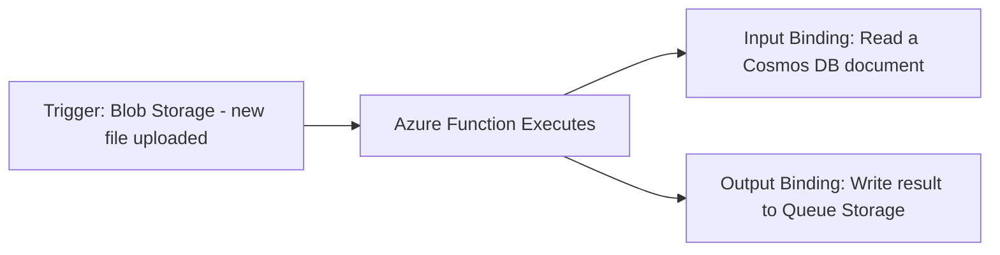
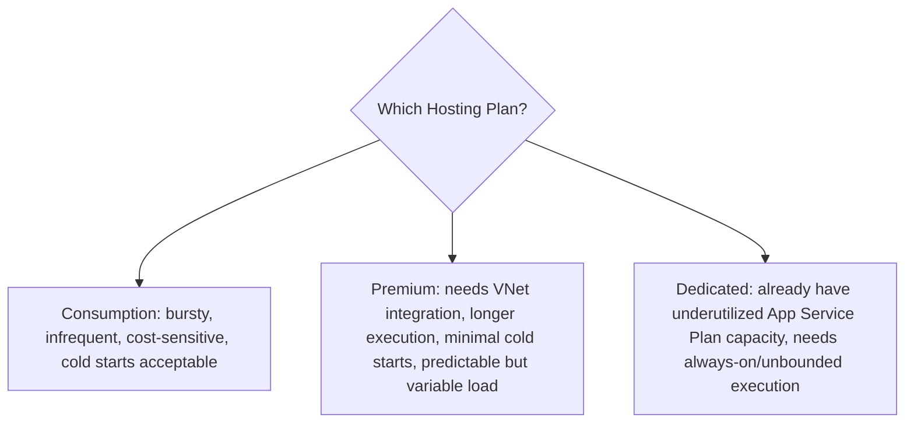
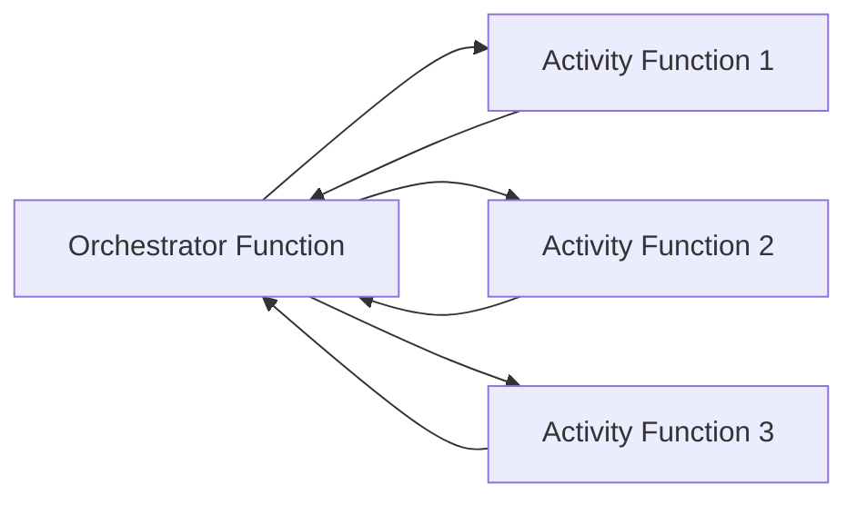
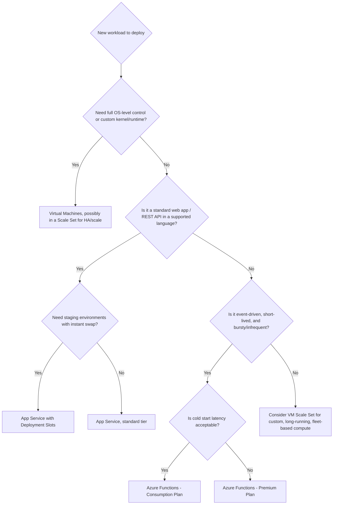

# Written and maintained by Vilas Varghese

# Azure Core Compute Services

## How to Use This Note

This note covers the four Azure compute services most heavily tested on AZ-900/AZ-400 and most commonly probed in interviews: **Virtual Machines, VM Scale Sets, App Service, and Azure Functions**. Each is introduced through its AWS equivalent, then explored to the depth needed to answer both exam questions and "design this architecture" interview prompts. The note closes with a decision framework you can use live in an interview to justify picking one compute service over another, exactly the kind of reasoning interviewers reward.

Kubernetes-based compute (AKS) is deliberately **not** covered here, it gets its own dedicated note later in the AZ-400 track alongside ACR and ACI, since it deserves the same depth your students already have for EKS.

---

## 1. The Azure Compute Decision Space

Before the details, orient with the full picture. Azure's compute services sit on a spectrum from "you manage everything" to "you manage nothing but code."



| Service | Control Level | AWS Equivalent |
|---|---|---|
| Virtual Machines | Full OS/runtime control | EC2 |
| VM Scale Sets | Managed fleet of identical VMs | Auto Scaling Group |
| App Service | Managed platform for web apps/APIs | Elastic Beanstalk |
| Azure Functions | Event-driven, no server management | Lambda |

**Interview framing to open with:** "Azure's compute options exist on a spectrum of control versus convenience, same as AWS's EC2-to-Lambda spectrum. The decision isn't 'which is best,' it's 'how much operational ownership does this specific workload need.'"

---

## 2. Azure Virtual Machines

### 2.1 Core Concepts vs EC2

| Concept | EC2 | Azure VM |
|---|---|---|
| Compute unit | Instance | Virtual Machine |
| Sizing | Instance type (e.g., `t3.medium`) | VM size/SKU (e.g., `Standard_D2s_v5`) |
| OS image | AMI | Image (Marketplace, custom, or shared image gallery) |
| Block storage | EBS volume | Managed Disk |
| Bootstrapping | User Data script | Custom Script Extension / cloud-init |
| Placement for HA | Multi-AZ manual design | Availability Set or Availability Zone (Note 2) |
| Spot capacity | Spot Instances | Spot VMs |
| Reserved capacity | Reserved Instances / Savings Plans | Reserved VM Instances / Azure Savings Plan for Compute |

### 2.2 VM Size (SKU) Naming Convention

This is a very common exam and interview question, since the naming encodes real capability information, unlike EC2's more arbitrary-looking type names.

```
Standard_D2s_v5
   |     | | |  |
   |     | | |  +-- Version (5th generation of this series)
   |     | | +----- Additive Feature (s = Premium Storage capable)
   |     | +------- vCPU count (2)
   |     +--------- Series letter (D = general purpose)
   +--------------- Tier (Standard or Basic)
```

| Series Letter | Purpose | Rough EC2 Equivalent |
|---|---|---|
| **A** | Entry-level, economical | `t` family |
| **B** | Burstable (accumulates CPU credits, same concept as `t` family) | `t` family |
| **D** | General purpose | `m` family |
| **E** | Memory-optimized | `r` family |
| **F** | Compute-optimized | `c` family |
| **L** | Storage-optimized, high disk throughput | `i` family |
| **N** | GPU-enabled | `p`/`g` family |
| **M** | Massive memory, large-scale databases | `x1`/`u` family |

**Exam trap:** the additive letters matter. `s` means the VM supports Premium SSD storage, a `D2_v5` (no `s`) and a `D2s_v5` can have different storage capabilities on the same base series. Always read the full SKU string, don't just match the series letter.

### 2.3 VM Pricing Models

| Model | Description | AWS Equivalent |
|---|---|---|
| **Pay-as-you-go** | Per-second billing, no commitment | On-Demand Instances |
| **Reserved VM Instances** | 1 or 3-year commitment for a discount (up to ~72%) | Reserved Instances |
| **Azure Savings Plan for Compute** | Commit to a fixed hourly spend across VM families/regions for flexibility | Compute Savings Plans |
| **Spot VMs** | Deeply discounted, can be evicted with short notice when Azure needs capacity back | Spot Instances |
| **Azure Hybrid Benefit** | Use existing on-prem Windows Server/SQL Server licenses to reduce VM cost | No direct AWS equivalent (closest: BYOL programs, but Hybrid Benefit is more formalized) |

**Azure Hybrid Benefit is worth calling out specifically in an interview**, it's a genuinely Azure-distinct cost lever tied to Microsoft's own licensing ecosystem, and shows awareness beyond a surface-level AWS-to-Azure port.

### 2.4 VM High Availability Recap (Cross-Reference to Note 2)



Even a **single VM** gets an SLA from Azure if it uses Premium SSD or Ultra Disk storage, a nuance worth knowing: Azure offers tiered SLA guarantees (single VM with premium storage < Availability Set < Availability Zone), each with a progressively higher uptime percentage guarantee.

---

## 3. VM Scale Sets

### 3.1 Core Concept vs Auto Scaling Groups

VM Scale Sets (VMSS) let you deploy and manage a set of identical, autoscaling VMs behind a load balancer, directly analogous to an AWS Auto Scaling Group fronted by an ALB.



| Concept | ASG | VM Scale Set |
|---|---|---|
| Scaling trigger | CloudWatch metric alarms | Azure Monitor metric rules |
| Scaling schedule | Scheduled scaling actions | Autoscale schedule-based profiles |
| Instance template | Launch Template/Configuration | VMSS Model (VM configuration + extensions) |
| Health checks | ELB health checks + ASG health check grace period | Application health extension + load balancer probes |
| Spread across zones | Manually configure ASG across AZ subnets | Native zone spreading via `zones` parameter |

### 3.2 Orchestration Modes: Uniform vs Flexible

This is a **genuinely new concept with no direct AWS parallel**, and a common exam/interview trap.

| Mode | Description | When to use |
|---|---|---|
| **Uniform Orchestration** | All VMs are identical, created from a single VMSS model, optimized for large-scale, fully homogeneous fleets | Large stateless web tiers, batch compute, identical worker nodes |
| **Flexible Orchestration** | VMs can have different sizes/configurations within the same scale set, supports mixing Spot and Regular VMs together, higher per-VM control | Workloads needing mixed instance types, high availability with fine-grained VM management, or migrating existing standalone VMs into a scale set |



**Interview-ready answer:** "Flexible orchestration is closer to how you might mix On-Demand and Spot instances in a single AWS ASG using mixed instance policies, but Azure makes this a first-class mode choice rather than a configuration option layered onto a single model."

### 3.3 Autoscale Rule Types

| Rule Type | Trigger |
|---|---|
| **Metric-based** | CPU, memory, disk, custom Application Insights metric crosses a threshold |
| **Schedule-based** | Scale to a fixed count at a specific time (e.g., scale up before a known daily peak) |
| **Predictive autoscale** | Uses machine learning on historical patterns to scale proactively ahead of anticipated demand |

**Predictive autoscale has no direct, native AWS ASG equivalent** (AWS's closest concept is predictive scaling policies added to ASGs, which is comparable but was introduced later and works differently under the hood). Worth mentioning explicitly if asked to differentiate Azure's autoscaling from AWS's.

---

## 4. Azure App Service

### 4.1 Core Concept vs Elastic Beanstalk

App Service is Azure's fully managed PaaS for hosting web apps, REST APIs, and mobile backends. You deploy code or a container image; Azure manages the OS, runtime patching, and load balancing.



| Concept | Elastic Beanstalk | Azure App Service |
|---|---|---|
| Underlying compute | EC2 instances managed by Beanstalk | App Service Plan (abstracted compute) |
| Scaling | ASG under the hood | Built-in scale up (bigger plan) and scale out (more instances) |
| Environment management | Beanstalk Environments (blue/green via environment swap) | **Deployment Slots** (staging/production swap) |
| Supported runtimes | Managed platforms (Java, .NET, Node, Python, etc.) or Docker | Managed runtimes (.NET, Java, Node, Python, PHP, Ruby) or custom containers |
| Config via code | `.ebextensions` | `web.config` / App Settings / Application Insights integration |

### 4.2 App Service Plans (The Pricing/Compute Tier)

An App Service Plan defines the underlying compute (VM size and count) that one or more Web Apps run on. Multiple apps can share a single plan.

| Tier | Purpose |
|---|---|
| **Free / Shared** | Development/testing only, shared compute, no custom domain/SSL |
| **Basic** | Dedicated compute, manual scaling only |
| **Standard** | Adds autoscaling, staging slots (up to 5) |
| **Premium** | More slots (up to 20), better performance, VNet integration |
| **Isolated** | Runs in a dedicated App Service Environment (ASE), full network isolation |

**Exam trap:** scaling up (changing to a bigger/higher tier) and scaling out (adding more instances of the same tier) are **two distinct operations** in App Service, and this vocabulary distinction (scale up vs scale out) is tested directly, don't conflate them.

### 4.3 Deployment Slots: Azure's Native Blue-Green Mechanism

This is one of the most interview-relevant App Service features, and maps directly to concepts your students already know from your Release Strategy notes.



- Deploy the new version to a **staging slot** first, fully isolated from production traffic.
- Warm up and validate the staging slot.
- **Swap** staging and production, this is a near-instantaneous, VIP-swap operation (the underlying IP addresses are exchanged), not a redeploy.
- If something's wrong, **swap back** just as fast.

**Direct interview connection:** "This is App Service's built-in equivalent of the blue-green deployment pattern, the same reasoning we'd use with an ALB and target groups in AWS, except Azure gives you the slot-swap mechanism natively at the platform level rather than something you build yourself with a load balancer and two environments."

**Exam trap:** slot-specific configuration (e.g., connection strings marked as "slot setting") **do not swap** with the slot, they stay pinned to the slot, this is intentional, so a staging slot can point to a test database while production points to the real one, even after multiple swaps.

### 4.4 App Service Networking and Isolation

- **VNet Integration**: lets an App Service reach resources inside a Virtual Network (e.g., a database on a private subnet), available from Standard tier and above.
- **Private Endpoints**: gives the App Service itself a private IP inside a VNet, so it's not reachable from the public internet at all.
- **App Service Environment (ASE)**: a fully isolated, single-tenant deployment of App Service inside your own VNet, for the highest security/compliance requirements, roughly analogous to running Elastic Beanstalk entirely within a private VPC with no public-facing components, but Azure packages this as a distinct, named product tier (Isolated).

---

## 5. Azure Functions

### 5.1 Core Concept vs Lambda

Azure Functions is Azure's serverless, event-driven compute service: you write a function, Azure handles provisioning, scaling, and infrastructure entirely.

| Concept | Lambda | Azure Functions |
|---|---|---|
| Unit of deployment | Function | Function (grouped into a **Function App**) |
| Event source | Event source mapping (S3, SQS, DynamoDB Streams, API Gateway) | **Triggers** (HTTP, Timer, Blob Storage, Queue Storage, Cosmos DB, Event Grid, Service Bus) |
| Output wiring | Manually written SDK calls, or Destinations (limited) | **Bindings** (declarative input/output wiring, no SDK boilerplate needed for common targets) |
| Max execution time | 15 minutes | Varies by hosting plan (see below), up to unlimited on Premium/Dedicated |
| Packaging | ZIP or container image | ZIP, container image, or run directly from a deployment package |
| Language support | Node, Python, Java, .NET, Go, Ruby, custom runtime | C#, JavaScript/TypeScript, Python, Java, PowerShell, custom handlers |

### 5.2 Triggers vs Bindings: A Genuinely New Concept

This distinction doesn't map cleanly to Lambda and is worth teaching carefully, it's a favorite interview question for candidates claiming Azure Functions experience.



- A **Trigger** is what causes the function to run, exactly one per function (HTTP request, timer, new blob, new queue message, etc.).
- A **Binding** is a declarative way to connect to data **without writing SDK/connection code**, an input binding reads data in, an output binding writes data out, and a function can have **multiple** input/output bindings alongside its single trigger.

**Interview-ready explanation:** "In Lambda, if I want to write a result to DynamoDB, I write boto3 code inside the function. In Azure Functions, I can declare an output binding to Cosmos DB in the function's configuration, and the platform handles the connection and write for me, no SDK code required for the common case. It's a more declarative model."

### 5.3 Hosting Plans (Critical Exam and Interview Topic)

This is the single most important Azure Functions topic to master, since it directly determines cost, scaling behavior, and cold start characteristics, and has no single Lambda equivalent (Lambda has essentially one hosting model with provisioned concurrency as an add-on; Azure splits this into three distinct plans).

| Hosting Plan | Scaling | Cold Start | Max Execution Time | Cost Model | Closest Lambda Analogy |
|---|---|---|---|---|---|
| **Consumption Plan** | Automatic, scales to zero | Yes, present | 5 min default (max 10 min) | Pay per execution + GB-seconds | Standard Lambda, no provisioned concurrency |
| **Premium Plan** | Automatic, but keeps **pre-warmed instances** | Minimal/avoided via pre-warmed instances | Unbounded (default 30 min, configurable) | Pay for pre-warmed instances + scale-out | Lambda with Provisioned Concurrency |
| **Dedicated (App Service) Plan** | Manual or autoscale, runs on your existing App Service Plan VMs | None (always running) | Unbounded | Pay for the underlying VM regardless of executions | Not a Lambda equivalent at all, closer to running your function code inside a container on EC2/ECS |



**Guaranteed exam/interview question:** "Which Functions hosting plan would you choose for a latency-sensitive, moderately-trafficked API, and why?" Answer: **Premium**, because Consumption's cold starts would hurt latency-sensitive requests, and Dedicated wastes money on idle capacity if traffic isn't already saturating an existing plan.

### 5.4 Durable Functions (No Direct Lambda Equivalent)

**Durable Functions** is an extension enabling stateful workflows on top of Azure Functions, orchestrating multiple function calls, managing state, and handling long-running processes, without you managing a separate state machine service.



**Direct AWS comparison worth making explicitly:** "Durable Functions is conceptually closest to AWS Step Functions, but instead of writing a separate state machine definition (ASL/JSON), you write the orchestration logic as ordinary code in the same language as your functions, and the Durable Functions extension handles checkpointing and state persistence behind the scenes." This comparison is a strong, specific answer if this note's content ever intersects with the Step Functions material from the FinancialServices interview prep.

---

## 6. Full Compute Comparison Table

| Dimension | VM | VM Scale Set | App Service | Azure Functions |
|---|---|---|---|---|
| Control level | Full (IaaS) | Full, fleet-managed | Managed platform (PaaS) | Fully managed (serverless) |
| Scaling | Manual | Automatic, fleet-wide | Scale up + scale out | Automatic, including scale-to-zero (Consumption) |
| Best for | Custom OS/runtime needs, lift-and-shift | Large homogeneous stateless fleets | Web apps, REST APIs, standard runtimes | Event-driven, short-lived, bursty workloads |
| Cold start | None | None | None (always running) | Present on Consumption, mitigated on Premium |
| Native blue-green support | No, build it yourself | Via load balancer traffic shifting | **Yes, Deployment Slots** | No, use traffic-splitting via Function App slots (Premium/Dedicated only) |
| AWS equivalent | EC2 | Auto Scaling Group | Elastic Beanstalk | Lambda |

---

## 7. Decision Framework for Interviews

Use this decision tree live when asked "which compute service would you use for X":



---

## 8. Common Interview and Exam Questions

**Virtual Machines:**
1. Decode the SKU `Standard_E4s_v5`, what does each part tell you?
2. What is Azure Hybrid Benefit, and why doesn't AWS have a precise equivalent?
3. What SLA differences exist between a single VM, a VM in an Availability Set, and a VM across Availability Zones?

**VM Scale Sets:**
4. What's the difference between Uniform and Flexible orchestration modes in a VM Scale Set?
5. Can a Flexible-orchestration VM Scale Set mix Spot and Regular VMs? Can a Uniform one?
6. What is predictive autoscale, and how does it differ from a simple CPU-threshold scaling rule?

**App Service:**
7. What's the difference between scaling up and scaling out in App Service?
8. Explain how a deployment slot swap works, and why slot-specific settings don't move during a swap.
9. What's the difference between VNet Integration and an App Service Environment?
10. Which App Service tier would you need to get 20 deployment slots, and VNet integration?

**Azure Functions:**
11. What's the difference between a trigger and a binding in Azure Functions?
12. Compare the three Azure Functions hosting plans in terms of cold start, scaling, and cost model.
13. Which hosting plan would you pick for a latency-sensitive API, and why?
14. What is Durable Functions, and what's its closest AWS equivalent? What's the key implementation difference?
15. Design a serverless workflow that fetches data, transforms it, and writes it to two different destinations, name the trigger and bindings you'd use.

---

## 9. Key Takeaways to Memorize Before the Exam

- **VM SKU naming is information-dense**: series letter, vCPU count, additive capability letters, and version all matter, read the full string.
- **Azure Hybrid Benefit and Spot VMs** are the two cost levers most worth naming specifically in an interview beyond basic Reserved Instances.
- **Uniform vs Flexible orchestration** in VM Scale Sets is a genuinely new concept with no single AWS parallel; Flexible allows mixed VM sizes and Spot+Regular combinations.
- **Deployment Slots** are App Service's native, platform-level blue-green mechanism, an instant VIP swap, not a redeploy, and slot-specific settings intentionally don't move during a swap.
- **Triggers vs Bindings** is the defining Azure Functions concept that doesn't map directly to Lambda's event-source-mapping model; bindings let you avoid SDK boilerplate for common data connections.
- **The three Azure Functions hosting plans (Consumption, Premium, Dedicated)** trade off cold start, execution time limits, and cost in ways that have no single Lambda equivalent, know when to pick each.
- **Durable Functions** is the closest conceptual analog to AWS Step Functions, but orchestration is written as code, not a separate state machine definition.

Next note in this track: **Azure Storage Services**, covering Blob, Files, Disk, Queue, and Table Storage, mapped against S3, EFS, EBS, and SQS.
