# Written and maintained by Vilas Varghese

# Azure Storage Services

## How to Use This Note

This note covers Azure's core storage services: **Blob, Files, Disk, Queue, and Table Storage**, each mapped to its AWS equivalent (S3, EFS, EBS, SQS, and DynamoDB respectively, since Table Storage has no listed AWS counterpart in the track title but maps closest to DynamoDB conceptually). This is one of the most heavily tested domains in both AZ-900 and AZ-400, and one of the most common "explain the difference between X and Y" interview topics, since Azure bundles multiple distinct storage types under one umbrella service (the Storage Account) in a way AWS does not.

---

## 1. The Big Structural Difference: The Storage Account

Before touching individual services, understand this: in AWS, S3, EBS, EFS, and SQS are **four separate services** with four separate consoles, ARNs, and billing lines. In Azure, **Blob, Files, Queue, and Table storage all live inside a single container construct called a Storage Account.** Managed Disks are the one exception, they're provisioned independently.

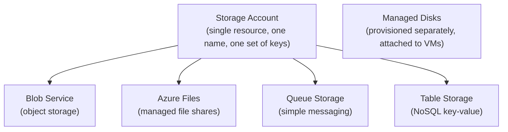

**Exam trap:** students familiar with AWS often assume each Azure storage type is a separate top-level resource like S3/EBS/EFS/SQS are. It isn't. You create **one Storage Account**, and Blob/Files/Queue/Table are **services within it**, sharing the same account name, access keys, and (mostly) the same redundancy/performance settings. Managed Disks are the outlier, provisioned on their own, not nested inside a Storage Account.

### 1.1 Storage Account Naming and Limits (Exam-Relevant)

- Name must be **globally unique across all of Azure**, lowercase letters and numbers only, 3-24 characters, no hyphens.
- A single Storage Account can host multiple containers/shares/queues/tables, but there are **subscription-level quotas** on total number of Storage Accounts per region (a soft limit, raisable via support request).
- Each Storage Account has **two access keys** (for key rotation without downtime) plus support for Azure AD-based access and Shared Access Signatures (SAS tokens).

---

## 2. Storage Account Types and Performance Tiers

This is foundational and applies across Blob, Files, Queue, and Table, so cover it before the individual services.

| Account Type | Supports | Performance Tier |
|---|---|---|
| **Standard General-purpose v2** | Blob, Files, Queue, Table | Standard (HDD-backed) |
| **Premium Block Blobs** | Blob only (block and append blobs) | Premium (SSD-backed), low latency |
| **Premium File Shares** | Files only | Premium (SSD-backed) |
| **Premium Page Blobs** | Page blobs only (used for unmanaged VM disks, legacy) | Premium |

**AWS comparison:** this tiering roughly mirrors the difference between S3 Standard and S3 Express One Zone (a newer, more directly comparable low-latency tier), but Azure has offered this Standard/Premium split as a first-class account-type decision for longer, and it's decided at account creation time (mostly immutable), not per-object like S3 storage classes.

---

## 3. Blob Storage (vs S3)

### 3.1 Core Concept

Blob Storage is Azure's object storage service, the direct and closest equivalent to S3.

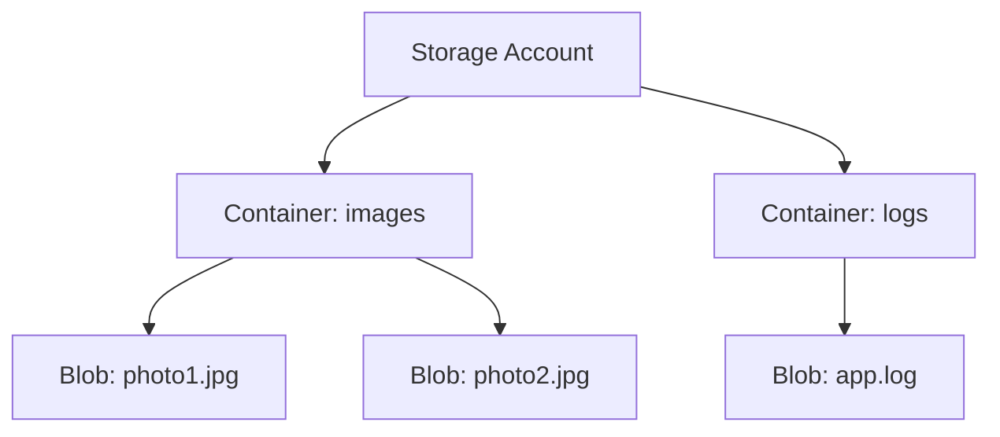

| Concept | S3 | Blob Storage |
|---|---|---|
| Bucket | Bucket | Container |
| Object | Object | Blob |
| Object versioning | Versioning | Blob versioning |
| Lifecycle rules | Lifecycle policies | Lifecycle management policies |
| Static website hosting | S3 static website hosting | Static website hosting (via `$web` container) |
| Event notifications | S3 Event Notifications | Event Grid integration |
| Replication | Cross-Region Replication (CRR) | Object replication (across storage accounts) |
| Soft delete/recovery | S3 Versioning + MFA delete | Soft delete for blobs and containers |

### 3.2 Blob Types (Genuinely New Concept, No Direct S3 Equivalent)

S3 has one object model. Azure Blob Storage has **three distinct blob types**, chosen at write time, this is a real exam and interview topic.

| Blob Type | Use Case | Max Size |
|---|---|---|
| **Block Blob** | Standard object storage: files, images, backups, most common type | Up to ~190.7 TiB |
| **Append Blob** | Optimized for append-only operations (logging scenarios, writing sequentially without rewriting existing data) | Up to ~195 GiB |
| **Page Blob** | Random read/write access, used as the backing store for unmanaged VM disks (legacy, pre-Managed Disks) | Up to 8 TiB |

**Interview-ready explanation:** "Block blobs are what you'd default to for anything comparable to an S3 object, general-purpose file storage. Append blobs are purpose-built for scenarios like continuously writing log entries without re-uploading the whole file. Page blobs are mostly a legacy concept now, since Managed Disks abstract this away, but they still exist for random-access, byte-range read/write patterns."

### 3.3 Access Tiers (Direct Equivalent to S3 Storage Classes)

| Azure Tier | S3 Equivalent | Use Case |
|---|---|---|
| **Hot** | S3 Standard | Frequently accessed data |
| **Cool** | S3 Standard-IA | Infrequently accessed, stored 30+ days |
| **Cold** | S3 Glacier Instant Retrieval | Rarely accessed, stored 90+ days, still needs fast retrieval |
| **Archive** | S3 Glacier Deep Archive | Rarely accessed, hours-long rehydration acceptable, lowest cost |

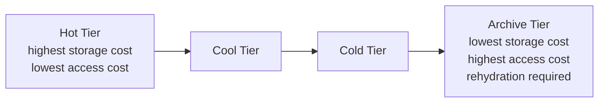

**Exam trap:** moving a blob out of the **Archive** tier requires an explicit **rehydration** operation, which can take **hours**, and you're billed for early-deletion penalties if you move data out before a minimum retention period. This mirrors S3 Glacier's retrieval delay concept closely, but the tier names themselves (Hot/Cool/Cold/Archive) don't map word-for-word to S3's naming (Standard/Standard-IA/Glacier/Glacier Deep Archive), memorize the mapping table above explicitly.

### 3.4 Redundancy Options (Deeper Than S3's Model)

This is one of the richest comparison points on the exam. Azure Blob Storage offers more explicitly named redundancy tiers than S3 does.

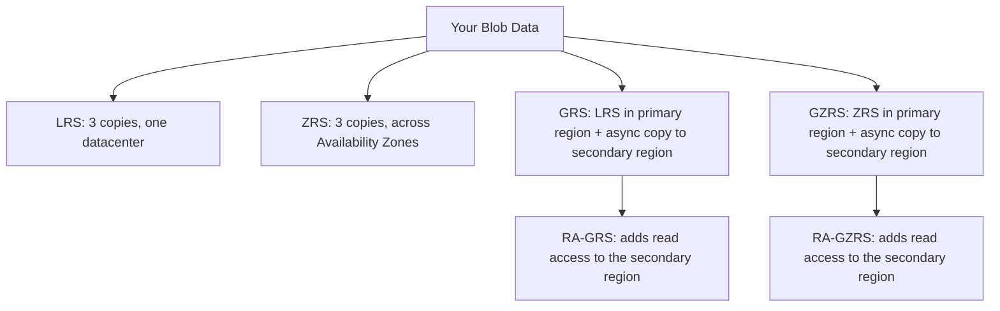

| Redundancy | Copies | Scope | Read access to secondary? |
|---|---|---|---|
| **LRS** (Locally Redundant Storage) | 3 | Single datacenter | No |
| **ZRS** (Zone-Redundant Storage) | 3 | Across Availability Zones in one region | No |
| **GRS** (Geo-Redundant Storage) | 6 (3+3) | Primary region (LRS) + secondary region (async) | No |
| **GZRS** (Geo-Zone-Redundant Storage) | 6 (3+3) | Primary region (ZRS) + secondary region (async) | No |
| **RA-GRS** | 6 (3+3) | Same as GRS | **Yes**, read-only access to secondary |
| **RA-GZRS** | 6 (3+3) | Same as GZRS | **Yes**, read-only access to secondary |

**AWS comparison:** S3 offers Standard (multi-AZ within a region, roughly comparable to ZRS) and Cross-Region Replication as an opt-in feature you configure yourself. Azure bakes geo-replication directly into the storage account's redundancy setting as a first-class, named option, this is a more explicit, menu-driven approach than S3's model, and the RA- prefix (read-access) variants are worth knowing by name since they're commonly tested directly ("what does the RA in RA-GRS stand for").

### 3.5 Blob Access Security

| Mechanism | Purpose | AWS Equivalent |
|---|---|---|
| **Shared Access Signature (SAS)** | Time-limited, scoped token granting access to specific resources without sharing account keys | Pre-signed URLs |
| **Storage Account Access Keys** | Full access to the entire account, should be rotated regularly, avoided in favor of SAS/Azure AD where possible | AWS Access Keys (analogous risk profile) |
| **Azure AD (Entra ID) Authentication** | Role-based access using Azure AD identities instead of keys | IAM roles/policies for S3 access |
| **Private Endpoints** | Access the storage account over a private IP inside your VNet | S3 VPC Endpoints (Gateway/Interface) |

---

## 4. Azure Files (vs EFS)

### 4.1 Core Concept

Azure Files provides fully managed **file shares** accessible via the **SMB** protocol (and NFS for Premium tier), mountable simultaneously from multiple VMs, containers, or on-premises machines.

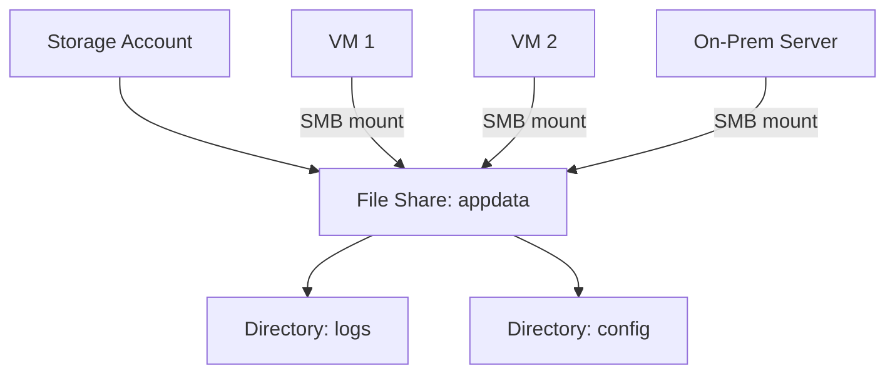

| Concept | EFS | Azure Files |
|---|---|---|
| Protocol | NFS | SMB (standard tier), NFS (premium tier only) |
| Mount target | Mount target per AZ | Direct mount via storage account endpoint |
| On-premises access | Via VPN/Direct Connect + NFS client | Native SMB support, plus **Azure File Sync** for on-prem caching |
| Windows compatibility | Limited (NFS-based, awkward for native Windows use) | **Native**, since SMB is the same protocol Windows file shares use |
| Performance tiers | Standard, One Zone, and performance modes (General Purpose/Max I/O) | Standard (HDD) and Premium (SSD) |

**Key differentiator to state in an interview:** "EFS is NFS-only, which makes it a great fit for Linux workloads but awkward for native Windows file-share scenarios. Azure Files supports SMB natively, which means it can directly replace an on-premises Windows file server, and Azure File Sync lets you cache that data locally on-prem while the source of truth lives in Azure."

### 4.2 Azure File Sync (No Direct AWS Equivalent)

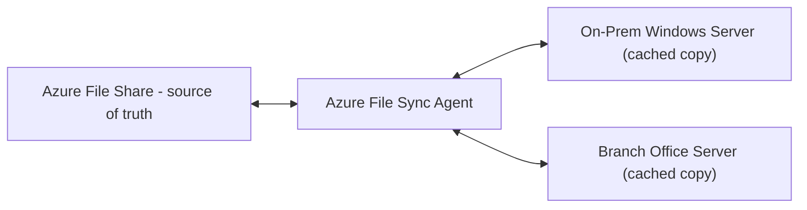

Azure File Sync lets an on-premises Windows Server act as a **cache** for an Azure File Share, with cloud tiering (infrequently accessed files are kept only in the cloud, with a small placeholder on-prem) and multi-site sync. AWS's closest parallel is AWS Storage Gateway (File Gateway mode), but it's architected differently and isn't as tightly integrated with a native file protocol the way Azure File Sync is with SMB. Worth naming explicitly if asked about hybrid file storage scenarios.

---

## 5. Managed Disks (vs EBS)

### 5.1 Core Concept

Managed Disks are Azure's block storage service, attached to VMs, directly analogous to EBS volumes.

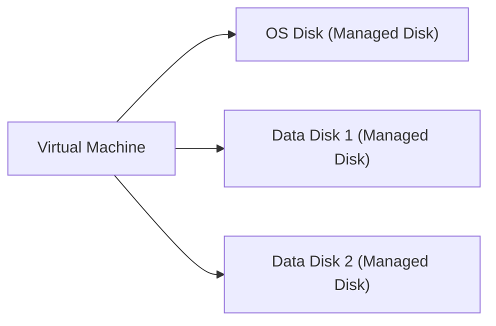

| Concept | EBS | Managed Disk |
|---|---|---|
| Volume types | gp3, io2, st1, sc1 | Standard HDD, Standard SSD, Premium SSD, Ultra Disk |
| Snapshots | EBS Snapshots (stored in S3 internally) | Disk Snapshots |
| Encryption | EBS encryption (KMS) | Azure Disk Encryption / Server-Side Encryption (platform-managed or customer-managed keys) |
| Attach/detach | Attach to one instance at a time (io2 supports Multi-Attach) | Attach to one VM at a time (**shared disks** feature supports multi-VM attach for clustered scenarios) |
| Resizing | Modify volume size/type live | Resize requires deallocating VM first (for some disk types) or live resize (Premium SSD v2/Ultra Disk) |

### 5.2 Disk Tiers Comparison

| Tier | IOPS/Throughput | Use Case | EBS Equivalent |
|---|---|---|---|
| **Standard HDD** | Lowest | Backup, infrequent access, dev/test | `st1`/`sc1` |
| **Standard SSD** | Moderate | Web servers, light enterprise workloads | `gp2`/`gp3` (lower end) |
| **Premium SSD** | High | Production workloads, databases | `gp3` (higher end) |
| **Ultra Disk** | Highest, independently configurable IOPS/throughput | Top-tier databases (SAP HANA, SQL Server), sub-millisecond latency | `io2` Block Express |

**Exam trap:** unlike EBS where you can typically modify volume type/size without stopping the instance, some Azure Managed Disk changes historically required deallocating the VM first. Premium SSD v2 and Ultra Disk support live performance adjustments (IOPS/throughput) without downtime, but switching disk **tier** (e.g., Standard HDD to Premium SSD) on older disk types still generally requires a VM deallocation. Always mention this caveat if asked about live resizing.

### 5.3 Managed Disks Are Not Inside a Storage Account

Worth repeating as its own callout since it's the most common structural mistake: **Managed Disks are provisioned as their own top-level resource**, not nested inside a Storage Account like Blob/Files/Queue/Table. This is a direct architectural difference from the shared-account model covered in Section 1, and a clean way to demonstrate structural understanding in an interview.

---

## 6. Queue Storage (vs SQS)

### 6.1 Core Concept

Queue Storage provides simple, reliable messaging for decoupling application components, directly analogous to SQS.

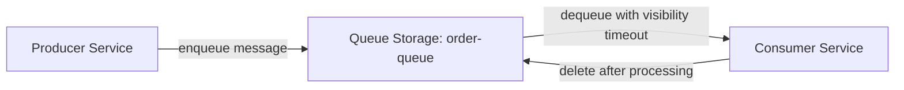

| Concept | SQS | Queue Storage |
|---|---|---|
| Message size limit | 256 KB | 64 KB |
| Visibility timeout | Yes | Yes (same concept: message is hidden from other consumers until processed or timeout expires) |
| FIFO support | Yes, dedicated FIFO queues | **No native FIFO guarantee** in Queue Storage (Service Bus is used instead for ordering, see below) |
| Dead-letter queue | Native DLQ support | No native DLQ in basic Queue Storage; must be built manually or use Service Bus |
| Max queue message retention | Up to 14 days | Up to 7 days (configurable, unlimited in some configurations) |

**Important exam/interview nuance:** Azure actually has **two separate queuing services**, and choosing between them is a common design question:

| Service | Best For | AWS Equivalent |
|---|---|---|
| **Queue Storage** | Simple, high-throughput, low-cost queuing without ordering or advanced features | SQS Standard Queue |
| **Service Bus Queues** | Enterprise messaging: guaranteed FIFO ordering, dead-lettering, transactions, topics/subscriptions (pub-sub) | SQS FIFO Queue + SNS combined, roughly |

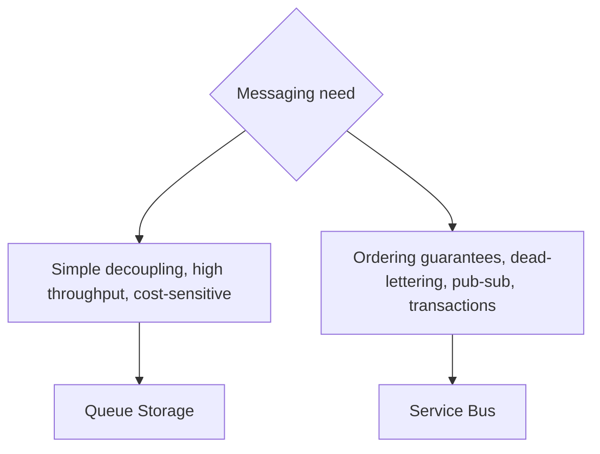

**Interview-ready answer:** "Queue Storage is the direct, lightweight equivalent of SQS Standard, cheap, simple, high-throughput, at-least-once delivery. If I need FIFO ordering, dead-letter queues, or pub-sub topics, comparable to combining SQS FIFO with SNS, I'd reach for Service Bus instead, since Queue Storage doesn't natively support those enterprise messaging features."

---

## 7. Table Storage (vs DynamoDB)

The track title lists this as "Queue Storage vs SQS" without a named AWS pairing for Table Storage, but it's important to cover since it's a distinct exam topic; Table Storage's closest AWS conceptual equivalent is a simplified DynamoDB.

### 7.1 Core Concept

Table Storage is a NoSQL key-value store for structured, non-relational data at massive scale and low cost.

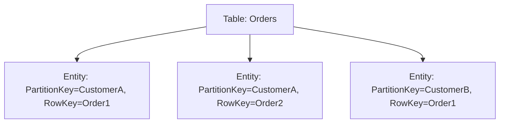

| Concept | DynamoDB | Table Storage |
|---|---|---|
| Item | Item | Entity |
| Primary key | Partition Key + Sort Key | **Partition Key + Row Key** (same two-part model) |
| Throughput model | Provisioned or On-Demand capacity | Pay-per-transaction, no provisioned throughput to configure |
| Secondary indexes | Global/Local Secondary Indexes | **None natively** (must denormalize or use Azure Cosmos DB Table API for this) |
| Global distribution | DynamoDB Global Tables | Not natively; **Cosmos DB Table API** is the upgrade path for this |

**Key positioning to know for the exam:** Table Storage is the low-cost, simpler NoSQL option. If you need global distribution, tunable consistency levels, secondary indexes, or multi-model APIs, the answer is to use **Azure Cosmos DB's Table API**, which is largely wire-compatible with Table Storage but adds these enterprise capabilities. This upgrade path (Table Storage to Cosmos DB Table API) is a very natural interview question: "when would you outgrow Table Storage?"

---

## 8. Full Comparison Table: Azure Storage vs AWS Storage

| Dimension | S3 | EFS | EBS | SQS | DynamoDB (rough) |
|---|---|---|---|---|---|
| Azure equivalent | Blob Storage | Azure Files | Managed Disks | Queue Storage (simple) / Service Bus (enterprise) | Table Storage (simple) / Cosmos DB (enterprise) |
| Lives inside a Storage Account? | Yes (Blob) | Yes (Files) | **No**, separate resource | Yes (Queue) | Yes (Table) |
| Protocol/access model | REST API, SDKs | NFS only | Attached block device | REST API, SDKs | REST API, SDKs |
| Redundancy naming | Standard/CRR (configured features) | Standard/One Zone | Volume-type dependent | Standard (multi-AZ built in) | Multi-AZ/Global Tables |
| Tiering | Storage Classes | Storage Classes | Volume types | N/A | N/A |

---

## 9. Decision Framework for Interviews

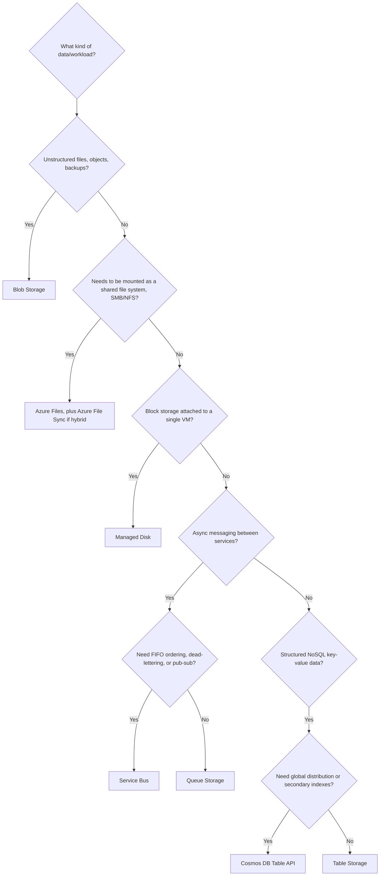

---

## 10. Common Interview and Exam Questions

**Structural:**
1. Which Azure storage services live inside a Storage Account, and which one does not?
2. Name the Storage Account naming constraints, and compare them to S3 bucket naming rules.

**Blob Storage:**
3. What are the three blob types, and when would you use an Append Blob instead of a Block Blob?
4. Map the four Blob access tiers to their closest S3 storage class equivalents.
5. What does the "RA" in RA-GRS stand for, and what capability does it add over GRS?
6. Compare LRS, ZRS, GRS, and GZRS in terms of copy count and geographic scope.

**Azure Files:**
7. Why is Azure Files often preferred over EFS for Windows-based workloads?
8. What is Azure File Sync, and what problem does it solve that a plain Azure File Share doesn't?

**Managed Disks:**
9. Why are Managed Disks structurally different from Blob/Files/Queue/Table in how they're provisioned?
10. Which Managed Disk tier would you choose for a database needing independently configurable IOPS and throughput?

**Queue Storage vs Service Bus:**
11. Why doesn't Queue Storage guarantee FIFO ordering, and what service would you use instead if you needed it?
12. Compare Queue Storage and Service Bus to their closest AWS equivalents.

**Table Storage:**
13. What are the two parts of a Table Storage entity's primary key, and what's the closest DynamoDB concept?
14. When would you outgrow Table Storage and move to Cosmos DB's Table API?

---

## 11. Key Takeaways to Memorize Before the Exam

- **Blob, Files, Queue, and Table Storage all live inside a single Storage Account**; Managed Disks are the one exception, provisioned separately.
- **Three blob types exist** (Block, Append, Page), each for a distinct access pattern, this has no single S3 equivalent.
- **Access tiers**: Hot, Cool, Cold, Archive, map roughly to S3 Standard, Standard-IA, Glacier Instant Retrieval, and Glacier Deep Archive, memorize this pairing explicitly since the names don't match.
- **Redundancy options** (LRS, ZRS, GRS, GZRS, and their RA- variants) are more explicitly named and menu-driven in Azure than in S3, know what each acronym expands to and what it guarantees.
- **Azure Files supports native SMB** (Windows-friendly), unlike EFS's NFS-only model; **Azure File Sync** is a genuinely new hybrid-caching concept with no direct AWS parallel.
- **Queue Storage vs Service Bus** is a real architectural decision: Queue Storage for simple/cheap/high-throughput, Service Bus for FIFO ordering, dead-lettering, and pub-sub, roughly mirroring the SQS Standard vs SQS FIFO+SNS distinction.
- **Table Storage's upgrade path is Cosmos DB's Table API**, when you need global distribution, secondary indexes, or tunable consistency.

Next note in this track: **Azure Networking Basics**, covering VNet, Subnets, NSGs, Load Balancer, Application Gateway, and Azure DNS, mapped against VPC, Security Groups, ALB/NLB, and Route 53.
