# Written and maintained by Vilas Varghese

# Azure Networking Basics

## How to Use This Note

Networking is where AWS engineers hit the most subtle gotchas moving to Azure, the concepts feel identical on the surface (VNet looks like VPC, NSG looks like Security Groups) but several behave differently underneath in ways that show up directly in exam questions and interview scenario prompts. This note covers **VNet, Subnets, NSGs, Azure Load Balancer, Application Gateway, and Azure DNS**, each mapped to its AWS equivalent, with explicit callouts wherever the mapping breaks down.

---

## 1. The Networking Stack Overview

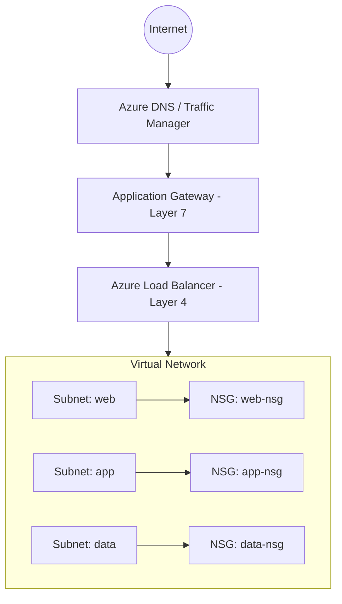

| Layer | AWS | Azure |
|---|---|---|
| DNS | Route 53 | Azure DNS |
| Global traffic routing | Route 53 (latency/geo routing) + CloudFront | Traffic Manager (DNS-based) + Front Door (application-layer) |
| Layer 7 load balancing | Application Load Balancer (ALB) | Application Gateway |
| Layer 4 load balancing | Network Load Balancer (NLB) | Azure Load Balancer |
| Network isolation | VPC | Virtual Network (VNet) |
| Network segmentation | Subnet | Subnet |
| Instance/subnet-level firewall | Security Group / NACL | Network Security Group (NSG) |

---

## 2. Virtual Network (VNet) vs VPC

### 2.1 Core Concept

A VNet is Azure's isolated network space, directly analogous to a VPC: you define an IP address range, carve it into subnets, and control routing and connectivity.

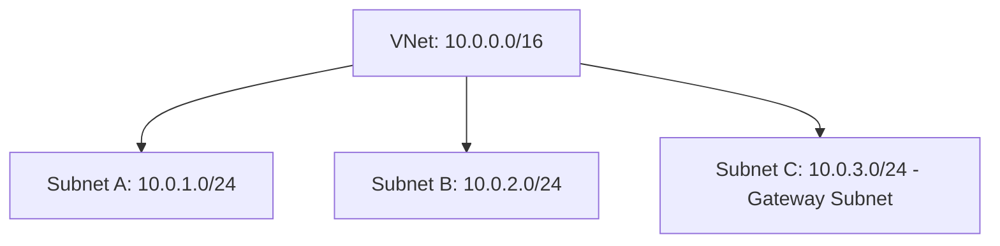

| Concept | VPC | VNet |
|---|---|---|
| Address space | CIDR block at creation | Address space (CIDR) at creation, can add more later |
| Subnetting | Manual, per-AZ subnets | Manual subnets, **not tied to a specific zone at creation** |
| Default deny/allow | Default deny inbound, default allow outbound (via Security Groups) | Same default behavior via NSGs |
| Peering | VPC Peering | VNet Peering |
| Cross-region connectivity | Transit Gateway / VPC Peering (region-to-region) | VNet Peering (Global) / Virtual WAN |
| On-prem connectivity | Direct Connect + VPN Gateway | ExpressRoute + VPN Gateway |
| Private connectivity to PaaS services | VPC Endpoints (Gateway/Interface) | **Service Endpoints** and **Private Endpoints** |

### 2.2 Critical Structural Difference: Subnets Are Not Zone-Bound

**This is one of the most important exam traps in Azure networking.** In AWS, a subnet is explicitly created within a single Availability Zone, if you want multi-AZ redundancy, you create multiple subnets, one per AZ, and distribute resources across them.

In Azure, **a subnet spans the entire region**, it is not tied to a specific Availability Zone. Zone placement for a resource (like a VM) is chosen independently, at the resource level, not by which subnet you place it in.

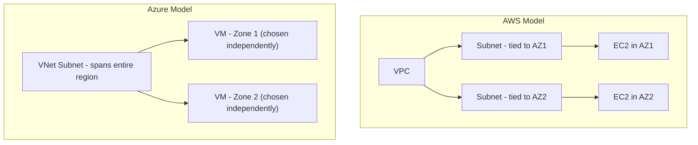

**Interview-ready explanation:** "In AWS, achieving multi-AZ redundancy means creating a subnet per AZ. In Azure, one subnet already spans all zones in the region, so I don't need a separate subnet per zone, I just specify the zone number on the resource itself, like a VM or a zone-redundant service. This trips up a lot of AWS engineers who instinctively try to create three subnets for three zones in Azure and find there's no zone parameter on the subnet creation blade at all."

### 2.3 VNet Peering vs VPC Peering

| Feature | VPC Peering | VNet Peering |
|---|---|---|
| Transitive routing | No (must peer explicitly, or use Transit Gateway) | No (must peer explicitly, or use Virtual WAN/hub-spoke) |
| Cross-region | Yes (inter-region peering) | Yes (Global VNet Peering) |
| Overlapping CIDR | Not allowed | Not allowed |
| Bandwidth | Depends on instance type | Uses the Microsoft backbone, generally high throughput between peered VNets |

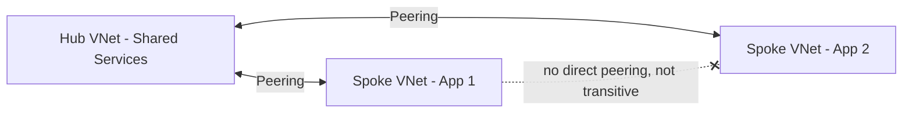

**Exam trap:** just like VPC Peering, VNet Peering is **not transitive**. If VNet A peers with VNet B, and VNet B peers with VNet C, A cannot reach C through B automatically. The standard solution, called the **Hub-and-Spoke topology**, uses a central hub VNet (often containing a firewall/NVA) that all spoke VNets peer with, and routes are configured through the hub via **User-Defined Routes (UDRs)**.

### 2.4 Service Endpoints vs Private Endpoints (No Single Clean AWS Parallel)

This is a nuanced area where Azure splits a concept AWS handles somewhat differently.

| Mechanism | What it does | Traffic path | Closest AWS Concept |
|---|---|---|---|
| **Service Endpoint** | Extends your VNet's identity to a PaaS service (e.g., Storage Account), traffic still uses the service's public IP but is routed over the Microsoft backbone and can be restricted to the VNet | Stays on Microsoft backbone, but the target still has a public endpoint | VPC Gateway Endpoint (for S3/DynamoDB) |
| **Private Endpoint** | Assigns the PaaS service a **private IP address inside your VNet**, traffic never touches the public internet or even the service's public endpoint | Fully private, resource gets an actual NIC/IP in your subnet | VPC Interface Endpoint (PrivateLink) |

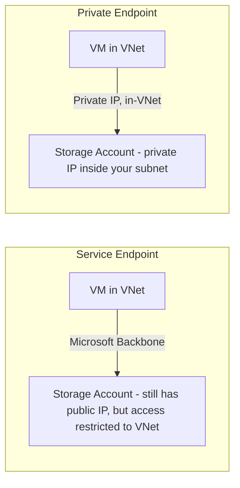

**Interview-ready distinction:** "A Service Endpoint is like AWS's Gateway Endpoint for S3, it keeps traffic off the public internet and lets you restrict access to your VNet, but the target service still technically has a public IP. A Private Endpoint is Azure's equivalent of AWS PrivateLink/Interface Endpoints, the service actually gets a private IP address inside my subnet, so it's genuinely part of my private network, not just reachable privately."

---

## 3. Network Security Groups (NSG) vs Security Groups

### 3.1 Core Concept

NSGs filter inbound and outbound traffic using allow/deny rules, applied at either the **subnet level** or the **network interface (NIC) level**.

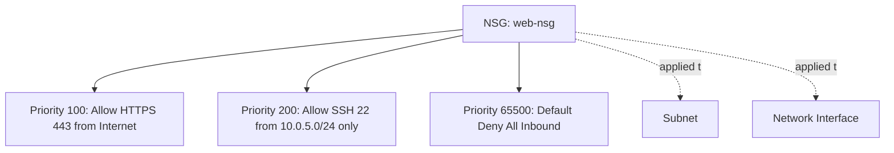

| Concept | AWS Security Group | NSG |
|---|---|---|
| Statefulness | Stateful (return traffic automatically allowed) | Stateful (same behavior) |
| Applied to | ENI/instance only | **Subnet or NIC** (can apply at both levels simultaneously) |
| Rule evaluation | All rules evaluated, allow-only (no explicit deny rules) | **Explicit allow AND deny rules**, evaluated in **priority order** (lowest number wins) |
| Default rules | Implicit default deny inbound | Explicit default rules always present (cannot be deleted, only overridden by higher-priority custom rules) |

### 3.2 The Biggest Difference: Explicit Priority-Based Rules

This is a **guaranteed exam topic** and a common point of confusion. AWS Security Groups are **allow-only**, you can't write a "deny" rule, you simply don't add an allow rule for traffic you want blocked. Azure NSGs support **both explicit allow and explicit deny rules**, and every rule has a **priority number (100-4096, lower number = higher priority)**. The first rule that matches, in priority order, wins, evaluation stops there.

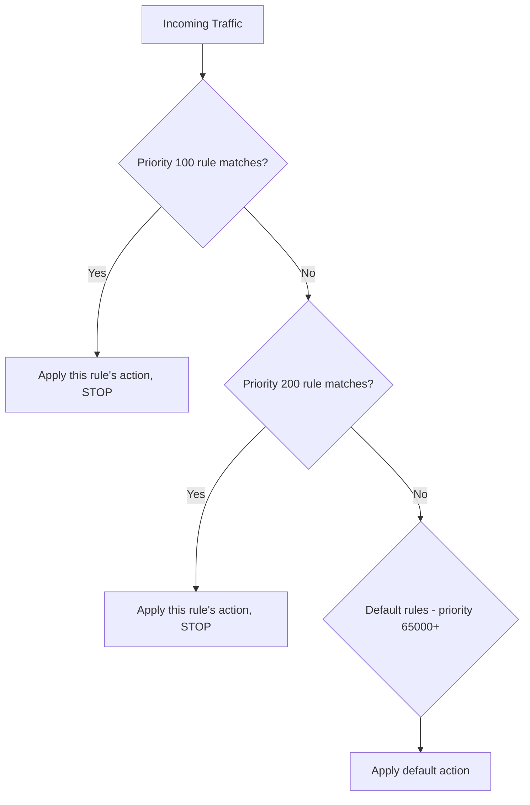

**Default NSG rules that always exist** (cannot be removed, only overridden):

| Priority | Direction | Rule |
|---|---|---|
| 65000 | Inbound | Allow all traffic from within the VNet (VNet-to-VNet) |
| 65001 | Inbound | Allow inbound from Azure Load Balancer health probes |
| 65500 | Inbound | Deny all other inbound traffic |
| 65000 | Outbound | Allow all traffic within the VNet |
| 65001 | Outbound | Allow all outbound to the Internet |
| 65500 | Outbound | Deny all other outbound traffic |

**Exam trap:** the default outbound rule **allows all outbound internet traffic** by default, unlike a fresh AWS Security Group where you must add outbound rules explicitly too (though AWS's default Security Group does also allow all outbound by default, so this one is actually similar, the key difference to remember is the *deny rule capability* and *priority ordering*, not the default posture itself).

### 3.3 NSG Applied at Two Levels Simultaneously

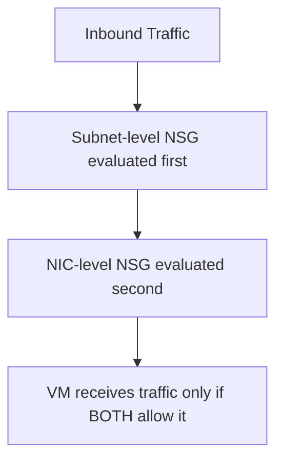

If an NSG is applied at both the subnet and the NIC level, traffic must be allowed by **both** to reach the VM, this layered evaluation has no direct AWS Security Group parallel (Security Groups apply only at the ENI level; NACLs are the closest AWS analog to subnet-level filtering, and NACLs are stateless while NSGs are stateful, an important distinction to hold onto).

**Cleanest interview summary:** "NSGs combine some of what Security Groups do and some of what NACLs do. Like Security Groups, they're stateful. Like NACLs, they support explicit deny rules and can be applied at the subnet level. Unlike either, a single NSG can be applied at both subnet and NIC level at once, and priority numbers determine which rule wins."

---

## 4. Azure Load Balancer vs NLB/ALB

Azure splits Layer 4 and Layer 7 load balancing into two separate named products, similar in spirit to AWS's NLB/ALB split.

### 4.1 Azure Load Balancer (Layer 4) vs NLB

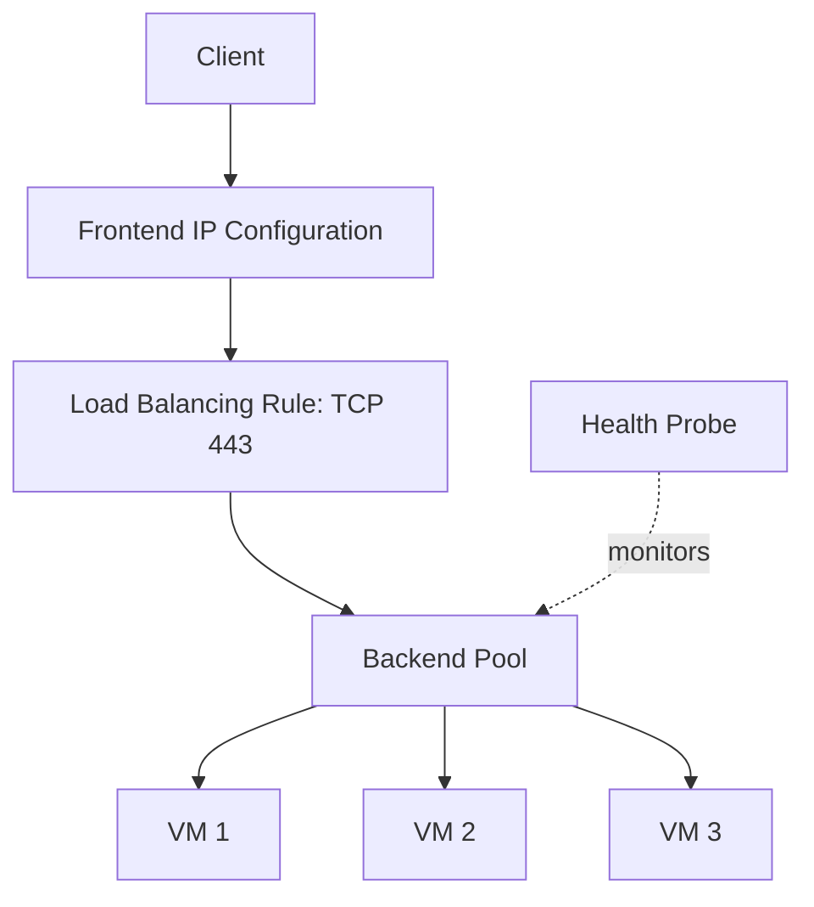

| Concept | NLB | Azure Load Balancer |
|---|---|---|
| OSI Layer | Layer 4 (TCP/UDP) | Layer 4 (TCP/UDP) |
| Public or internal | Internet-facing or internal | **Public** or **Internal** SKU, chosen explicitly at creation |
| Pricing tiers | Single tier | **Basic** and **Standard** SKU (Basic is being retired, Standard is the modern default) |
| Cross-zone load balancing | Optional toggle | Standard SKU is zone-redundant by default when configured with a zone-redundant frontend IP |
| Static IP | Elastic IP association | Static Public IP SKU (Standard) |

**Exam trap:** Azure Load Balancer's **Basic SKU is being deprecated** (retirement announced), and it lacks Availability Zone support entirely. Always default to recommending the **Standard SKU** in any design answer, this is a safe, forward-looking, and correct exam answer.

### 4.2 Application Gateway (Layer 7) vs ALB

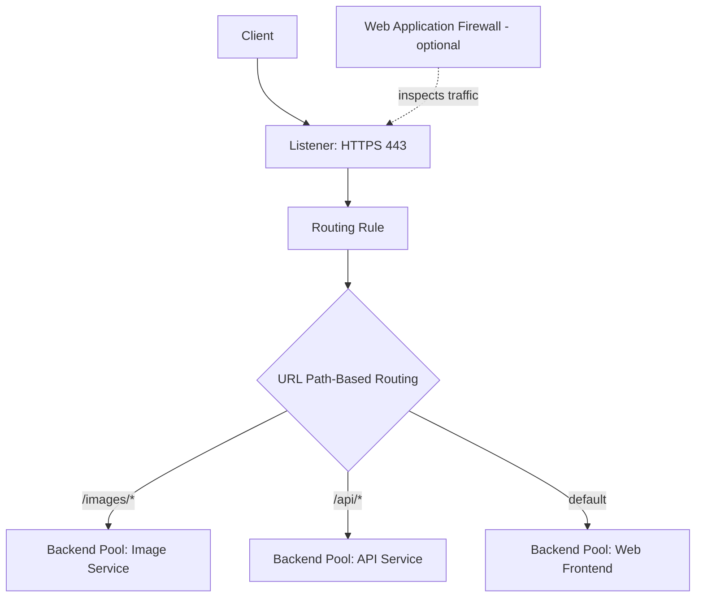

| Concept | ALB | Application Gateway |
|---|---|---|
| OSI Layer | Layer 7 (HTTP/HTTPS) | Layer 7 (HTTP/HTTPS) |
| Path-based routing | Yes (listener rules) | Yes (URL path maps) |
| Host-based routing | Yes | Yes (multi-site listeners) |
| SSL termination | Yes | Yes |
| Web Application Firewall | Separate service: AWS WAF, attached to ALB | **Built-in optional SKU**: Application Gateway WAF SKU/WAF v2 |
| Autoscaling | Handled automatically by AWS | **Autoscaling v2 SKU** available, must be selected explicitly |
| Session affinity | Sticky sessions via cookie | Cookie-based affinity (same concept) |

**Key difference to highlight in an interview:** "In AWS, WAF is a separate service you attach to an ALB. In Azure, the Web Application Firewall is offered as an integrated SKU option directly on Application Gateway itself, WAF_v2, so it's more tightly bundled into the same resource rather than a standalone service you wire in separately."

### 4.3 Decision Framework: Load Balancer vs Application Gateway

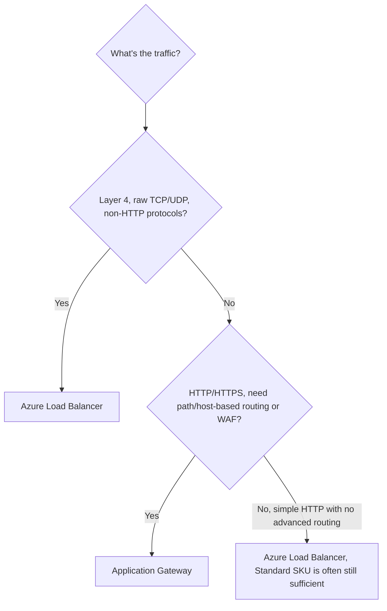

---

## 5. Azure DNS and Traffic Manager vs Route 53

### 5.1 Azure DNS (vs Route 53's DNS hosting function)

Azure DNS hosts DNS zones and resolves domain names, the direct equivalent of Route 53's DNS hosting.

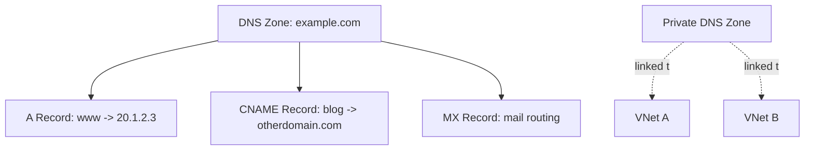

| Concept | Route 53 | Azure DNS |
|---|---|---|
| Public DNS zones | Hosted Zone (public) | DNS Zone |
| Private DNS (internal to VNet) | Private Hosted Zone | **Private DNS Zone**, explicitly linked to one or more VNets |
| Record types | Standard record types + Alias records | Standard record types (no "Alias" concept; instead, use an **Alias record set** pointing to certain Azure resources directly) |
| Health checks tied to DNS | Route 53 Health Checks + failover routing | Not built into Azure DNS directly, **Traffic Manager** handles this instead |

### 5.2 Traffic Manager vs Route 53 Routing Policies

This is where the mapping diverges structurally. Route 53 bundles DNS hosting *and* intelligent routing policies (latency-based, geolocation, weighted, failover) into one service. Azure splits this: **Azure DNS** handles plain DNS hosting, and **Traffic Manager** handles intelligent, policy-based DNS routing as a separate product.

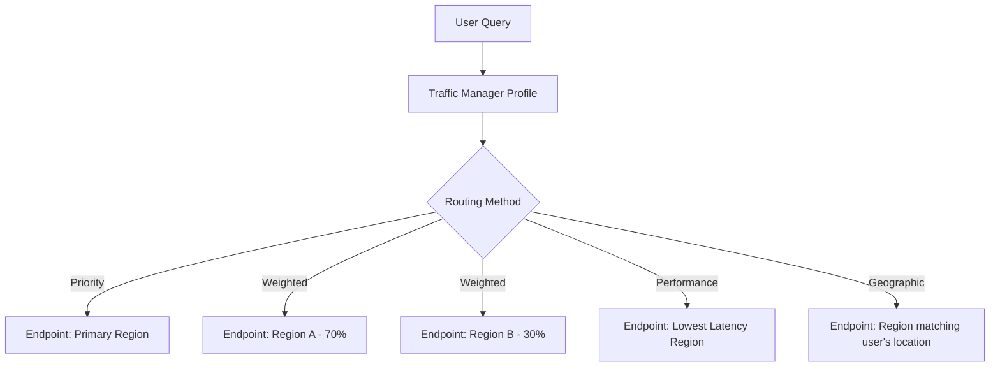

| Traffic Manager Routing Method | Route 53 Equivalent |
|---|---|
| Priority | Failover routing policy |
| Weighted | Weighted routing policy |
| Performance | Latency-based routing policy |
| Geographic | Geolocation routing policy |
| Multivalue | Multivalue answer routing policy |
| Subnet | No direct Route 53 equivalent (routes based on the requester's IP range mapping) |

**Important limitation to know for the exam:** Traffic Manager operates purely at the **DNS level**, it directs clients to different endpoints by resolving DNS queries differently, but it does not proxy or inspect actual traffic. This is identical in principle to how Route 53 routing policies work (DNS-level direction, not actual traffic passthrough), so this part of the mental model transfers cleanly.

### 5.3 Where Azure Front Door Fits (The CDN + Layer 7 Global Router)

Since students already know CloudFront, it's worth placing **Azure Front Door** correctly here rather than leaving a gap: Front Door is Azure's global, application-layer (Layer 7) load balancer and CDN combined, operating at the HTTP/HTTPS layer with actual traffic proxying (unlike Traffic Manager's DNS-only approach).

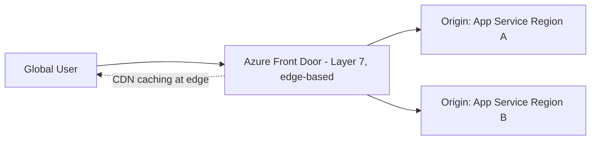

| Capability | CloudFront | Front Door |
|---|---|---|
| CDN/edge caching | Yes | Yes |
| Layer 7 global load balancing with actual proxying | Via CloudFront + Lambda@Edge/origin groups | Native, built-in |
| WAF integration | AWS WAF attached to CloudFront | Front Door WAF policies, built-in |
| DNS-only routing (no proxying) | Not this service (that's Route 53's job) | Not this service (that's Traffic Manager's job) |

**Full picture worth stating explicitly in an interview:** "Azure splits what CloudFront and Route 53 do across three services: Azure DNS handles plain DNS hosting, Traffic Manager handles DNS-level intelligent routing without proxying traffic, and Front Door handles actual Layer 7 proxying with CDN caching and WAF, closer to what CloudFront plus Route 53 latency routing would give you combined."

---

## 6. Full Networking Comparison Table

| Dimension | AWS | Azure | Key Difference to Remember |
|---|---|---|---|
| Virtual network | VPC | VNet | Subnets are region-wide in Azure, not AZ-bound |
| Segmentation | Subnet (AZ-bound) | Subnet (region-wide) | Zone chosen per-resource in Azure, not per-subnet |
| Instance-level firewall | Security Group | NSG (NIC-level) | NSG supports explicit deny; SG is allow-only |
| Subnet-level firewall | NACL (stateless) | NSG (subnet-level, stateful) | Azure uses one construct (NSG) for both levels; AWS uses two (SG + NACL) |
| Private access to PaaS | Gateway Endpoint / Interface Endpoint (PrivateLink) | Service Endpoint / Private Endpoint | Same two-tier split, different names |
| Layer 4 load balancing | NLB | Azure Load Balancer | Use Standard SKU always, Basic is deprecated |
| Layer 7 load balancing | ALB | Application Gateway | WAF is a bundled SKU option in Azure, a separate service in AWS |
| DNS hosting | Route 53 (hosting + routing combined) | Azure DNS (hosting only) | Azure splits routing logic into Traffic Manager |
| Intelligent DNS routing | Route 53 routing policies | Traffic Manager | Same routing method concepts, different product boundary |
| Global CDN + Layer 7 proxy | CloudFront (+ Route 53 for routing) | Azure Front Door | Front Door actually proxies traffic; Traffic Manager does not |
| VPC/VNet interconnect | VPC Peering / Transit Gateway | VNet Peering / Virtual WAN | Both non-transitive by default, both use hub-spoke pattern |

---

## 7. Reference Architecture: Putting It All Together

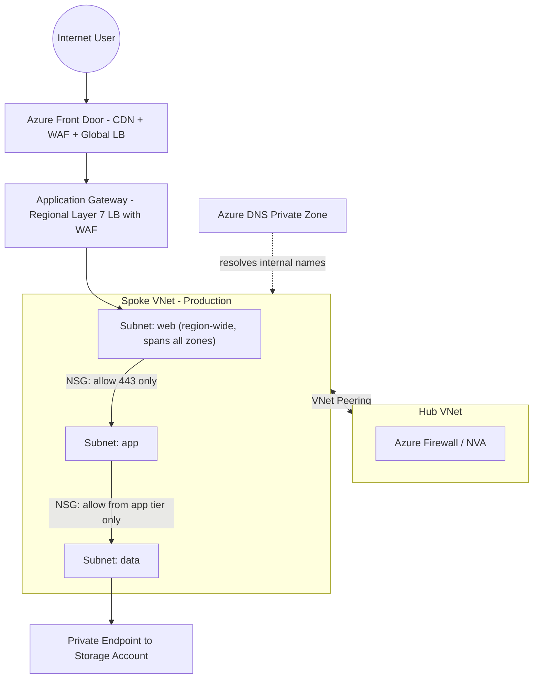

**Narrate this top to bottom in class:** global traffic hits Front Door first (CDN caching, WAF, global routing), then Application Gateway for regional Layer 7 routing and its own WAF layer, into a spoke VNet with tiered subnets protected by NSGs at each boundary, connected to a hub VNet for centralized firewall/egress control, with private endpoints keeping data-tier PaaS access off the public internet entirely.

---

## 8. Common Interview and Exam Questions

**VNet and Subnets:**
1. Is an Azure subnet tied to a specific Availability Zone? How does this differ from an AWS subnet, and what does it mean for how you design for multi-zone availability?
2. Is VNet Peering transitive? What pattern do you use to work around this limitation?
3. What's the difference between a Service Endpoint and a Private Endpoint?

**NSG:**
4. How does an NSG's rule evaluation differ from a Security Group's? What role does priority play?
5. Can an NSG be applied at both the subnet and NIC level simultaneously? What happens if they conflict?
6. Name the six default NSG rules that always exist and cannot be deleted.

**Load Balancing:**
7. Why should you always choose the Standard SKU over Basic SKU for Azure Load Balancer in a new design?
8. When would you choose Application Gateway over Azure Load Balancer?
9. Where does Web Application Firewall live in Azure's Layer 7 load balancing story, compared to how AWS WAF attaches to an ALB?

**DNS and Global Routing:**
10. Why does Azure split DNS hosting (Azure DNS) and intelligent routing (Traffic Manager) into two products, when Route 53 combines both?
11. What's the fundamental architectural difference between Traffic Manager and Azure Front Door?
12. Map each Traffic Manager routing method to its Route 53 routing policy equivalent.

---

## 9. Key Takeaways to Memorize Before the Exam

- **Azure subnets span the entire region and are not tied to an Availability Zone**, this is the single most important structural difference from AWS's AZ-bound subnet model; zone placement happens at the resource level instead.
- **NSGs support explicit allow AND deny rules evaluated by priority number** (lower wins), unlike AWS Security Groups which are allow-only; NSGs can be applied at both subnet and NIC level simultaneously.
- **Service Endpoints keep traffic on the Microsoft backbone but the target keeps a public IP; Private Endpoints give the PaaS service an actual private IP in your VNet**, mirroring the Gateway Endpoint vs Interface Endpoint (PrivateLink) split in AWS.
- **Always default to Standard SKU for Azure Load Balancer**, Basic SKU is deprecated and lacks zone support.
- **Web Application Firewall is a bundled SKU on Application Gateway**, not a separate attached service the way AWS WAF is with ALB.
- **Azure splits Route 53's combined DNS-hosting-plus-routing model into three products**: Azure DNS (hosting), Traffic Manager (DNS-level intelligent routing, no proxying), and Front Door (actual Layer 7 proxying with CDN and WAF, closest to CloudFront).
- **VNet Peering is non-transitive**, just like VPC Peering; use hub-and-spoke topology with User-Defined Routes for multi-VNet architectures needing centralized routing/firewalling.

Next note in this track: **Azure Identity Fundamentals**, covering Azure AD (Entra ID), RBAC, and Conditional Access, mapped against IAM users, roles, and policies.
