# Written and maintained by Vilas Varghese

# Azure Database Services: Azure SQL Database, Cosmos DB, PostgreSQL/MySQL vs RDS, DynamoDB

**Topic:** Azure Database Services Fundamentals and comparison with AWS Database Services
**Duration:** ~120 minutes
**Audience:** Beginners with some AWS exposure, preparing for AZ-900

**Learning Objectives:** By the end of this session, learners will be able to:
- Explain the difference between relational and NoSQL database models
- Describe Azure SQL Database deployment options and purchasing models
- Describe Azure Database for PostgreSQL/MySQL and when to use it
- Explain Azure Cosmos DB's multi-model, globally distributed architecture
- Map Azure database services to their AWS equivalents (RDS, DynamoDB)
- Answer AZ-900 exam questions confidently on this topic

---

## 1. Cold Open + Roadmap
**(Timing: 0:00 - 0:05)**

Every application needs somewhere to put its data. The question is never "should I use a database," it's "which kind of database, and who manages it?"

In the old world, you'd install SQL Server on a physical machine, patch it yourself, back it up yourself, scale it yourself. In the cloud, you get to hand most of that work off. Azure offers a whole family of **managed database services** so you can focus on your application, not on babysitting database infrastructure.

If you've touched AWS, you already know **Amazon RDS** (managed relational databases) and **DynamoDB** (managed NoSQL). Azure's equivalents are **Azure SQL Database**, **Azure Database for PostgreSQL/MySQL**, and **Azure Cosmos DB**. Today we go deep on all of them, and map every concept back to AWS.

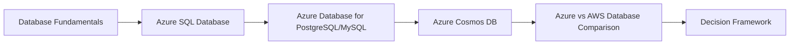

Think of it like choosing a place to live. A **relational database** is like a house with a fixed floor plan, rooms (tables) with clearly defined purposes, and strict rules about what goes where (schema). A **NoSQL database** is like a flexible loft space, you can reconfigure the layout on the fly, store odd-shaped furniture (unstructured data), and expand rapidly without renovating.

> **Exam Tip:** AZ-900 frequently tests whether you know which Azure service is "fully managed PaaS" versus "you manage the OS/patching yourself" (IaaS, e.g., SQL Server on a VM). All the services discussed today are PaaS: Azure handles patching, backups, and high availability for you.

---

## 2. Database Fundamentals on Azure
**(Timing: 0:05 - 0:15)**

### 2.1 Relational vs NoSQL

| Aspect | Relational (SQL) | NoSQL |
|---|---|---|
| Data structure | Tables, rows, columns, fixed schema | Flexible: documents, key-value, graph, wide-column |
| Relationships | Enforced via foreign keys, joins | Typically denormalized, minimal joins |
| Scaling approach | Primarily vertical (bigger machine), some horizontal via sharding | Primarily horizontal (scale out across nodes) |
| Best for | Transactional systems, structured data, complex queries | High-velocity, high-volume, flexible-schema, globally distributed apps |
| Azure Examples | Azure SQL Database, Azure Database for PostgreSQL/MySQL | Azure Cosmos DB |
| AWS Examples | Amazon RDS | Amazon DynamoDB |

### 2.2 Where Do Azure's Managed Database Services Sit?

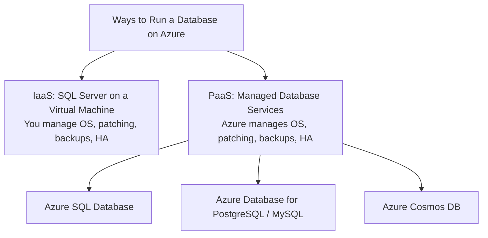

> **Exam Tip:** If a scenario says "the customer wants full control over the OS and patching schedule," that's IaaS (SQL Server on a VM). If it says "the customer wants Microsoft to handle patching, backups, and HA automatically," that's PaaS (Azure SQL Database, Azure Database for PostgreSQL/MySQL, or Cosmos DB). This IaaS vs PaaS distinction is one of the most reliable ways to eliminate wrong answers.

### 2.3 The Shared Responsibility Angle for Databases

| Responsibility | IaaS (SQL on VM) | PaaS (Azure SQL Database, PostgreSQL, MySQL, Cosmos DB) |
|---|---|---|
| OS patching | You | Microsoft |
| Database engine patching | You | Microsoft |
| Backups | You configure and manage | Automatic, built-in |
| High availability | You architect (e.g., Always On) | Built-in, configurable tiers |
| Scaling | You resize the VM/manage sharding | Built-in scaling options (vCore, RU, compute tiers) |

---

## 3. Azure SQL Database Deep Dive
**(Timing: 0:15 - 0:35)**

### 3.1 What is Azure SQL Database?

**Azure SQL Database** is a fully managed relational database-as-a-service built on the SQL Server engine. It handles patching, backups, high availability, and most administrative tasks automatically, letting you focus purely on schema design and queries.

### 3.2 Deployment Options

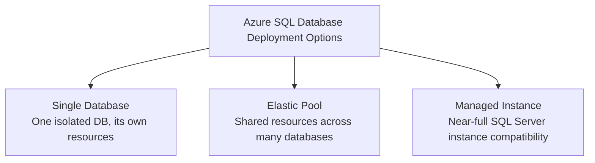

| Option | Best For | Key Trait |
|---|---|---|
| **Single Database** | One app, one isolated database | Simplest option, own dedicated resources |
| **Elastic Pool** | Many databases with unpredictable/variable usage (e.g., SaaS with one DB per customer) | Databases share a pool of resources, cost-efficient at scale |
| **Managed Instance** | Lift-and-shift from on-premises SQL Server, needs instance-level features (cross-database queries, SQL Agent) | Highest compatibility with traditional SQL Server |

> **Exam Tip:** "A company is migrating an on-premises SQL Server with minimal code changes and needs cross-database queries." Answer: **Managed Instance**, not Single Database.

### 3.3 Purchasing Models

| Model | How It Works | Best For |
|---|---|---|
| **DTU-based (Database Transaction Unit)** | Bundled measure of compute, storage, and I/O in preset tiers (Basic, Standard, Premium) | Simpler, predictable workloads, easier to get started |
| **vCore-based** | You choose compute and storage independently, choose generation of hardware | Granular control, better cost optimization for varied workloads, supports Azure Hybrid Benefit (bring your own SQL Server license) |

> **Exam Tip:** vCore model supports **Azure Hybrid Benefit**, letting you reuse existing on-premises SQL Server licenses to reduce cost. This is a specific exam-favorite detail.

### 3.4 Built-in High Availability and Backups

- Automatic backups with **point-in-time restore** (typically 7-35 days retention depending on tier)
- Built-in high availability architecture (multiple replicas maintained automatically behind the scenes)
- Geo-replication options for disaster recovery across regions

### 3.5 Portal Walkthrough: Create a SQL Database

1. Sign in to `portal.azure.com`
2. Search for **SQL databases**, click **+ Create**
3. Select your **Subscription** and **Resource Group**
4. Enter a **Database name**, and create or select a **Server** (this is the logical server hosting your database)
5. Choose **Compute + storage**: pick DTU-based or vCore-based tier
6. Under **Networking**, choose public or private endpoint access
7. Click **Review + Create**, then **Create**

---

## 4. Azure Database for PostgreSQL / MySQL Deep Dive
**(Timing: 0:35 - 0:50)**

### 4.1 What Are These Services?

**Azure Database for PostgreSQL** and **Azure Database for MySQL** are fully managed database services for these popular open-source relational engines. If your application already uses PostgreSQL or MySQL (common with open-source stacks, Django, Node.js apps, WordPress, etc.), these services let you migrate with minimal code changes while Azure handles the operational burden.

### 4.2 Deployment Model: Flexible Server

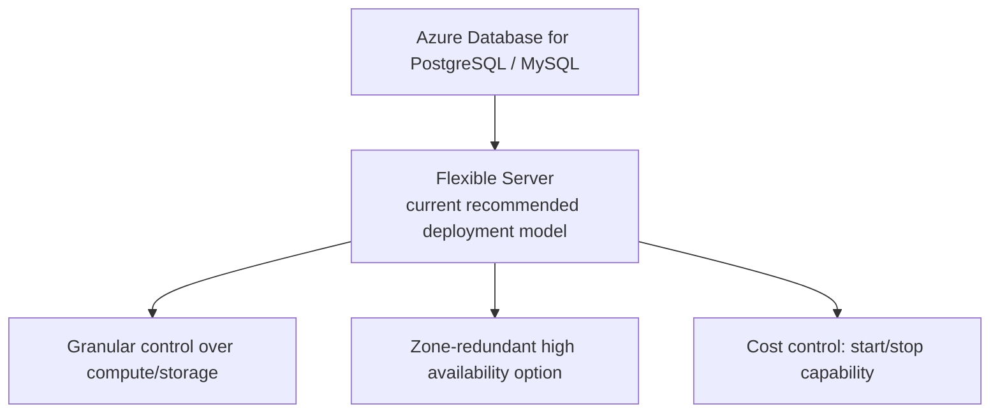

> **Exam Tip:** Microsoft has moved to **Flexible Server** as the modern deployment option for both PostgreSQL and MySQL (the older "Single Server" option is being retired). If the exam mentions granular control over maintenance windows, or the ability to stop/start the server to save cost, that's Flexible Server.

### 4.3 Why Choose These Over Azure SQL Database?

| Scenario | Better Choice |
|---|---|
| App is already built on Microsoft SQL Server / T-SQL | Azure SQL Database |
| App is already built on PostgreSQL or MySQL, open-source stack | Azure Database for PostgreSQL/MySQL |
| Migrating from on-premises SQL Server, need high instance compatibility | Azure SQL Managed Instance |

> **Exam Tip:** These three services are NOT interchangeable, they support different database engines. The exam tests recognition of "which engine does this Azure service support," don't assume they're all just "generic SQL."

### 4.4 Portal Walkthrough: Create an Azure Database for PostgreSQL Flexible Server

1. Search for **Azure Database for PostgreSQL flexible servers**, click **+ Create**
2. Select **Subscription**, **Resource Group**, and **Region**
3. Enter a **Server name** and **Admin username/password**
4. Choose **Compute + storage** tier (Burstable, General Purpose, Memory Optimized)
5. Configure **Networking** (public access or private VNet integration)
6. Click **Review + Create**, then **Create**

---

## 5. Azure Cosmos DB Deep Dive
**(Timing: 0:50 - 1:10)**

### 5.1 What is Cosmos DB?

**Azure Cosmos DB** is Azure's globally distributed, multi-model NoSQL database service. It's built for applications that need extremely low latency, elastic scalability, and the ability to run reliably across multiple regions worldwide, with strong guarantees around availability and performance.

### 5.2 Multi-Model: Multiple APIs, One Engine

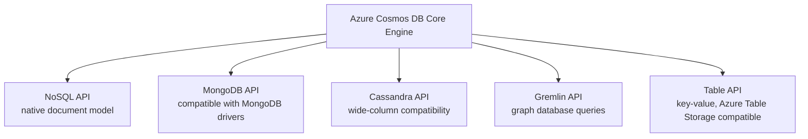

This is a defining feature: you pick the API that matches your application's existing data model or driver ecosystem, but underneath, it's all running on the same Cosmos DB engine with the same global distribution and scaling guarantees.

> **Exam Tip:** A common exam trap is assuming Cosmos DB is only a document database. Remember: it's multi-model, supporting document, key-value, graph, and wide-column via different APIs.

### 5.3 Global Distribution and Multi-Region Writes

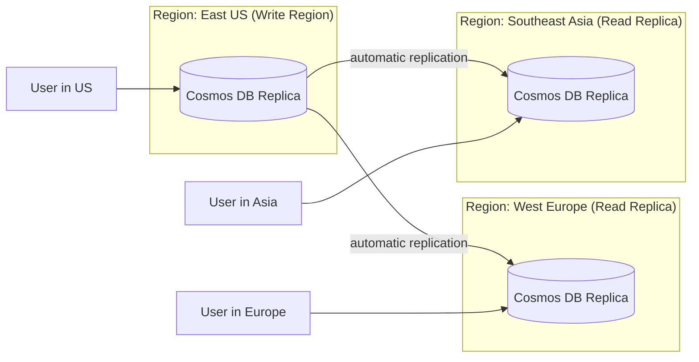

With a few clicks, you can add regions to a Cosmos DB account, and data automatically replicates. Optionally, you can enable **multi-region writes**, letting every region accept writes (not just reads), useful for globally distributed applications needing low write latency everywhere.

### 5.4 Consistency Levels: The Spectrum

Cosmos DB offers five consistency levels, letting you tune the tradeoff between consistency and performance/latency:

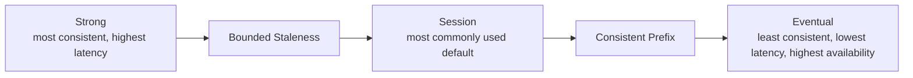

| Level | Guarantee | Tradeoff |
|---|---|---|
| **Strong** | Reads always return the most recent committed write | Highest latency, lowest availability during network partition |
| **Bounded Staleness** | Reads lag behind writes by a bounded time/version window | Configurable staleness window |
| **Session** (default) | Within a single client session, reads always see your own writes | Good balance, most apps use this |
| **Consistent Prefix** | Reads never see out-of-order writes | Order preserved, but staleness possible |
| **Eventual** | Reads may return stale data temporarily | Lowest latency, highest availability |

> **Exam Tip:** **Session consistency is the default** and most commonly used level for Cosmos DB. If asked "which consistency level offers the strongest guarantee," the answer is **Strong**. If asked "which offers the best performance/lowest latency," the answer is **Eventual**.

### 5.5 Partitioning and Request Units (RU)

- **Partition Key**: a property you choose that determines how Cosmos DB distributes your data across underlying physical partitions, critical for scalability
- **Request Units (RU)**: Cosmos DB's currency for throughput. Every operation (read, write, query) costs a certain number of RUs. You provision RU/s (throughput capacity) or use serverless/autoscale modes.

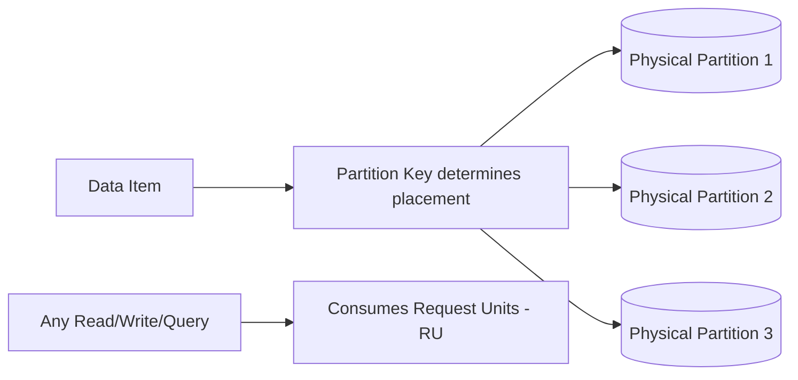

> **Exam Tip:** Know the term **Request Units (RU)** as Cosmos DB's throughput currency, this is a uniquely Cosmos DB concept with no direct AWS naming equivalent (closest AWS analog is DynamoDB's Read/Write Capacity Units, conceptually similar but named differently).

### 5.6 Portal Walkthrough: Create a Cosmos DB Account

1. Search for **Azure Cosmos DB**, click **+ Create**
2. Choose the **API** (e.g., "Azure Cosmos DB for NoSQL")
3. Select **Subscription**, **Resource Group**, **Account Name**, and **Region**
4. Choose capacity mode: **Provisioned throughput** or **Serverless**
5. Optionally enable **Global distribution** and add additional regions
6. Click **Review + Create**, then **Create**

---

## 6. Azure Database Services vs AWS: The Big Comparison
**(Timing: 1:10 - 1:30)**

### 6.1 Structural Comparison

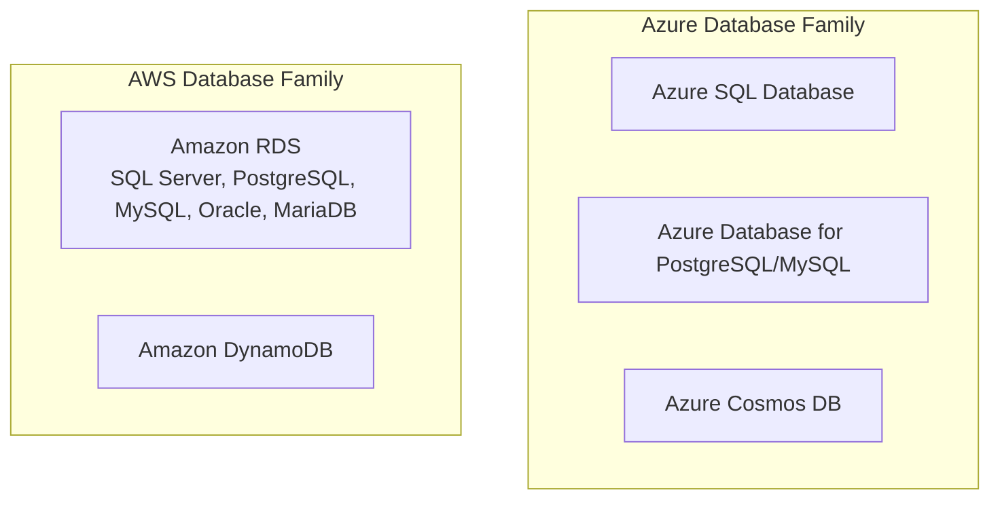

### 6.2 Concept-by-Concept Mapping

| Azure Service | AWS Equivalent | Key Difference |
|---|---|---|
| Azure SQL Database | Amazon RDS for SQL Server | Azure SQL Database is a distinct PaaS offering optimized specifically around the SQL Server engine with unique deployment options (Single DB, Elastic Pool, Managed Instance); RDS is a general-purpose managed relational hosting layer supporting multiple engines under one umbrella |
| Azure SQL Managed Instance | Amazon RDS Custom / RDS for SQL Server (with high compatibility mode) | Both aim for high compatibility with a traditional on-premises SQL Server for easier lift-and-shift |
| Azure Database for PostgreSQL | Amazon RDS for PostgreSQL | Conceptually near-identical: managed open-source relational engine |
| Azure Database for MySQL | Amazon RDS for MySQL | Conceptually near-identical: managed open-source relational engine |
| Azure Cosmos DB | Amazon DynamoDB | Both are NoSQL, globally distributed, low-latency PaaS. Cosmos DB is multi-model (document, key-value, graph, wide-column via APIs); DynamoDB is primarily key-value/document only. Cosmos DB offers five tunable consistency levels; DynamoDB offers two (Strong and Eventual) |
| Cosmos DB Request Units (RU) | DynamoDB Read/Write Capacity Units (RCU/WCU) | Both are throughput-based billing/capacity currencies, named and calculated differently |
| Cosmos DB multi-region writes | DynamoDB Global Tables | Both support multi-region active-active replication for globally distributed low-latency access |

### 6.3 The Most Important Interview/Exam Line

> "Azure splits managed relational databases by engine, Azure SQL Database for SQL Server workloads, and Azure Database for PostgreSQL/MySQL for open-source engines, whereas AWS RDS hosts multiple engines (SQL Server, PostgreSQL, MySQL, Oracle, MariaDB) under a single unified service. For NoSQL, Azure Cosmos DB is broader than DynamoDB in that it's multi-model, document, key-value, graph, and wide-column, accessible through different APIs, all backed by the same globally distributed engine with five tunable consistency levels, compared to DynamoDB's simpler two-level consistency model."

### 6.4 Common Misconceptions to Avoid

- **Misconception:** "Cosmos DB is just Azure's DynamoDB." Reality: Cosmos DB is multi-model and supports multiple APIs (including a MongoDB-compatible API and a Cassandra-compatible API); DynamoDB is a single key-value/document model.
- **Misconception:** "Azure SQL Database, PostgreSQL, and MySQL services are basically the same thing with different names." Reality: they support fundamentally different database engines and are not interchangeable, choose based on which engine your application requires.
- **Misconception:** "All Azure database services require you to manage patching like AWS EC2-hosted databases." Reality: all the services discussed today are PaaS, Microsoft manages patching, backups, and HA automatically, similar to how RDS (not self-hosted databases on EC2) manages this in AWS.

---

## 7. Choosing the Right Database: Decision Framework
**(Timing: 1:30 - 1:40)**

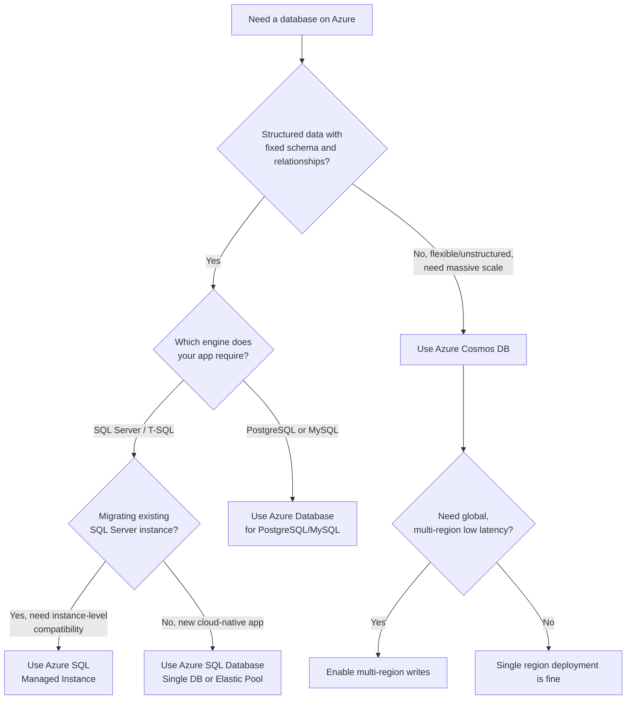

> **Exam Tip:** When a scenario mentions "globally distributed," "millisecond latency," "flexible schema," or "massive scale-out," think **Cosmos DB**. When it mentions "existing SQL Server application," "T-SQL," or "relational schema with joins," think **Azure SQL Database** family. When it mentions "open-source engine" (PostgreSQL/MySQL), think **Azure Database for PostgreSQL/MySQL**.

---

## 8. Recap: The Complete Mental Model
**(Timing: 1:40 - 1:45)**

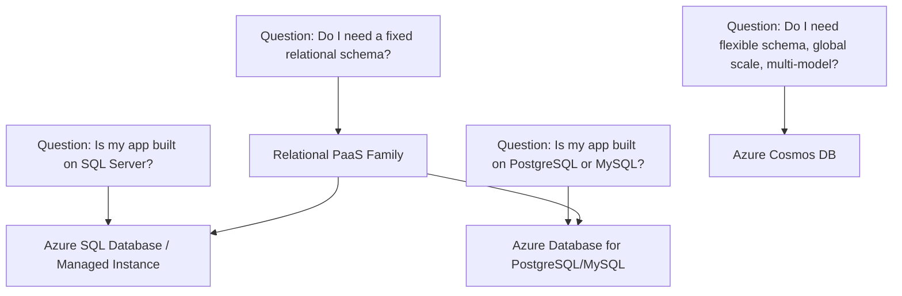

Return to the housing analogy one final time: **Azure SQL Database / Managed Instance / PostgreSQL / MySQL** are all fixed-floor-plan houses, just built by different architects (engines). **Cosmos DB** is the flexible loft space that can be reconfigured instantly and replicated into identical lofts around the world.

---

## 9. Exam Tips Quick-Fire Summary
**(Timing: 1:45 - 1:50)**

1. All Azure database services covered today (SQL Database, PostgreSQL/MySQL, Cosmos DB) are PaaS, Microsoft handles patching, backups, and HA automatically.
2. Azure SQL Database has three deployment options: Single Database, Elastic Pool, and Managed Instance, know when each applies.
3. Managed Instance is the choice for high-compatibility lift-and-shift migrations from on-premises SQL Server.
4. vCore purchasing model supports Azure Hybrid Benefit (reuse existing SQL Server licenses).
5. Flexible Server is the modern, recommended deployment model for Azure Database for PostgreSQL/MySQL.
6. Azure SQL Database, PostgreSQL, and MySQL support different engines, they are not interchangeable.
7. Cosmos DB is multi-model: NoSQL/document, MongoDB, Cassandra, Gremlin (graph), and Table APIs, all on one engine.
8. Cosmos DB offers five consistency levels; Session is the default and most commonly used.
9. Request Units (RU) are Cosmos DB's throughput currency for reads/writes/queries.
10. Cosmos DB supports multi-region writes for globally distributed, low-latency applications.
11. Cosmos DB is broader than DynamoDB (multi-model, five consistency levels vs DynamoDB's two).

---

## 10. Interview Questions (Consolidated Q&A)

**Q1: What is the difference between Azure SQL Database, Azure SQL Managed Instance, and SQL Server on a VM?**
A: Azure SQL Database is a fully managed PaaS offering with the least administrative overhead, ideal for new cloud-native apps. Azure SQL Managed Instance offers near-full SQL Server compatibility as PaaS, ideal for lift-and-shift migrations needing instance-level features like cross-database queries. SQL Server on a VM is IaaS, giving full control over the OS and SQL Server installation, but you're responsible for patching, backups, and HA yourself.

**Q2: When would you choose an Elastic Pool over a Single Database?**
A: When you have many databases (e.g., one per customer in a SaaS application) with unpredictable, non-simultaneous usage patterns. An Elastic Pool lets these databases share a pool of compute/storage resources, which is more cost-efficient than provisioning each database individually for peak load.

**Q3: What is Azure Hybrid Benefit, and which purchasing model supports it?**
A: Azure Hybrid Benefit lets you apply existing on-premises SQL Server (or Windows Server) licenses toward Azure costs, reducing your bill. It's supported under the vCore purchasing model for Azure SQL Database and Managed Instance.

**Q4: Why is Cosmos DB described as "multi-model," and why does that matter?**
A: Cosmos DB supports multiple data models and APIs (document/NoSQL, MongoDB-compatible, Cassandra-compatible wide-column, Gremlin graph, and Table key-value), all running on the same underlying globally distributed engine. This matters because it lets teams pick the API matching their existing application drivers or data model without switching database platforms entirely.

**Q5: Explain Cosmos DB consistency levels and when you'd choose Strong versus Eventual.**
A: Cosmos DB offers five levels: Strong, Bounded Staleness, Session, Consistent Prefix, and Eventual. Strong guarantees you always read the latest committed write but has the highest latency and lowest availability during a network partition. Eventual offers the lowest latency and highest availability but may return stale data temporarily. You'd choose Strong for financial transactions requiring absolute correctness, and Eventual for something like a social media "like counter" where slight staleness is acceptable in exchange for speed.

**Q6: What are Request Units (RU) in Cosmos DB?**
A: RUs are Cosmos DB's currency for measuring the cost of database operations (reads, writes, queries) in terms of throughput. You provision a certain number of RU/s (or use serverless/autoscale), and every operation consumes some amount of that budget depending on its complexity and the size of data involved.

**Q7: How does Azure's database service lineup compare structurally to AWS's?**
A: AWS hosts multiple relational engines (SQL Server, PostgreSQL, MySQL, Oracle, MariaDB) under one unified service, RDS. Azure splits this by engine family: Azure SQL Database/Managed Instance for SQL Server, and Azure Database for PostgreSQL/MySQL for open-source engines. For NoSQL, Cosmos DB is broader and more flexible than DynamoDB, supporting multiple APIs and five consistency levels versus DynamoDB's two.

**Q8: A startup needs a globally distributed database with very low read latency for users across three continents. Which Azure service fits, and how would you configure it?**
A: Azure Cosmos DB, configured with global distribution enabled across regions matching the user base (e.g., North America, Europe, Asia), and potentially multi-region writes enabled if the application needs low write latency everywhere, not just reads.

**Q9: What is the difference between Cosmos DB's multi-region writes and simply adding read replicas in other regions?**
A: Adding regions without multi-region writes gives you additional read replicas (low-latency reads globally) but all writes still go to a single write region. Enabling multi-region writes allows every configured region to accept writes directly, reducing write latency globally but requiring careful conflict resolution strategy design.

**Q10: Why might a company choose Azure Database for PostgreSQL Flexible Server over migrating to Azure SQL Database?**
A: If their existing application and team expertise is built entirely around PostgreSQL (queries, drivers, tooling, ORM configurations), migrating to a different engine (SQL Server via Azure SQL Database) would require significant rework. Flexible Server lets them keep their existing PostgreSQL codebase while gaining Azure's managed operational benefits.

**Q11: What's a key architectural consideration when choosing a partition key in Cosmos DB?**
A: The partition key determines how data is distributed across physical partitions, so it should be chosen to ensure an even distribution of read/write load and avoid "hot partitions" where one partition key value receives disproportionate traffic, which would create a scalability bottleneck.

**Q12: How would you explain the RU/DynamoDB capacity unit comparison to someone from an AWS background?**
A: Both are throughput-based billing/capacity mechanisms: Cosmos DB uses a single unified Request Unit (RU) currency covering reads, writes, and queries based on operation complexity, while DynamoDB separates Read Capacity Units (RCU) and Write Capacity Units (WCU) as distinct, separately provisioned metrics. Conceptually similar goal, different accounting models.

---

## 11. Exam-Style Practice Questions (AZ-900 Format)

**Question 1:** Which Azure SQL Database deployment option is best suited for lift-and-shift migration of an on-premises SQL Server instance requiring cross-database queries?

A) Single Database
B) Elastic Pool
C) Managed Instance
D) Cosmos DB

**Answer: C.** Managed Instance offers the highest compatibility with traditional SQL Server instance-level features like cross-database queries, ideal for lift-and-shift scenarios.

---

**Question 2:** A SaaS company has 200 databases, one per customer, with unpredictable usage patterns. Which Azure SQL Database option minimizes cost while handling this efficiently?

A) Single Database for each customer, provisioned at peak capacity
B) Elastic Pool
C) Managed Instance
D) Azure Database for PostgreSQL

**Answer: B.** Elastic Pool allows many databases to share a pool of resources, cost-efficient when individual databases have unpredictable, non-simultaneous peak usage.

---

**Question 3:** Which purchasing model for Azure SQL Database supports Azure Hybrid Benefit?

A) DTU-based model
B) vCore-based model
C) Both equally
D) Neither, Hybrid Benefit only applies to VMs

**Answer: B.** The vCore-based purchasing model supports Azure Hybrid Benefit, letting customers apply existing SQL Server licenses toward Azure costs.

---

**Question 4:** Which Azure Cosmos DB feature allows applications to select a data model/API matching their existing application drivers (e.g., MongoDB or Cassandra)?

A) Request Units
B) Multi-model support via multiple APIs
C) Consistency levels
D) Global distribution

**Answer: B.** Cosmos DB's multi-model architecture provides multiple APIs (NoSQL, MongoDB, Cassandra, Gremlin, Table) on one underlying engine.

---

**Question 5:** What is the default consistency level in Azure Cosmos DB?

A) Strong
B) Eventual
C) Session
D) Bounded Staleness

**Answer: C.** Session consistency is the default and most commonly used level, balancing consistency and performance for most applications.

---

**Question 6:** Which Azure Cosmos DB consistency level offers the lowest latency and highest availability, at the cost of potentially stale reads?

A) Strong
B) Bounded Staleness
C) Session
D) Eventual

**Answer: D.** Eventual consistency prioritizes latency and availability over strict read freshness.

---

**Question 7:** What is the AWS equivalent most comparable to Azure Cosmos DB?

A) Amazon RDS
B) Amazon DynamoDB
C) Amazon Redshift
D) Amazon Aurora

**Answer: B.** DynamoDB is AWS's globally distributed, low-latency NoSQL database service, the closest structural equivalent to Cosmos DB.

---

**Question 8:** A company wants to migrate their existing PostgreSQL application to Azure with minimal code changes while Azure manages patching and backups. Which service should they choose?

A) Azure SQL Database
B) Azure SQL Managed Instance
C) Azure Database for PostgreSQL
D) Azure Cosmos DB with NoSQL API

**Answer: C.** Azure Database for PostgreSQL is the fully managed PaaS offering specifically for PostgreSQL workloads, requiring minimal application changes.

---

**Question 9:** What does "RU" stand for in the context of Azure Cosmos DB, and what does it measure?

A) Redundancy Unit, measuring backup copies
B) Request Unit, measuring the throughput cost of database operations
C) Region Unit, measuring the number of deployed regions
D) Replication Unit, measuring data replication lag

**Answer: B.** Request Units (RU) measure the throughput cost of reads, writes, and queries in Cosmos DB.

---

**Question 10:** Which statement correctly distinguishes Azure's relational database offerings from AWS RDS?

A) Azure hosts all relational engines under a single unified service, exactly like RDS
B) Azure splits relational services by engine family (Azure SQL Database for SQL Server, Azure Database for PostgreSQL/MySQL for open-source engines), while AWS RDS hosts multiple engines under one umbrella service
C) AWS RDS only supports NoSQL workloads
D) Azure SQL Database and Azure Database for PostgreSQL are the exact same service with different names

**Answer: B.** This is the key structural difference emphasized in Section 6: Azure splits its relational PaaS offerings by engine family, while AWS RDS unifies multiple engines under one service umbrella.
