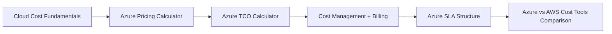
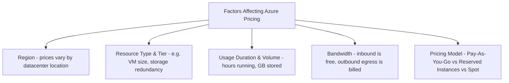
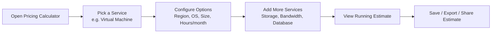
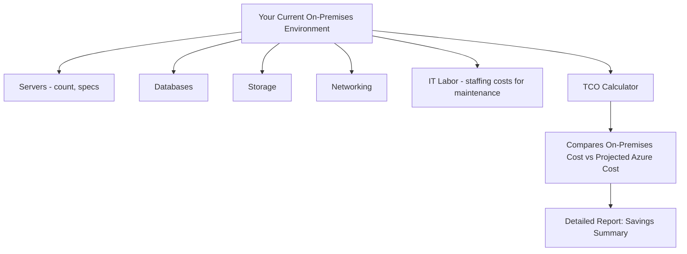
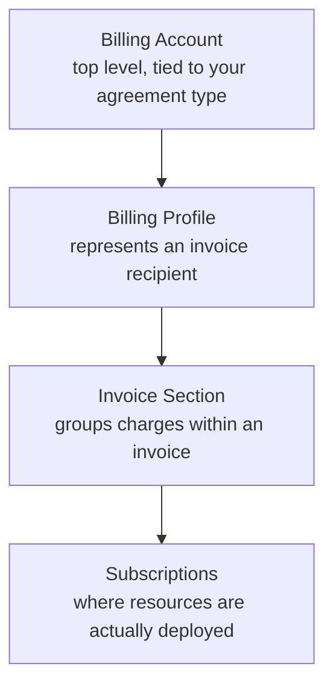
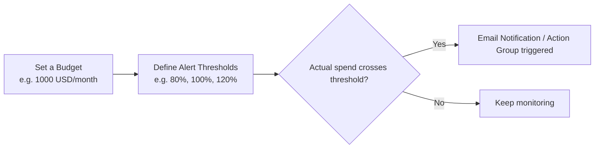
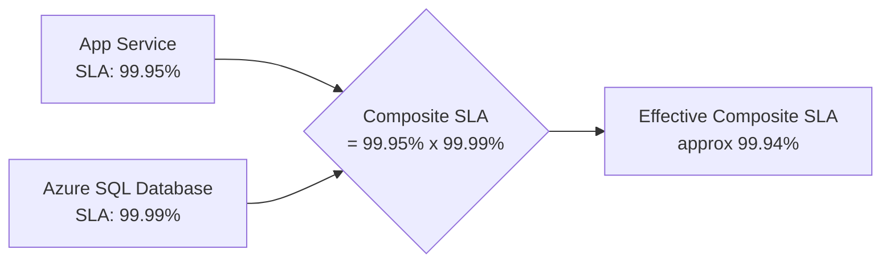
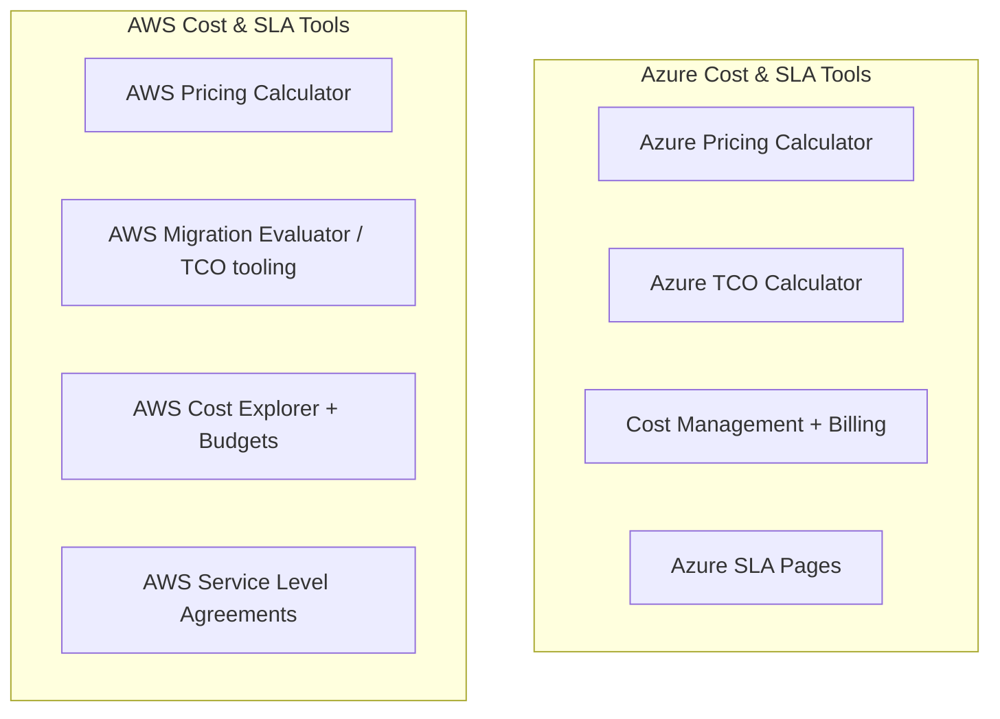
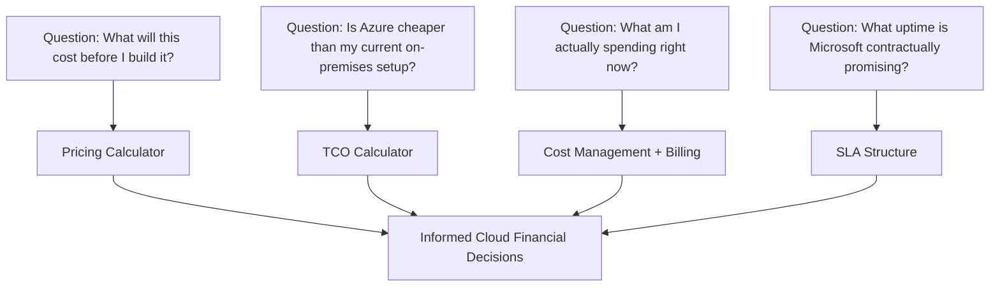

# Written and maintained by Vilas Varghese

# Pricing, Cost Management, and SLAs: Pricing Calculator, Cost Management + Billing, TCO Calculator, SLA Structure vs AWS

**Topic:** Azure Pricing, Cost Management, TCO, and SLA Fundamentals, compared with AWS Cost Explorer/Pricing Calculator
**Duration:** ~120 minutes
**Audience:** Beginners with some AWS exposure, preparing for AZ-900

**Learning Objectives:** By the end of this session, learners will be able to:
- Explain consumption-based pricing and the factors that affect Azure costs
- Use the Azure Pricing Calculator to estimate solution costs
- Use the Azure TCO Calculator to compare on-premises cost vs Azure cost
- Navigate Cost Management + Billing: billing hierarchy, budgets, alerts, and cost analysis
- Explain Azure SLA structure, including composite SLAs and downtime calculations
- Map Azure cost/SLA tools to their AWS equivalents
- Answer AZ-900 exam questions confidently on this topic

---

## 1. Cold Open + Roadmap
**(Timing: 0:00 - 0:05)**

Here's a question every business asks before adopting any cloud: "How much is this actually going to cost me, and what happens if it goes down?"

Unlike buying a server outright, where you pay once and know the number, the cloud charges you based on what you **consume**, compute hours, storage gigabytes, data transferred out. This is powerful (pay only for what you use) but also unpredictable if you don't actively manage it. That unpredictability is exactly why Azure gives you a whole toolkit: calculators to estimate cost before you deploy, dashboards to track cost after you deploy, and contractual guarantees (SLAs) about how reliable the service will be.

If you've touched AWS, you already know the **AWS Pricing Calculator** and **Cost Explorer**. Azure's answers are the **Pricing Calculator**, the **TCO Calculator**, and **Cost Management + Billing**. Today we go deep on all of them, plus how Azure's SLA structure works.

Think of it like planning a road trip. Before you leave, you estimate fuel cost based on distance and mileage, that's the **Pricing Calculator**. You might also compare "is it cheaper to drive my own car or take a cab service long-term," that's the **TCO Calculator**. Once you're on the road, you watch the fuel gauge and track actual spend against your budget, that's **Cost Management**. And before you even trust the cab service, you check their promised on-time guarantee, that's the **SLA**.

> **Exam Tip:** AZ-900 tests all four of these as distinct tools with distinct purposes. A common trap is confusing the Pricing Calculator (estimate future cost) with Cost Management (track actual, already-incurred cost).

---

## 2. Cloud Cost Fundamentals
**(Timing: 0:05 - 0:15)**

### 2.1 CapEx vs OpEx

| Model | Meaning | Traditional On-Premises | Cloud |
|---|---|---|---|
| **CapEx (Capital Expenditure)** | Large upfront investment in physical assets | Buying servers, building data centers | Rare in cloud (mostly avoided) |
| **OpEx (Operational Expenditure)** | Ongoing, pay-as-you-go operational cost | Not typical for infra | Standard cloud billing model |

The cloud shifts spending from CapEx to OpEx: instead of buying a server for $50,000 upfront, you pay a monthly bill based on actual usage. This is one of the most fundamental value propositions of cloud computing, and one of the most frequently tested AZ-900 concepts.

> **Exam Tip:** If a question describes "shifting away from large upfront hardware investments toward pay-as-you-go operational spending," the answer is **the shift from CapEx to OpEx**.

### 2.2 Consumption-Based Pricing

Azure (like AWS) charges based on **what you actually consume**: compute hours, storage GB/month, data egress, number of transactions, and so on. Key factors that influence your bill:

| Factor | Detail |
|---|---|
| **Region** | The same VM can cost differently in different Azure regions due to local infrastructure/tax/energy costs |
| **Resource type/tier** | A larger VM size or premium storage tier costs more than a basic one |
| **Bandwidth (egress)** | Data coming INTO Azure is generally free; data going OUT of Azure to the internet is billed |
| **Pricing model** | Pay-As-You-Go (flexible, higher rate) vs Reserved Instances (1 or 3-year commitment, discounted) vs Spot pricing (steep discount, can be reclaimed) |

> **Exam Tip:** Remember the specific, frequently tested rule: **inbound data transfer is free, outbound data transfer (egress) is charged**. This exact asymmetry shows up often on AZ-900.

### 2.3 Free Account and Free Tier

Azure offers a **free account** for new customers, including a credit for the first 30 days, plus a set of **"Always Free"** services (limited quantities of certain services free forever) and 12 months of popular services free.

---

## 3. Azure Pricing Calculator Deep Dive
**(Timing: 0:15 - 0:30)**

### 3.1 What is the Pricing Calculator?

The **Azure Pricing Calculator** (found at `azure.microsoft.com/pricing/calculator`) is a free web tool that lets you estimate the cost of Azure services **before you deploy them**. You pick services, configure options (region, tier, quantity), and it produces an estimated monthly cost.

### 3.2 What You Can Do With It

- Build a multi-service estimate (e.g., a VM + a Storage Account + a SQL Database, all in one estimate)
- Compare pricing across regions
- Compare Pay-As-You-Go vs Reserved Instance pricing
- Save and share an estimate via a URL, useful for getting stakeholder sign-off before deployment

### 3.3 Portal Walkthrough: Build a Simple Estimate

1. Go to `azure.microsoft.com/pricing/calculator`
2. Click **Virtual Machines** to add it to your estimate
3. Configure: Region (e.g., East US), Operating System (Windows/Linux), Instance size (e.g., B2s), Hours per month (e.g., 730 for always-on)
4. Scroll down, click **Storage Accounts**, configure capacity and redundancy tier (LRS, GRS, etc.)
5. Scroll to the bottom, view **Your Estimate**, showing total estimated monthly cost broken down by service
6. Click **Save estimate** or **Share** to generate a shareable link

> **Exam Tip:** The Pricing Calculator estimates cost **before deployment**, it does not read your actual Azure usage. If a question describes analyzing your real, already-incurred spending, that's Cost Management, not the Pricing Calculator.

---

## 4. Azure TCO (Total Cost of Ownership) Calculator
**(Timing: 0:30 - 0:45)**

### 4.1 What Problem Does TCO Solve?

The Pricing Calculator tells you "what will Azure cost." The **TCO Calculator** answers a different question: "how does running this on Azure compare to what I'm paying today to run it on-premises?" It's designed to build the business case for migration.

### 4.2 What Inputs Does It Require?

- Number and type of on-premises servers (specs: cores, RAM)
- Databases in use
- Storage volume
- Networking infrastructure
- Assumptions about IT labor, facilities (power, cooling, real estate), and software licensing costs

### 4.3 What Output Does It Produce?

A detailed report comparing your **current on-premises TCO** against a **projected Azure cost**, typically highlighting savings in categories like:
- Hardware costs (avoided by not buying servers)
- Labor costs (reduced administrative overhead)
- Facilities costs (power, cooling, physical space)
- Software licensing (potential Hybrid Benefit savings)

### 4.4 Portal Walkthrough: Using the TCO Calculator

1. Go to `azure.microsoft.com/pricing/tco/calculator`
2. Enter your current on-premises **servers** (count, specs, virtualization details)
3. Enter your **databases** (type, size)
4. Enter your **storage** (volume, type)
5. Enter your **networking** details (bandwidth usage)
6. Adjust **assumptions** (labor cost per admin, power cost per kWh, etc., defaults are provided but can be customized)
7. Click **View Report**, review the categorized savings breakdown and total projected savings percentage

> **Exam Tip:** The TCO Calculator's core purpose is to **build a cost-comparison business case for migrating from on-premises to Azure**. If a question mentions "comparing current infrastructure costs to Azure," think TCO Calculator, not the Pricing Calculator (which only estimates future Azure cost in isolation, without an on-premises comparison).

---

## 5. Cost Management + Billing Deep Dive
**(Timing: 0:45 - 1:05)**

### 5.1 What is Cost Management + Billing?

**Cost Management + Billing** is the Azure Portal tool for tracking, analyzing, and controlling **actual, already-incurred** spend, plus managing invoices and billing relationships. This is fundamentally different from the Pricing Calculator (pre-deployment estimation), Cost Management looks backward and in real time at what you're actually spending.

### 5.2 The Billing Hierarchy

| Level | Purpose |
|---|---|
| **Billing Account** | The root of your billing relationship with Microsoft, structure varies by agreement type (Microsoft Customer Agreement, Enterprise Agreement, Pay-As-You-Go) |
| **Billing Profile** | Represents a single invoice; you can have multiple profiles for different departments or cost centers |
| **Invoice Section** | Lets you further break down a single invoice by team/project for internal chargeback |
| **Subscription** | Where actual resources are deployed and where RBAC/Policy are applied (tying back to earlier lectures) |

> **Exam Tip:** This hierarchy is distinct from the Management Group → Subscription → Resource Group → Resource hierarchy used for RBAC/Policy scoping. Billing hierarchy is about invoices and payment; resource hierarchy is about access/governance. Don't confuse the two on the exam.

### 5.3 Cost Analysis

The **Cost Analysis** view lets you visualize spending over time, broken down by subscription, resource group, resource type, or **tags**. This is your primary "what am I actually spending money on right now" dashboard.

### 5.4 Budgets and Alerts

You can define a **Budget** (a spending limit over a period) and set **alert thresholds** as percentages of that budget. When actual spend crosses a threshold, Azure sends a notification, this does NOT automatically stop spending or shut down resources, it's a notification mechanism, not an enforcement mechanism (unless paired with additional automation).

> **Exam Tip:** A commonly tested nuance: **Budgets and alerts notify you, they do not automatically block or stop resource usage** by default. If a question implies automatic shutdown, that requires additional automation (like an Action Group triggering a Logic App/Function), it's not built into the Budget feature itself.

### 5.5 Cost Allocation via Tags

**Tags** are key-value pairs (e.g., `Department: Finance`, `Environment: Production`) you can apply to resources. Cost Management lets you filter and group spend by tags, essential for chargeback/showback reporting across departments or projects.

### 5.6 Azure Advisor Cost Recommendations

**Azure Advisor** analyzes your resource usage and configuration, then proactively recommends cost-saving actions, such as resizing or shutting down underutilized VMs, or purchasing Reserved Instances for consistently running workloads.

### 5.7 Portal Walkthrough: Set a Budget and Alert

1. Navigate to **Cost Management + Billing** in the portal
2. Select your **Subscription** scope
3. Click **Budgets** → **+ Add**
4. Name the budget, set **Amount** (e.g., $1,000) and **Reset period** (Monthly)
5. Under **Alert conditions**, add thresholds: e.g., 80% (Actual), 100% (Actual)
6. Add an **email recipient** for notifications
7. Click **Create**

Now, if spend crosses 80% of $1,000 this month, an email notification is sent automatically.

---

## 6. Azure SLAs Deep Dive
**(Timing: 1:05 - 1:20)**

### 6.1 What is an SLA?

A **Service Level Agreement (SLA)** is Microsoft's contractual, formal commitment to a specific level of uptime/performance for a service. If Microsoft fails to meet the committed SLA, customers are entitled to **service credits** (a partial refund on their bill for that service), not a full guarantee of zero downtime, but a financial remedy when targets are missed.

### 6.2 SLA Percentages and Downtime

SLAs are typically expressed as a percentage of uptime per month or per year. Higher percentages mean progressively less allowed downtime:

| SLA % | Approx. Downtime per Year | Approx. Downtime per Month |
|---|---|---|
| 99% | ~3.65 days | ~7.2 hours |
| 99.9% | ~8.76 hours | ~43.2 minutes |
| 99.95% | ~4.38 hours | ~21.6 minutes |
| 99.99% | ~52.56 minutes | ~4.32 minutes |

> **Exam Tip:** You do not need to memorize exact downtime figures, but you MUST understand the **relationship**: each additional "9" dramatically reduces allowed downtime. This is often called the "rule of nines," and questions frequently ask you to reason about which SLA level implies more or less downtime, not to calculate exact minutes.

### 6.3 Composite SLAs

Real applications rarely depend on just one service, they chain multiple services together (e.g., a web app depends on App Service AND a SQL Database AND storage). A **Composite SLA** is the combined effective SLA of the entire chain, and it's calculated by **multiplying** the individual SLAs together.

**Key insight: the composite SLA of dependent services is always LOWER than the lowest individual SLA in the chain.** This is a crucial, non-obvious concept: chaining more dependent services together makes your overall guaranteed uptime worse, not better, because ALL components must be up for the whole chain to be up.

> **Exam Tip:** This is one of the highest-value concepts on the exam. The formula is: multiply the individual SLA percentages (as decimals) together. E.g., $0.9995 \times 0.9999 \approx 0.9994$, or 99.94%. Remember: **composite SLA is always lower than any single component's SLA.**

### 6.4 Improving Composite SLA Through Independent Redundancy

You can improve overall availability by adding **independent redundant instances** of a component, since the probability of BOTH failing simultaneously is much lower than either failing alone. When two independent instances of the same component are used (e.g., two VMs in different Availability Zones), you calculate combined availability using:

$$1 - (1 - SLA_1)(1 - SLA_2)$$

For example, if two independent VMs each have an SLA of 99.9% ($0.999$):

$$1 - (1 - 0.999)(1 - 0.999) = 1 - (0.001 \times 0.001) = 1 - 0.000001 = 0.999999$$

That's 99.9999% combined availability, far higher than either VM alone. This is why architects deploy redundant instances across Availability Zones, redundancy multiplies your effective uptime upward, while dependency chains multiply it downward.

> **Exam Tip:** Two very different formulas for two very different scenarios: **dependent (chained) services multiply SLAs down**; **independent (redundant) parallel components combine to push effective availability up**. Exam questions test whether you can tell which scenario applies.

### 6.5 SLA for Azure Products That Have None

Not every Azure feature/service has a formal SLA (particularly Free tier services, or preview/beta features). Always check the specific published SLA per service on the Azure SLA page, don't assume every service has the same guarantee.

---

## 7. Azure Cost Tools vs AWS: The Big Comparison
**(Timing: 1:20 - 1:35)**

### 7.1 Structural Comparison

### 7.2 Concept-by-Concept Mapping

| Azure Tool | AWS Equivalent | Key Difference |
|---|---|---|
| Azure Pricing Calculator | AWS Pricing Calculator | Both estimate future cost pre-deployment based on selected services/configuration; near-identical purpose |
| Azure TCO Calculator | AWS Migration Evaluator (formerly TSO Logic) / AWS TCO tooling | Both build a business case comparing on-premises cost to cloud cost; Azure's tool is more directly self-service and public-facing |
| Cost Management + Billing (Cost Analysis) | AWS Cost Explorer | Both provide historical/real-time visualization of actual incurred spend, filterable by service, tag, account/subscription |
| Cost Management Budgets | AWS Budgets | Both let you set a spend threshold and receive alert notifications when crossed; neither automatically stops spending by default |
| Billing Account -> Billing Profile -> Invoice Section -> Subscription | AWS Organizations -> Consolidated Billing -> Linked Accounts | Both provide hierarchical structures for centralizing/allocating cost across an organization, though the specific terms and levels differ |
| Azure SLA (per-service, composite SLA math) | AWS Service Level Agreements (per-service) | Both offer per-service uptime guarantees with service credits on breach; AWS SLAs are typically expressed similarly but composite/chained SLA reasoning applies conceptually to both clouds |

### 7.3 The Most Important Interview/Exam Line

> "Azure and AWS both provide a Pricing Calculator for pre-deployment cost estimation and a Cost Explorer/Cost Management dashboard for tracking actual spend, these are conceptually near-identical tools with different names. Azure additionally provides a dedicated public TCO Calculator for building on-premises-to-cloud migration business cases, comparable to AWS's Migration Evaluator. Both clouds calculate SLA credits similarly, and both require you to reason about composite SLAs when your architecture chains multiple dependent services together, since the combined guaranteed uptime is always lower than any single component's SLA."

### 7.4 Common Misconceptions to Avoid

- **Misconception:** "The Pricing Calculator shows my actual current bill." Reality: it's a pre-deployment estimate; Cost Management + Billing shows actual incurred spend.
- **Misconception:** "Setting a Budget automatically stops resources from running once the limit is hit." Reality: Budgets only send notifications by default; automatic shutdown requires additional automation.
- **Misconception:** "Chaining more services together with high individual SLAs gives you a higher overall SLA." Reality: composite (dependent) SLAs multiply down, always resulting in a lower combined guarantee than any single component.
- **Misconception:** "An SLA guarantees zero downtime." Reality: an SLA guarantees a *percentage* of uptime and entitles you to a service credit if breached, it does not eliminate downtime entirely.

---

## 8. Recap: The Complete Mental Model
**(Timing: 1:35 - 1:40)**

Return to the road trip analogy one final time: **Pricing Calculator** estimates fuel cost before the trip, **TCO Calculator** compares driving yourself versus a cab service long-term, **Cost Management** watches your actual spend as you drive, and the **SLA** is the promised on-time guarantee from your service provider, with a partial refund if they're late.

---

## 9. Exam Tips Quick-Fire Summary
**(Timing: 1:40 - 1:45)**

1. Cloud computing shifts spending from CapEx (upfront hardware) to OpEx (pay-as-you-go).
2. Inbound data transfer into Azure is free; outbound data transfer (egress) is billed.
3. The Pricing Calculator estimates cost BEFORE deployment; it does not read actual usage.
4. The TCO Calculator compares on-premises cost against projected Azure cost, used to build a migration business case.
5. Cost Management + Billing tracks actual, already-incurred spend, and manages the billing hierarchy (Billing Account -> Billing Profile -> Invoice Section -> Subscription).
6. Budgets and alerts notify you when spend crosses a threshold; they do not automatically stop resources by default.
7. Tags allow cost allocation/chargeback reporting by department, project, or environment.
8. SLA percentages express guaranteed uptime; each additional "9" dramatically reduces allowed downtime.
9. Composite (dependent/chained) SLAs multiply individual SLAs together and are always lower than any single component's SLA.
10. Independent redundant components combine to increase effective availability above any single component's SLA, using $1 - (1-SLA_1)(1-SLA_2)$.
11. An SLA breach entitles customers to service credits, not a guarantee of zero downtime.

---

## 10. Interview Questions (Consolidated Q&A)

**Q1: What is the difference between the Azure Pricing Calculator and the TCO Calculator?**
A: The Pricing Calculator estimates the cost of a proposed Azure deployment in isolation, useful for budgeting a new solution. The TCO Calculator compares your existing on-premises infrastructure costs (hardware, labor, facilities) against projected Azure costs, used specifically to build a migration business case showing potential savings.

**Q2: How is a composite SLA calculated, and why does it matter architecturally?**
A: A composite SLA for dependent (chained) services is calculated by multiplying the individual SLA percentages together, e.g., 99.95% x 99.99%. It matters because the result is always lower than any individual component's SLA, meaning architectures with more sequential dependencies have progressively worse guaranteed uptime, an important consideration when designing multi-tier applications.

**Q3: How can you improve availability above a single component's SLA?**
A: By deploying independent, redundant instances of that component (e.g., across Availability Zones) rather than relying on a single instance. Combined availability for two independent components is calculated as $1 - (1-SLA_1)(1-SLA_2)$, which pushes the effective uptime higher than either component alone.

**Q4: What happens when actual spending crosses a configured Budget threshold in Cost Management?**
A: Azure sends a notification (typically via email or an Action Group) alerting you that spend has crossed the threshold. It does not automatically stop or restrict resource usage by default; additional automation would be required to enforce a hard spending cap.

**Q5: Explain the Azure billing hierarchy from top to bottom.**
A: Billing Account (the root of your agreement with Microsoft) contains one or more Billing Profiles (each representing a single invoice), which contain Invoice Sections (used to further subdivide a single invoice for internal reporting), which are linked to Subscriptions (where actual resources are deployed and consume cost).

**Q6: Why is inbound versus outbound data transfer pricing asymmetric in Azure?**
A: Cloud providers generally do not charge for data coming into their platform (ingress) to encourage adoption and data migration, but they do charge for data leaving the platform to the public internet (egress), since that consumes their outbound network capacity and is a common cost lever across all major cloud providers, including AWS.

**Q7: How does Azure Advisor contribute to cost management?**
A: Azure Advisor analyzes actual resource usage and configuration patterns, then proactively recommends specific cost-saving actions, such as resizing over-provisioned VMs, deleting unattached disks, or purchasing Reserved Instances for steady-state workloads, complementing the reactive tracking that Cost Management provides.

**Q8: Compare Azure Cost Management + Billing to AWS Cost Explorer.**
A: Both provide historical and near-real-time visualization of actual cloud spend, filterable by service, resource group/account, and tags, and both support setting budget thresholds with alert notifications. The core difference is naming and the specific billing hierarchy structure each cloud uses to organize invoices and accounts.

**Q9: If a company wants a partial refund because Azure failed to meet its committed SLA, what are they entitled to, and what should they NOT expect?**
A: They are entitled to a service credit, a partial credit/refund applied against their bill for that specific service, proportional to the severity of the SLA breach as defined in Microsoft's published SLA terms. They should NOT expect complete compensation for business losses caused by the downtime, nor should they expect the SLA to have guaranteed zero downtime in the first place.

**Q10: A three-tier application uses App Service (SLA 99.95%), Azure SQL Database (SLA 99.99%), and Azure Cache for Redis (SLA 99.9%), all as sequential dependencies. Roughly what should the architect expect for the composite SLA, and why?**
A: Multiplying the three SLAs together ($0.9995 \times 0.9999 \times 0.999 \approx 0.9984$) gives an effective composite SLA of roughly 99.84%, lower than any individual component. The architect should expect the overall guaranteed uptime of the whole chain to be worse than any single service's published SLA, since all three dependent components must be simultaneously available for the application to be considered up.

**Q11: What's the practical business use case for the TCO Calculator beyond just generating a number?**
A: It's primarily used to build a persuasive, structured business case for leadership or finance teams considering cloud migration, breaking down projected savings across hardware, labor, facilities, and licensing categories in a shareable report format, useful in stakeholder presentations and migration justification documents.

**Q12: Why might two different Azure customers see different prices for the exact same VM size in the Pricing Calculator?**
A: Pricing can vary by region (different Azure datacenter locations have different costs), by the chosen pricing model (Pay-As-You-Go vs Reserved Instance vs Spot), and potentially by negotiated enterprise agreement discounts not reflected in the public calculator's default rates.

---

## 11. Exam-Style Practice Questions (AZ-900 Format)

**Question 1:** Which Azure tool would you use to estimate the cost of a proposed solution before deploying any resources?

A) Cost Management + Billing
B) Azure Pricing Calculator
C) Azure Advisor
D) Azure Monitor

**Answer: B.** The Pricing Calculator is specifically designed for pre-deployment cost estimation. Cost Management (A) tracks actual incurred spend; Advisor (C) gives optimization recommendations based on existing usage; Monitor (D) is unrelated to cost.

---

**Question 2:** A company wants to compare their current on-premises infrastructure costs against projected Azure costs to build a migration business case. Which tool should they use?

A) Azure Pricing Calculator
B) Azure TCO Calculator
C) Cost Management + Billing
D) Azure Service Health

**Answer: B.** The TCO Calculator is purpose-built for comparing on-premises costs (hardware, labor, facilities) against projected Azure costs.

---

**Question 3:** Which type of data transfer is typically billed by Azure?

A) Data transferred into Azure (ingress)
B) Data transferred out of Azure to the internet (egress)
C) Both are always free
D) Both are always billed equally

**Answer: B.** Outbound data transfer (egress) is billed; inbound data transfer (ingress) is generally free.

---

**Question 4:** What happens by default when actual spend crosses a configured Budget alert threshold in Cost Management?

A) All resources in the subscription are automatically deleted
B) A notification is sent; resources continue running unless additional automation is configured
C) The subscription is automatically suspended
D) Nothing happens until the end of the billing cycle

**Answer: B.** Budgets send alert notifications by default; they do not automatically restrict or stop resource usage without additional configured automation.

---

**Question 5:** An application depends sequentially on two services with SLAs of 99.9% and 99.95%. What is true about the composite SLA of this application?

A) It will be higher than both individual SLAs
B) It will be exactly the average of the two SLAs
C) It will be lower than both individual SLAs
D) SLA percentages cannot be combined mathematically

**Answer: C.** Composite (dependent/chained) SLAs are calculated by multiplying the individual SLAs together, always resulting in a value lower than any single component's SLA.

---

**Question 6:** How can an architect increase effective availability above a single component's published SLA?

A) By adding more sequential dependent services
B) By deploying independent, redundant instances of that component in parallel
C) By upgrading to a higher Azure support plan
D) By using the Pricing Calculator to select a higher SLA option

**Answer: B.** Independent, redundant parallel instances combine using $1-(1-SLA_1)(1-SLA_2)$, increasing effective availability above any single instance's SLA.

---

**Question 7:** What does an Azure SLA entitle a customer to if Microsoft fails to meet the committed uptime percentage?

A) A full refund of all cloud spending for that month
B) A service credit proportional to the severity of the breach
C) Free migration assistance to another cloud provider
D) Nothing, SLAs are not enforceable

**Answer: B.** SLA breaches entitle customers to service credits as defined in the published SLA terms, not a full refund or unrelated compensation.

---

**Question 8:** Which AWS tool is most directly comparable to Azure Cost Management + Billing's Cost Analysis feature?

A) AWS Pricing Calculator
B) AWS Cost Explorer
C) AWS Trusted Advisor
D) AWS Organizations

**Answer: B.** AWS Cost Explorer provides historical and near-real-time visualization of actual incurred AWS spend, directly comparable to Azure's Cost Analysis feature within Cost Management + Billing.

---

**Question 9:** In the Azure billing hierarchy, which level directly represents a single invoice sent to the customer?

A) Billing Account
B) Billing Profile
C) Invoice Section
D) Subscription

**Answer: B.** A Billing Profile represents a single invoice; Invoice Sections further subdivide charges within that invoice, and the Billing Account is the top-level root of the agreement.

---

**Question 10:** Which statement correctly distinguishes CapEx from OpEx in the context of cloud adoption?

A) CapEx is pay-as-you-go spending; OpEx is upfront hardware investment
B) CapEx is large upfront investment in physical assets; OpEx is ongoing, pay-as-you-go operational spending, which is the model the cloud enables
C) CapEx and OpEx are interchangeable terms with no practical difference
D) Cloud computing eliminates both CapEx and OpEx entirely

**Answer: B.** This is the foundational cloud financial concept: cloud adoption shifts organizations from CapEx-heavy models to OpEx-based consumption pricing.
