# Written and maintained by Vilas Varghese

# Governance, Compliance, and Security Basics: Azure Policy, Blueprints, Compliance Manager, Defender for Cloud vs AWS

**Topic:** Azure Governance and Security Fundamentals, compared with AWS Organizations/SCPs, AWS Config, and Security Hub
**Duration:** ~120 minutes
**Audience:** Beginners with some AWS exposure, preparing for AZ-900

**Learning Objectives:** By the end of this session, learners will be able to:
- Distinguish Governance, Security, and Compliance as related but separate concepts
- Explain how Azure Policy enforces resource configuration rules
- Explain how Azure Blueprints package governance artifacts into repeatable environments
- Explain what Microsoft Purview Compliance Manager measures and reports
- Explain Microsoft Defender for Cloud's posture management and workload protection roles
- Map each Azure governance/security tool to its AWS equivalent
- Answer AZ-900 exam questions confidently on this topic

---

## 1. Cold Open + Roadmap
**(Timing: 0:00 - 0:05)**

Picture a large organization with 200 subscriptions, thousands of resources, and dozens of teams deploying infrastructure independently. Without any central control, chaos is inevitable: someone deploys a storage account with public access enabled, someone else spins up an expensive VM in the wrong region, another team ignores a regulatory requirement entirely.

**Governance** is how organizations put guardrails around cloud usage at scale, not to block people from working, but to make sure everyone works within agreed boundaries automatically, without a human manually checking every deployment.

Azure gives you four major tools for this: **Azure Policy** (enforce configuration rules), **Azure Blueprints** (package governance artifacts into repeatable environments), **Microsoft Purview Compliance Manager** (measure your compliance posture against regulations), and **Microsoft Defender for Cloud** (monitor and improve your security posture). If you've touched AWS, you'll recognize parallels to **AWS Organizations + SCPs**, **AWS Config**, and **AWS Security Hub**.

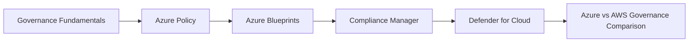

Think of it like running a large restaurant chain. **Governance** is the corporate rulebook, every location must follow food safety codes, pricing standards, and branding guidelines. **Azure Policy** is the automatic inspector that walks into every restaurant and flags (or blocks) any violation of the rulebook. **Blueprints** are the "franchise starter kit," a complete package of equipment, layout, and rules bundled together so a new location can be set up correctly from day one. **Compliance Manager** is the health inspector's scorecard, showing how compliant you are against a specific certification standard (like a health code). **Defender for Cloud** is the ongoing security patrol, continuously watching for vulnerabilities like unlocked doors or expired fire extinguishers.

> **Exam Tip:** AZ-900 frequently tests the difference between RBAC (who can do what, covered in an earlier lecture) and Azure Policy (what configurations are allowed, regardless of who is doing it). Keep this distinction sharp throughout this session.

---

## 2. Governance Fundamentals
**(Timing: 0:05 - 0:15)**

### 2.1 Governance vs Security vs Compliance

These three terms overlap but are not the same thing:

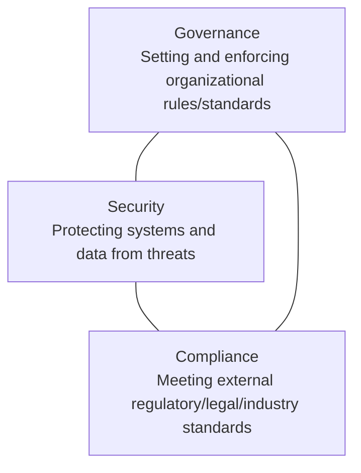

| Concept | Core Question | Azure Tool Example |
|---|---|---|
| **Governance** | Are we consistently applying our own internal rules across the organization? | Azure Policy, Blueprints |
| **Security** | Are we protected against threats, vulnerabilities, and attacks? | Microsoft Defender for Cloud |
| **Compliance** | Are we meeting external regulatory/legal/industry requirements (GDPR, ISO 27001, HIPAA)? | Microsoft Purview Compliance Manager |

They overlap heavily in practice: a governance policy might enforce a security best practice (e.g., "always encrypt storage accounts"), which also happens to satisfy a compliance requirement (e.g., a regulation mandating encryption at rest).

> **Exam Tip:** If a question asks about "enforcing organization-wide rules on resource configuration," think Governance/Azure Policy. If it emphasizes "meeting a named regulatory framework like GDPR or ISO," think Compliance/Compliance Manager. If it emphasizes "detecting vulnerabilities or threats," think Security/Defender for Cloud.

### 2.2 Recap: The Resource Hierarchy (Why Governance Needs Scale)

From our Identity lecture, recall the Azure resource hierarchy:

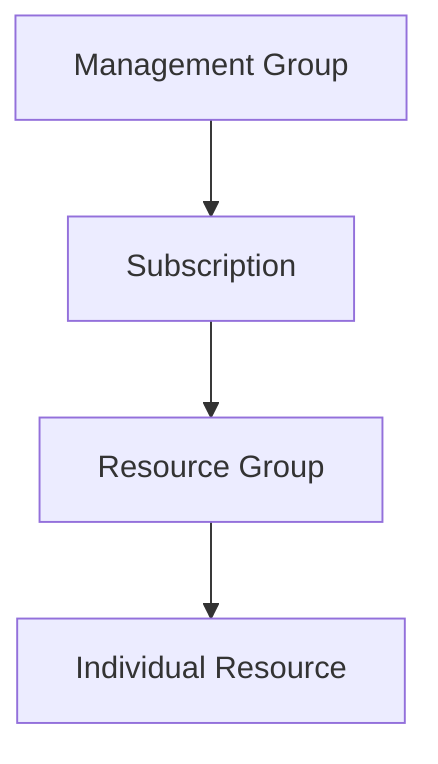

Governance tools like Azure Policy and Blueprints can be applied at any level of this hierarchy, and just like RBAC, they **inherit downward**. Assign a policy at a Management Group, and it automatically applies to every subscription, resource group, and resource beneath it. This is precisely why large organizations need governance tools: manually configuring rules on thousands of individual resources doesn't scale, but assigning one policy at the Management Group level does.

---

## 3. Azure Policy Deep Dive
**(Timing: 0:15 - 0:35)**

### 3.1 What is Azure Policy?

**Azure Policy** is Azure's service for creating, assigning, and enforcing rules about resource **configuration**. It answers: "regardless of who is deploying this resource, does it comply with our organizational rules?"

This is fundamentally different from RBAC. RBAC controls **who can do what** (permissions). Azure Policy controls **what configurations are allowed**, even for someone who technically has permission to create the resource.

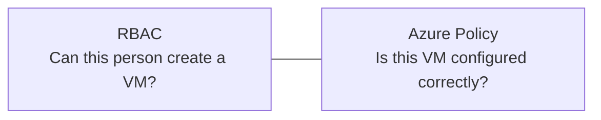

> **Exam Tip:** A classic AZ-900 scenario: "A user has Contributor access and creates a VM in a disallowed region." RBAC would have permitted the action (they have Contributor rights), but Azure Policy can still block it if a policy restricts allowed regions. This is the key exam distinction: RBAC and Policy are independent, complementary layers.

### 3.2 Policy Definitions, Initiatives, and Assignments

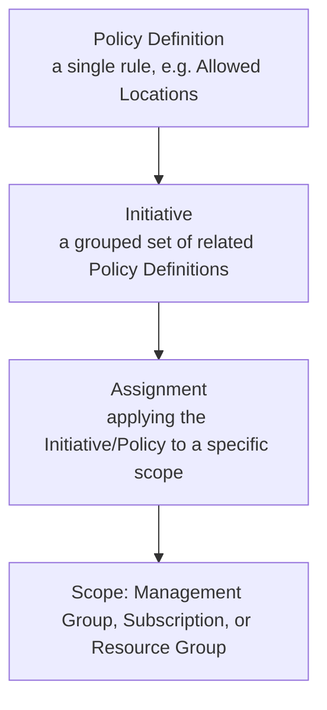

| Term | Meaning | Example |
|---|---|---|
| **Policy Definition** | A single rule describing a desired configuration state | "Allowed locations: East US, West Europe only" |
| **Initiative (Policy Set)** | A collection of related Policy Definitions grouped together for easier management | "ISO 27001 compliance initiative" bundling 50 related policy definitions |
| **Assignment** | The act of applying a Policy Definition or Initiative to a specific scope | Assigning the "Allowed locations" policy to the entire Management Group |

> **Exam Tip:** Think of an Initiative as a "policy of policies," a convenient bundle. This mirrors how a single regulatory framework (like ISO 27001) actually requires dozens of individual technical controls, bundled into one assignable unit.

### 3.3 Policy Effects

When a resource is evaluated against a policy, one of several **effects** determines what happens:

| Effect | What It Does |
|---|---|
| **Deny** | Blocks the non-compliant resource from being created/modified |
| **Audit** | Allows the action but flags the resource as non-compliant in reporting (no blocking) |
| **Append** | Adds specified fields/tags to the resource during creation (e.g., automatically adding a required tag) |
| **DeployIfNotExists** | Automatically deploys a related resource/configuration if a prerequisite is missing (e.g., auto-enable diagnostic logging if not already configured) |
| **Disabled** | Turns off the policy without deleting the assignment |

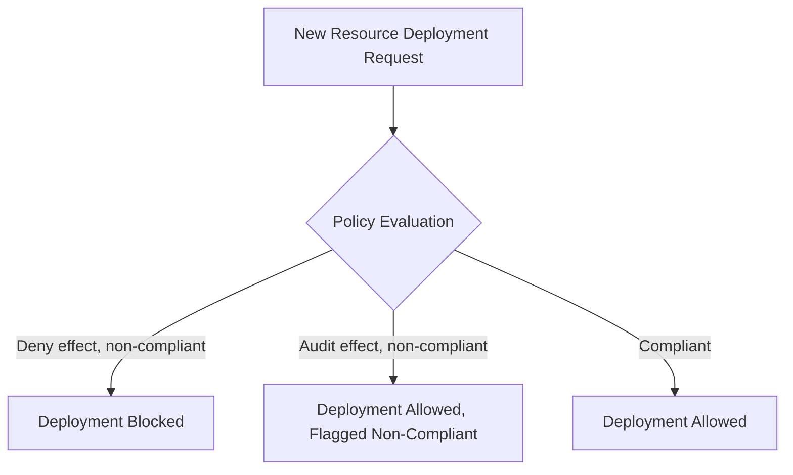

> **Exam Tip:** "Audit" and "Deny" are the two most commonly tested effects. Remember: Audit does NOT block anything, it only reports non-compliance. Deny actively prevents the deployment.

### 3.4 Portal Walkthrough: Assign a Built-in Policy

1. Sign in to `portal.azure.com`, search for **Policy**
2. In the left menu, click **Definitions**, search for the built-in definition **"Allowed locations"**
3. Click it, then click **Assign**
4. Set **Scope** to your desired Subscription or Resource Group
5. Under **Parameters**, select the allowed locations (e.g., East US, West Europe)
6. Under **Non-compliance message**, optionally customize the message shown to users
7. Click **Review + create**, then **Create**

Now, any attempt to deploy a resource outside the allowed regions within this scope will be blocked (if effect is Deny) or flagged (if effect is Audit).

---

## 4. Azure Blueprints Deep Dive
**(Timing: 0:35 - 0:50)**

### 4.1 What Do Blueprints Orchestrate?

**Azure Blueprints** package together everything needed to set up a compliant, ready-to-use environment in one repeatable, versioned bundle:

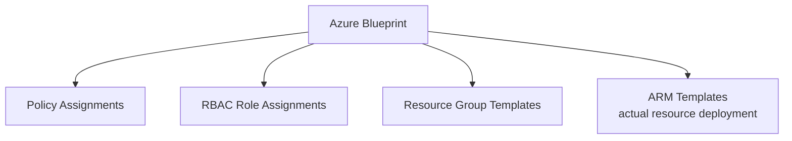

Instead of manually configuring Policies, RBAC, and resources separately every time you spin up a new subscription or environment (e.g., for a new department, project, or regional office), a Blueprint bundles all of them into a single artifact you can assign repeatedly, ensuring every new environment starts out compliant and consistent by design.

### 4.2 Versioning and Locking

Blueprints support **versioning** (track and roll back to earlier bundle definitions) and **resource locking**, ensuring resources deployed via a Blueprint cannot be accidentally modified or deleted outside the Blueprint's lifecycle, protecting the integrity of the standardized environment.

### 4.3 Important Note: Deprecation

Microsoft has announced that Azure Blueprints is being deprecated in favor of newer tools: **Template Specs** and **Deployment Stacks**, which achieve similar packaging/repeatability goals using more modern ARM/Bicep-based tooling. AZ-900 content historically includes Blueprints, so you should still know the concept for the exam, but be aware in real-world practice that Microsoft is steering customers toward these newer alternatives.

> **Exam Tip:** AZ-900 exam questions may still reference Blueprints as a named concept: "packages Policies, RBAC, and Resource Manager templates into a single, versioned, repeatable artifact." Recognize this definition even as the underlying tooling evolves in practice.

### 4.4 When to Use Blueprints vs Plain ARM/Bicep Templates

| Scenario | Better Choice |
|---|---|
| Deploying just resources, no governance bundling needed | Plain ARM/Bicep template |
| Need to bundle Policies + RBAC + Resources together as one repeatable, versioned package for many new environments | Blueprints (or its modern successors) |

---

## 5. Microsoft Purview Compliance Manager Deep Dive
**(Timing: 0:50 - 1:05)**

### 5.1 What is Compliance Manager?

**Microsoft Purview Compliance Manager** is a workflow-based risk assessment tool that helps you understand your organization's compliance posture against specific regulatory standards, such as GDPR, ISO 27001, NIST 800-53, or HIPAA. It's fundamentally a **reporting and improvement-tracking tool**, not an enforcement engine like Azure Policy.

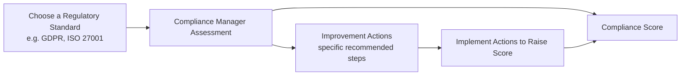

### 5.2 The Compliance Score

Compliance Manager calculates a **Compliance Score**, a percentage-like number reflecting how well your current configuration aligns with the selected regulatory standard's requirements. It breaks the standard down into individual **Improvement Actions**, specific technical or procedural steps you can take (some are automatically assessed based on actual Azure configuration, others require manual attestation, like confirming a policy document exists).

### 5.3 Improvement Actions

Each Improvement Action has:
- A description of what needs to be done
- Points contributing toward your overall Compliance Score
- A responsibility indicator (Microsoft's responsibility, your responsibility, or shared)

> **Exam Tip:** Compliance Manager's Compliance Score reflects a **shared responsibility model**: some controls are automatically satisfied by Microsoft's infrastructure, some require action from you, the customer, and Compliance Manager clearly separates which is which.

### 5.4 Compliance Manager vs Azure Policy: The Critical Distinction

| Aspect | Azure Policy | Compliance Manager |
|---|---|---|
| Primary Function | Actively enforces/audits technical resource configuration | Assesses and reports overall compliance posture against named regulatory standards |
| Enforcement | Can actively Deny non-compliant deployments | Does NOT block anything, purely reporting/tracking |
| Scope | Azure resource configuration | Broader organizational compliance, includes policies, procedures, and Microsoft 365 in addition to Azure |

> **Exam Tip:** This is a frequently tested distinction. Azure Policy actively enforces configuration rules in real time. Compliance Manager is a posture assessment and improvement-tracking dashboard, it reports on compliance, it does not enforce or block anything itself.

---

## 6. Microsoft Defender for Cloud Deep Dive
**(Timing: 1:05 - 1:25)**

### 6.1 What is Defender for Cloud?

**Microsoft Defender for Cloud** is Azure's unified security management tool, combining two major capabilities:

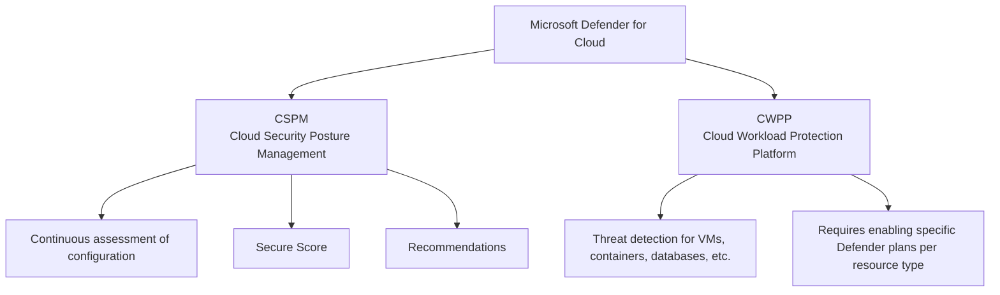

| Capability | What It Does |
|---|---|
| **CSPM (Cloud Security Posture Management)** | Free, foundational capability: continuously assesses your resource configurations against security best practices, calculates a Secure Score, and provides prioritized Recommendations |
| **CWPP (Cloud Workload Protection)** | Paid, advanced capability: active threat detection and protection for specific workload types (VMs, SQL databases, Storage, Kubernetes, Key Vault, etc.), each enabled via a specific "Defender plan" |

### 6.2 Secure Score

**Secure Score** is a single aggregated percentage reflecting your overall security posture across your Azure environment, similar in spirit to Compliance Manager's Compliance Score, but focused specifically on security best practices rather than named regulatory frameworks.

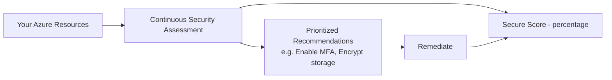

### 6.3 Regulatory Compliance Dashboard

Defender for Cloud also includes a **Regulatory Compliance dashboard**, showing how your Azure environment maps against specific standards (PCI DSS, ISO 27001, SOC 2, etc.), similar in spirit to Compliance Manager, but scoped specifically to Azure resource configuration rather than the broader organizational scope Compliance Manager covers.

### 6.4 Defender Plans (Workload Protection)

Each resource type has its own dedicated **Defender plan** you can individually enable, since threat detection needs differ by workload:

| Defender Plan | Protects |
|---|---|
| Defender for Servers | Virtual Machines |
| Defender for Storage | Storage Accounts |
| Defender for SQL | Azure SQL Database / SQL on VMs |
| Defender for Containers | AKS / container workloads |
| Defender for Key Vault | Key Vault access anomalies |

> **Exam Tip:** Remember the two-layer structure: **CSPM (free, posture assessment, Secure Score) is always on**; **CWPP (paid, active threat protection, per-resource-type Defender plans) must be explicitly enabled** for the specific workloads you want protected.

### 6.5 How Defender for Cloud Uses Azure Policy Under the Hood

Behind the scenes, Defender for Cloud's Recommendations and Secure Score calculations are actually powered by **Azure Policy** assignments (specifically, an initiative called the Microsoft cloud security benchmark). This is a great "aha" moment for learners: governance and security tools are deeply integrated, Policy provides the enforcement/assessment engine, Defender for Cloud provides the security-focused dashboard and workflow on top of it.

### 6.6 Portal Walkthrough: View Secure Score and a Recommendation

1. Navigate to **Microsoft Defender for Cloud** in the portal
2. On the **Overview** page, view your current **Secure Score** percentage
3. Click **Recommendations** in the left menu
4. Select a recommendation (e.g., "Storage accounts should restrict network access")
5. Review the affected resources and the remediation steps provided
6. Optionally click **Quick Fix** if available, to remediate automatically

---

## 7. Azure Governance/Security Stack vs AWS: The Big Comparison
**(Timing: 1:25 - 1:45)**

### 7.1 Structural Comparison

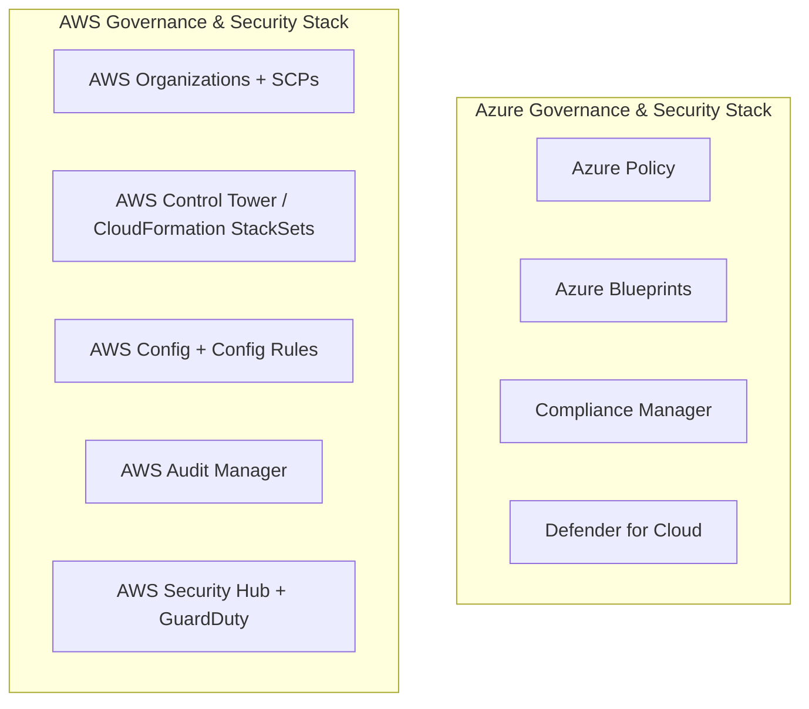

### 7.2 Concept-by-Concept Mapping

| Azure Tool | AWS Equivalent | Key Difference |
|---|---|---|
| Azure Policy | AWS Config (Config Rules) + Service Control Policies (SCPs) | This is a nuanced, frequently misunderstood mapping, see 7.3 below for a detailed breakdown |
| Azure Blueprints | AWS Control Tower (Account Factory) / CloudFormation StackSets | Both bundle governance artifacts (policies, roles, resource templates) into repeatable environment packages for new accounts/subscriptions |
| Microsoft Purview Compliance Manager | AWS Audit Manager | Both assess and report compliance posture against named regulatory frameworks, with improvement recommendations and scoring |
| Microsoft Defender for Cloud (CSPM) | AWS Security Hub | Both aggregate security findings, calculate a security score, and provide prioritized recommendations across the cloud environment |
| Microsoft Defender for Cloud (CWPP, per-resource Defender plans) | Amazon GuardDuty (+ Inspector for workload-specific scanning) | Both provide active threat detection for specific workload types; AWS splits this across multiple specialized services (GuardDuty for threat detection, Inspector for vulnerability scanning), Azure consolidates under one Defender for Cloud umbrella with per-resource-type plans |

### 7.3 The Nuanced Policy vs SCP Mapping (Important!)

This is the trickiest mapping in the whole comparison, and worth slowing down on:

- **Azure Policy** evaluates and enforces **resource-level configuration** (e.g., "storage accounts must use encryption," "VMs must be in approved regions"). It can Deny or Audit individual resource configurations.
- **AWS SCPs (Service Control Policies)** work differently: they don't check resource configuration at all, they restrict which **IAM actions/API calls** are even possible within an account, acting as a permission guardrail ("no one in this account can ever call `ec2:RunInstances` in region X," regardless of their IAM permissions).
- **AWS Config (Config Rules)** is actually the closer functional match to Azure Policy: it continuously evaluates actual resource configurations against defined rules and can flag (or, with remediation actions, correct) non-compliant resources.

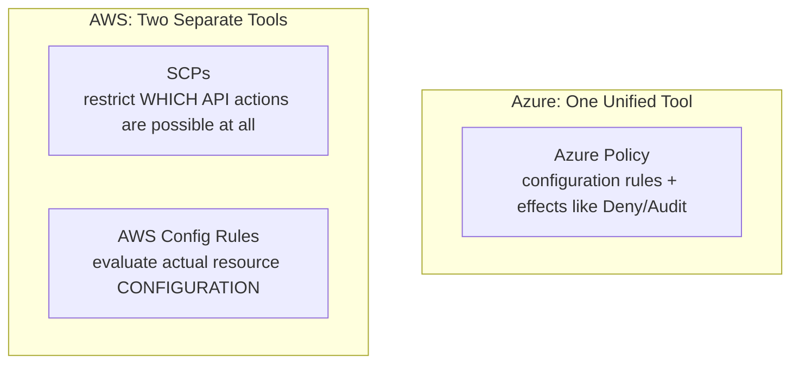

> **Exam Tip / Common Misconception:** Do NOT assume Azure Policy maps only to SCPs. The more accurate mapping is: **Azure Policy's configuration-auditing behavior is closest to AWS Config Rules**, while **Azure Policy's Deny effect (blocking an action outright) has some functional overlap with SCPs' blanket permission restrictions**, but they operate at different layers (resource configuration vs IAM action availability). This nuance is a favorite "gotcha" in interviews with candidates who've worked in both clouds.

### 7.4 The Most Important Interview/Exam Line

> "Azure consolidates governance into two core services, Azure Policy for configuration enforcement and Blueprints for packaging repeatable compliant environments, while AWS splits similar functionality across SCPs (restricting which IAM actions are even possible), AWS Config (auditing actual resource configuration), and Control Tower/StackSets (packaging repeatable account setups). For compliance reporting, Compliance Manager is comparable to AWS Audit Manager, and for security posture plus threat detection, Defender for Cloud's two-layer model, CSPM and CWPP, maps to AWS Security Hub for posture aggregation and GuardDuty for active threat detection."

### 7.5 Common Misconceptions to Avoid

- **Misconception:** "Azure Policy and AWS SCPs are the same thing." Reality: SCPs restrict permissions/API actions at the account level; Azure Policy evaluates and enforces actual resource configuration. AWS Config Rules are the closer functional match to Azure Policy.
- **Misconception:** "Compliance Manager and Defender for Cloud's Regulatory Compliance dashboard are the same tool." Reality: Compliance Manager covers a broader organizational scope (including Microsoft 365 and manual attestations); Defender for Cloud's Regulatory Compliance dashboard is scoped specifically to Azure resource configuration.
- **Misconception:** "Defender for Cloud is entirely free." Reality: CSPM (Secure Score, Recommendations) is free; CWPP (active threat protection via Defender plans) is a paid, per-resource-type capability.

---

## 8. Recap: The Complete Mental Model
**(Timing: 1:45 - 1:50)**

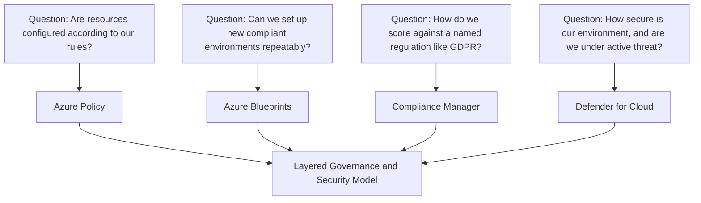

Return to the restaurant chain analogy one final time: **Azure Policy** is the automatic inspector enforcing the rulebook at every location, **Blueprints** is the franchise starter kit ensuring every new location launches correctly configured, **Compliance Manager** is the health inspector's scorecard against a named certification standard, and **Defender for Cloud** is the ongoing security patrol watching for vulnerabilities and active threats.

---

## 9. Exam Tips Quick-Fire Summary
**(Timing: 1:50 - 1:55)**

1. Governance, Security, and Compliance are related but distinct concepts, know which Azure tool maps to each.
2. RBAC controls WHO can do WHAT; Azure Policy controls WHAT CONFIGURATIONS are allowed, regardless of who is doing it, they are independent, complementary layers.
3. Policy Definition -> Initiative (grouped definitions) -> Assignment (applied at a scope) is the core Azure Policy hierarchy.
4. Deny blocks non-compliant deployments; Audit only flags them without blocking, know this distinction cold.
5. Azure Blueprints bundle Policies, RBAC, and Resource Manager templates into a single versioned, repeatable package; it's being succeeded by Template Specs and Deployment Stacks.
6. Compliance Manager assesses and reports compliance posture (Compliance Score, Improvement Actions) against named regulatory standards; it does NOT enforce or block anything.
7. Defender for Cloud has two layers: CSPM (free, Secure Score, Recommendations) and CWPP (paid, active threat protection via per-resource Defender plans).
8. Defender for Cloud's Secure Score and Recommendations are actually powered by Azure Policy assignments under the hood.
9. Azure Policy's closest AWS functional match is AWS Config Rules (configuration auditing), not SCPs (which restrict IAM actions at the account level), a commonly misunderstood mapping.
10. Compliance Manager maps to AWS Audit Manager; Defender for Cloud's CSPM maps to AWS Security Hub; Defender for Cloud's CWPP maps to Amazon GuardDuty/Inspector.

---

## 10. Interview Questions (Consolidated Q&A)

**Q1: What is the difference between Azure RBAC and Azure Policy?**
A: RBAC controls who can perform actions on Azure resources (authorization based on identity). Azure Policy controls what configurations are allowed on resources, regardless of who is performing the action. A user might have full RBAC permission to create a resource, but Azure Policy can still deny the deployment if the resulting configuration violates an organizational rule, such as using a disallowed region.

**Q2: Explain the relationship between a Policy Definition, an Initiative, and an Assignment.**
A: A Policy Definition is a single rule (e.g., "allowed locations"). An Initiative groups multiple related Policy Definitions together for easier management (e.g., bundling 50 definitions into an "ISO 27001" initiative). An Assignment is the act of applying either a single Policy Definition or an entire Initiative to a specific scope, such as a Management Group, Subscription, or Resource Group.

**Q3: What's the difference between the Audit and Deny policy effects?**
A: Audit allows the non-compliant action to proceed but flags the resource as non-compliant in reporting dashboards. Deny actively blocks the non-compliant deployment or modification from happening at all.

**Q4: What does Azure Blueprints package together, and why is that valuable at scale?**
A: Blueprints bundle Policy assignments, RBAC role assignments, Resource Group definitions, and ARM templates into a single versioned, repeatable artifact. This is valuable because it lets organizations spin up new, fully compliant environments (for new departments, projects, or regions) consistently, without manually reconfiguring governance and resources every time.

**Q5: How does Compliance Manager differ from Azure Policy in terms of what it actually does?**
A: Azure Policy actively enforces or audits technical resource configurations in real time (it can literally block a non-compliant deployment). Compliance Manager is a reporting and workflow tool that assesses your overall compliance posture against a named regulatory standard, calculates a Compliance Score, and tracks Improvement Actions, but it does not enforce or block anything itself.

**Q6: Explain the two layers of Microsoft Defender for Cloud.**
A: CSPM (Cloud Security Posture Management) is the free, always-on layer that continuously assesses resource configurations, calculates a Secure Score, and surfaces prioritized security recommendations. CWPP (Cloud Workload Protection) is the paid layer providing active threat detection for specific workload types (VMs, SQL, Storage, Containers, Key Vault), each enabled individually via a specific Defender plan.

**Q7: How does Defender for Cloud's Secure Score relate to Azure Policy under the hood?**
A: Defender for Cloud's Recommendations and Secure Score calculations are actually powered by Azure Policy assignments, specifically an initiative built around the Microsoft cloud security benchmark. This shows how governance and security tooling are deeply integrated in Azure, Policy provides the underlying evaluation engine, and Defender for Cloud provides the security-focused presentation and workflow layer on top.

**Q8: Why is mapping Azure Policy directly to AWS SCPs considered a common mistake?**
A: SCPs restrict which IAM actions/API calls are even possible within an AWS account, operating at the permissions layer, they don't inspect actual resource configuration. Azure Policy evaluates and enforces actual resource configuration state (e.g., is encryption enabled, is the region allowed). The more accurate functional match for Azure Policy's configuration-auditing role is AWS Config Rules, not SCPs.

**Q9: A company needs to ensure every new Azure subscription automatically gets specific RBAC roles, security policies, and a standard set of resources deployed. What Azure tool addresses this, and what's happening to it?**
A: Azure Blueprints addresses this, bundling Policies, RBAC assignments, and Resource Manager templates into one repeatable, versioned package. Microsoft has announced Blueprints is being succeeded by newer tools, Template Specs and Deployment Stacks, which accomplish similar goals using more modern ARM/Bicep-based tooling.

**Q10: How would you explain Defender for Cloud's relationship to AWS Security Hub and GuardDuty to an AWS-experienced colleague?**
A: Defender for Cloud's free CSPM layer (Secure Score, Recommendations, Regulatory Compliance dashboard) is comparable to AWS Security Hub, which aggregates findings and provides a security posture score across an AWS environment. Defender for Cloud's paid CWPP layer (active threat detection via per-resource Defender plans) is comparable to Amazon GuardDuty for threat detection, with some overlap with AWS Inspector for workload-specific vulnerability scanning. Azure consolidates both posture and workload protection under one product umbrella, while AWS splits them across dedicated services.

**Q11: What's the difference between what Compliance Manager measures versus what Defender for Cloud's Regulatory Compliance dashboard measures?**
A: Compliance Manager assesses compliance posture across a broader organizational scope, including Microsoft 365 configurations and manual attestations (like confirming a written policy document exists), not just Azure resources. Defender for Cloud's Regulatory Compliance dashboard is scoped specifically to Azure resource configuration as evaluated by underlying Policy initiatives, a narrower, more technically automated view of the same general concept.

**Q12: Why does an organization need both Azure Policy and RBAC, rather than relying on just one?**
A: RBAC alone can't prevent a permitted user from creating a misconfigured or non-compliant resource, it only controls whether they're allowed to attempt the action at all. Azure Policy alone can't control who has access to sensitive management operations in the first place. Together, they form complementary layers: RBAC governs identity-based permissions, and Policy governs configuration correctness regardless of who's acting.

---

## 11. Exam-Style Practice Questions (AZ-900 Format)

**Question 1:** A user has Contributor access to a Resource Group and attempts to deploy a VM in a region that is not on the organization's approved list. What is most likely to happen?

A) The deployment succeeds because Contributor access allows VM creation
B) The deployment is blocked by Azure Policy, regardless of the user's RBAC permissions
C) The deployment succeeds but the user's RBAC role is automatically downgraded
D) Azure Policy has no ability to block resource deployments

**Answer: B.** Azure Policy operates independently of RBAC and can block non-compliant configurations (like disallowed regions) even for users with sufficient RBAC permissions.

---

**Question 2:** What is the relationship between a Policy Definition and an Initiative?

A) An Initiative is a single rule; a Policy Definition is a group of Initiatives
B) An Initiative is a collection of related Policy Definitions grouped together for easier management
C) They are the same concept with different names
D) A Policy Definition can only exist within an Initiative, never independently

**Answer: B.** An Initiative groups multiple related Policy Definitions together; a Policy Definition can also be assigned independently without belonging to an Initiative.

---

**Question 3:** Which Azure Policy effect allows a non-compliant resource to be created but flags it in compliance reporting without blocking it?

A) Deny
B) Audit
C) Append
D) DeployIfNotExists

**Answer: B.** Audit flags non-compliance without blocking the deployment. Deny actively blocks it.

---

**Question 4:** What does Azure Blueprints package together into a single, repeatable, versioned artifact?

A) Only ARM templates
B) Only RBAC role assignments
C) Policy assignments, RBAC role assignments, Resource Groups, and ARM templates
D) Only Compliance Manager assessments

**Answer: C.** Blueprints bundle all four of these governance artifacts together for repeatable environment setup.

---

**Question 5:** What does Microsoft Purview Compliance Manager primarily provide?

A) Real-time blocking of non-compliant resource deployments
B) A Compliance Score and Improvement Actions assessing posture against named regulatory standards
C) Active threat detection for virtual machines
D) RBAC role assignment management

**Answer: B.** Compliance Manager is a reporting and workflow tool for assessing compliance posture, it does not actively block or enforce anything (that is Azure Policy's role).

---

**Question 6:** Which two layers make up Microsoft Defender for Cloud?

A) RBAC and Azure Policy
B) CSPM (Cloud Security Posture Management) and CWPP (Cloud Workload Protection)
C) Billing and Cost Management
D) Blueprints and Compliance Manager

**Answer: B.** Defender for Cloud consists of a free CSPM layer (Secure Score, Recommendations) and a paid CWPP layer (active threat protection via Defender plans).

---

**Question 7:** Which AWS service is functionally the closest match to Azure Policy's configuration-auditing behavior?

A) AWS Organizations Service Control Policies (SCPs)
B) AWS Config (Config Rules)
C) AWS IAM
D) AWS CloudTrail

**Answer: B.** AWS Config Rules continuously evaluate actual resource configuration, the closest functional match to Azure Policy. SCPs restrict IAM actions/API availability, a different layer entirely.

---

**Question 8:** Which AWS service is most comparable to Microsoft Defender for Cloud's free CSPM capability (Secure Score and Recommendations)?

A) Amazon GuardDuty
B) AWS Security Hub
C) AWS Config
D) AWS Audit Manager

**Answer: B.** AWS Security Hub aggregates security findings and provides an overall security posture score, comparable to Defender for Cloud's CSPM/Secure Score capability.

---

**Question 9:** A company wants to confirm their environment satisfies GDPR requirements, including both technical Azure configurations and organizational policy documentation. Which tool should they primarily use?

A) Azure Policy
B) Azure Blueprints
C) Microsoft Purview Compliance Manager
D) Microsoft Defender for Cloud CWPP

**Answer: C.** Compliance Manager assesses compliance posture against named regulatory standards across a broad organizational scope, including both technical configuration and manual/procedural attestations, unlike Azure Policy which only handles technical resource configuration.

---

**Question 10:** What powers Microsoft Defender for Cloud's Secure Score and Recommendations under the hood?

A) Azure Blueprints versioning
B) Azure Policy assignments (based on the Microsoft cloud security benchmark initiative)
C) AWS Config Rules imported into Azure
D) Manual security audits performed by Microsoft support staff

**Answer: B.** Defender for Cloud's Secure Score and Recommendations are calculated using underlying Azure Policy assignments tied to the Microsoft cloud security benchmark initiative.
